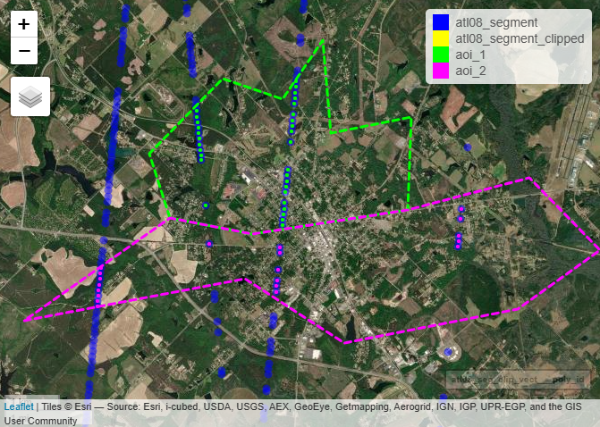
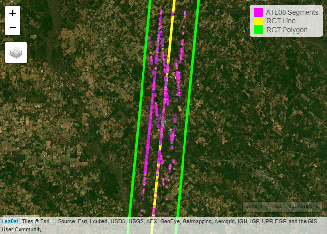

<br/>
[](https://carlos-alberto-silva.r-universe.dev/ICESat2VegR)
[](https://github.com/carlos-alberto-silva/ICESat2VegR/actions/workflows/rhub.yaml)
[](https://cran.r-project.org/package=ICESat2VegR)


**ICESat2VegR: An R Package for NASA's Ice, Cloud, and Elevation
Satellite (ICESat-2) Data Processing and Visualization for Land and
Vegetation Applications.**

Authors: Carlos Alberto Silva and Caio Hamamura

The ICESat2VegR package provides functions for downloading, reading, visualizing, processing, and exporting NASA's ICESat-2 ATL03 (Global Geolocated Photon Data) and 
ATL08 (Land and Vegetation Height) products for land and vegetation applications in the R environment.


# Getting started

```{r setup, include=FALSE}
knitr::opts_chunk$set(
  fig.path = "readme/"
)
```

```{r install_package, eval=FALSE}
# The r-universe version (recommended for the latest version)
install.packages("ICESat2VegR", , repos = c("https://caiohamamura.r-universe.dev", "https://cloud.r-project.org"))

# The CRAN version
install.packages("ICESat2VegR")
```

## Load the package

```{r load_package}
library(ICESat2VegR)
```

## Configuring the package

This package uses three Python packages through `reticulate`:

1.  [earthaccess](https://github.com/nsidc/earthaccess): allows reading
    directly from the cloud
2.  [h5py](https://github.com/h5py/h5py): for reading hdf5 content from
    the cloud
3.  [earthengine-api](https://github.com/google/earthengine-api):
    integration with Google Earth Engine for sampling, extracting raster data, and upscaling models.

The configuration should be automatically handled by `reticulate::py_require`, so you should not
need to do anything further for configuring the `python` environment.

### EarthData NASA's authentication

There are two major options for authenticate ahead.

1. Set the environmental variables `EARTHDATA_USERNAME` and `EARTHDATA_PASSWORD` at system level
before opening R:
1. Use the `earthdata_login(output_dir = '~')` which will ask for username and password and
save them to `.netrc` as plain text.


### EarthEngine authentication

To use Earth Engine, you may also need to configure a project the Earth Engine API.
Please, refer to <https://developers.google.com/earth-engine/guides/access#create-a-project>
for more details. 

After setting the project up, just use the `project-name`

```{r ee_initialize_hidden, include=FALSE}
ee_initialize('ee-caiohamamura')
```

```{r ee_initialize_example, eval=FALSE}
ee_initialize('project-name')
```

## Introduction

There are two different ways of working with ICESat-2 data: locally or using cloud computing. 
Most users should work locally unless they are operating within an AWS cloud-computing environment in the us-west-2 region.

## Opening the example dataset

As we will be working with multiple HDF5 granules, we will use `lapply()` for reading and extracting information from the granules.
If you are working with a single granule, you can follow the simpler instructions provided in the function documentation examples without using `lapply()`.

```{r setup_outdir_hidden, include=FALSE}
outdir <- normalizePath("~/test_ICESat2/")
```

```{r download_example_dataset, eval=FALSE}
# Set output directory
outdir <- tempdir()
dir.create(outdir, showWarnings = FALSE)

# Download example dataset
url <- "https://github.com/carlos-alberto-silva/ICESat2VegR/releases/download/example_datasets/Study_Site.zip"
zip_file <- file.path(outdir, "Study_Site.zip")
if (!file.exists(zip_file)) {
  download.file(url, zip_file, mode = "wb")
}

# Unzip the example dataset
if (!file.exists(file.path(outdir, "ATL03_20190413122158_02330302_006_02_clip.h5"))) {
  unzip(zip_file, exdir = outdir)
}
```

```{r list_example_files}
list.files(outdir)
```

## Search parameters

```{r define_search_parameters}
# Specifying bounding box coordinates
lower_left_lon <- -83.26
lower_left_lat <- 31.95
upper_right_lon <- -83.11
upper_right_lat <- 32.46


# Specifying the date range
daterange <- c("2019-04-12", "2019-05-03")
```

## Working locally

First we need to find the granules:

```{r find_atl03_granules_local}
atl03_granules_local <- ATLAS_dataFinder(
  short_name = "ATL03",
  lower_left_lon,
  lower_left_lat,
  upper_right_lon,
  upper_right_lat,
  version = "007",
  daterange = daterange,
  persist = FALSE,
  cloud_computing = FALSE
)

head(atl03_granules_local)
```

```{r find_atl08_granules_local}
atl08_granules_local <- ATLAS_dataFinder(
  short_name = "ATL08",
  lower_left_lon,
  lower_left_lat,
  upper_right_lon,
  upper_right_lat,
  version = "007",
  daterange = daterange,
  persist = TRUE,
  cloud_computing = FALSE
)

head(atl08_granules_local)
```
Now we download the granules:

```{r download_granules, eval=FALSE}
# Download granules
ATLAS_dataDownload(atl03_granules_local, outdir)
ATLAS_dataDownload(atl08_granules_local, outdir)
```

And then we can open and work with them.

### Opening multiple files with `lapply`

The functions developed in the package are designed to work with a single file. 
However, by using `lapply`, we can work with lists of files as if we were using
a `for` loop.

```{r read_atl_files}
## ATL03
# Read the granules
atl03_files <- list.files(outdir, "ATL03.*h5", full.names = TRUE)
atl03_h5 <- lapply(atl03_files, ATL03_read)

## ATL08
# Read the granules
atl08_files <- list.files(outdir, "ATL08.*h5", full.names = TRUE)
atl08_h5 <- lapply(atl08_files, ATL08_read)

# List groups within first file of atl08_h5
atl08_h5[[1]]$ls()
```

### NOTE: for those not familiar with `lapply`

You can read this as if we were looping over the listed files. For example:

```r
atl03_files <- list.files(outdir, "ATL03.*h5", full.names = TRUE)
```

This will look for all files matching the [regular expression](https://en.wikipedia.org/wiki/Regular_expression)
pattern `ATL03.*h5`. That is, it searches for files that contain `"ATL03"` 
followed by any character (`.`) repeated zero or more times (`*`), and ending
with `"h5"`.

Setting `full.names = TRUE` returns the full path of the matching files.

The result is a `list` of files matching `ATL03<anything>.h5`, which we store in
the `atl03_files` variable. Then we can use:

```r
atl03_h5 <- lapply(atl03_files, ATL03_read)
```

This applies `ATL03_read` to each file and returns another list, where each
element corresponds to one ATL03 H5 file opened by the package. The result is
stored in the `atl03_h5` variable.

We can use the same `lapply` pattern to apply any function to the opened
ATL03 H5 files, such as `close`, which releases the H5 file handle:

```r
lapply(atl03_h5, close)
```

This is essentially equivalent to using a `for` loop, which some may
already be familiar with. We could write the previous steps as:

```r
for (ii in atl03_files) {
  atl03_h5 <- ATL03_read(ii)
  close(atl03_h5)
}
```

One limitation of a `for` loop is that it runs as a single block, which can make
interactive debugging less convenient. Any change or correction must be made
inside the loop definition. For this reason, many developers use workarounds to
debug `for` loops line by line by manually setting the loop index (`ii`, in this
case).

Using `lapply` can be more convenient for interactive programming because you
apply a single function over the elements and immediately obtain a results. 
After execution, you can directly examine the returned object to verify that
everything worked as expected.

One important consideration is that `lapply` stores all results in memory. In
contrast, a `for` loop can release resources at each iteration (for example,
by explicitly calling `close()`), which may be preferable when working with
large files or limited memory.

## Working in the cloud

In cloud computing you don't need to download the data, instead you can read
the data and start working with it, but it is only worth it and fast if you use
an Amazon computing instance in `us-west2`. If you are physically close to that
region and have a fast link it may be usable.

```{r find_atl03_granules_cloud, eval=FALSE}
atl03_granules_cloud <- ATLAS_dataFinder(
  short_name = "ATL03",
  lower_left_lon,
  lower_left_lat,
  upper_right_lon,
  upper_right_lat,
  version = "007",
  daterange = daterange,
  persist = TRUE,
  cloud_computing = TRUE
)
```

```{r read_atl03_cloud, eval=FALSE}
# Read the granule (the ATL03_read can only read one granule per read)
atl03_h5_cloud <- ATL03_read(atl03_granules_cloud[1])

# List groups within the h5 in cloud
atl03_h5_cloud$beams
```

```{r close_atl03_cloud, eval=FALSE}
close(atl03_h5_cloud)
```

# Extracting ATL03 photons attributes

```{r extract_atl03_photons}
atl03_photons_dt <- lapply(atl03_h5, ATL03_photons_attributes_dt)

lapply(atl03_photons_dt, head)
```


```{r plot_atl03_photons_subset}
atl03_photons_dt[[1]][beam == "gt1r" & dist_ph_along < 10000,
  plot(dist_ph_along, h_ph, xlab="dist_ph_along", ylab="Elevation (m)", pch=16, cex=0.2)
]
```

Join all the data tables by using the `rbindlist2` helper function from this
package. Don't use `data.table::rbindlist`, because then the original `class` 
will be lost and you won't be able to run any other function from this
package over the result.

```{r combine_atl03_photons}
atl03_photons_dt <- rbindlist2(atl03_photons_dt)

head(atl03_photons_dt)
```

# Segment-Level Extraction of ATL03 Metadata and ATL08 Attributes

```{r extract_atl03_segment_metadata}
# ATL03 seg attributes
atl03_seg_att_ls <- lapply(
  atl03_h5,
  ATL03_seg_metadata_dt,
  attributes = c("delta_time", "solar_elevation", "pitch", "h_ph", "ref_elev")
)
atl03_seg_dt <- rbindlist2(atl03_seg_att_ls)

# Remove segments above 20km
atl03_seg_dt <- atl03_seg_dt[h_ph < 20000]

head(atl03_seg_dt)
```

```{r extract_atl08_segment_attributes}
# ATL08 seg attributes
atl08_seg_att_ls <- lapply(
  atl08_h5,
  ATL08_seg_attributes_dt,
  attributes = c("h_canopy", "h_te_mean", "terrain_slope", "canopy_openness", "night_flag")
)
atl08_seg_dt <- rbindlist2(atl08_seg_att_ls)

# Consider only segment with h_canopy < 100 and terrain height < 20000
atl08_seg_dt <- atl08_seg_dt[h_canopy < 100 & h_te_mean < 20000]

head(atl08_seg_dt)
```


### Plot histograms:

```{r plot_segment_histograms}
layout(t(1:2))

# ATL03 height histogram
hist(atl03_seg_dt$h_ph, col = "#bd8421", xlab = "Elevation (m)", main = "ATL03 h_ph")
hist(atl08_seg_dt$h_canopy, col = "green", xlab = "Height (m)", main = "ATL08 h_canopy")
```

## Export to vector

The function `to_vect()` will return a `terra::vect` object.

```{r export_atl03_to_vector, eval=FALSE}
library(terra)

blueYellowRed <- function(n) grDevices::hcl.colors(n, "RdYlBu")

set.seed(42)
mask <- base::sample(seq_len(nrow(atl03_seg_dt)), 50)
atl03_seg_vect <- to_vect(atl03_seg_dt)

# Plot with mapview
mapview::mapview(
  atl03_seg_vect[mask],
  zcol = "h_ph",
  layer.name = "h_ph",
  breaks = 3,
  col.regions = blueYellowRed,
  map.types = c("Esri.WorldImagery")
)
```

<div align="center">


</div>

```{r export_atl08_to_vector, eval = FALSE}
# Extract vector from atl08_seg_dt
class(atl08_seg_dt)
atl08_seg_vect <- to_vect(atl08_seg_dt)

# Palette function
greenYellowRed <- function(n) {
  grDevices::hcl.colors(n, "RdYlGn")
}


# Plot with mapview
leaflet_available <- require("leaflet")
if (!leaflet_available) stop("leaflet not found!")

map_vect <- mapview::mapView(
  atl08_seg_vect,
  layer.name = "h_canopy",
  zcol = "h_canopy",
  col.regions = greenYellowRed,
  map.types = c("Esri.WorldImagery")
)

map_vect
```

<div align="center">


</div>

Save vector as geopackage file. The formats supported are as from GDAL
terra package.

```{r write_vectors_to_disk, eval=FALSE}
terra::writeVector(atl03_seg_vect, file.path(outdir, "atl03_seg.gpkg"))
terra::writeVector(atl08_seg_vect, file.path(outdir, "atl08_seg.gpkg"))
```

## View ATL08 segments as raster

Single max_h_canopy:

```{r raster_max_h_canopy, eval = FALSE}
redYellowGreen <- function(n) grDevices::hcl.colors(n, "RdYlGn")
max_h_canopy <- ATL08_seg_attributes_dt_gridStat(atl08_seg_dt, func = max(h_canopy), res = 0.01)

mapview::mapView(
  max_h_canopy,
  map = map_vect,
  col.regions = redYellowGreen
)
```

<div align="center">


</div>

Multiple attributes:

```{r raster_multiple_attributes, eval = FALSE}
multiple_attributes <- ATL08_seg_attributes_dt_gridStat(atl08_seg_dt, func = list(
  max_h_canopy = max(h_canopy),
  min_h_canopy = min(h_canopy),
  mean_canopy_openness = mean(canopy_openness),
  mean_h_te_mean = mean(h_te_mean)
), res = 0.01)

map_vect_openness <- mapview::mapView(
  atl08_seg_vect,
  zcol = "canopy_openness",
  layer.name = "canopy_openness",
  col.regions = redYellowGreen,
  map.types = c("Esri.WorldImagery")
)

blueYellowRed <- function(n) grDevices::hcl.colors(n, "RdYlBu", rev = TRUE)

map_vect_terrain <- mapview::mapView(
  atl08_seg_vect,
  zcol = "h_te_mean",
  layer.name = "h_te_mean",
  col.regions = blueYellowRed,
  map.types = c("Esri.WorldImagery")
)


m1 <- mapview::mapView(multiple_attributes[[1]], layer.name = "Max h_canopy", map = map_vect, col.regions = redYellowGreen)
m2 <- mapview::mapView(multiple_attributes[[2]], layer.name = "Min h_canopy", map = map_vect, col.regions = redYellowGreen)
m3 <- mapview::mapView(multiple_attributes[[3]], layer.name = "Mean canopy openness", map = map_vect_openness, col.regions = redYellowGreen)
m4 <- mapview::mapView(multiple_attributes[[4]], layer.name = "Mean h_te_mean", col.regions = blueYellowRed, map = map_vect_terrain)

leafsync::sync(m1, m2, m3, m4)
```

<div align="center" style="width:100%;">

<figure>

<figcaption aria-hidden="true">multi</figcaption>
</figure>

</div>

# Clipping ATL03 and ATL08 data

Now we will use the clipping functions. There are two ways of clipping data in ICESat2VegR:

1.Clipping raw HDF5 data from ATL03 and ATL08 files
2.Clipping extracted attributes produced by the extraction functions, such as:

`ATL03_seg_metadata_dt`
`ATL03_photon_attributes_dt`
`ATL08_seg_attributes_dt`
`ATL03_ATL08_photons_attributes_dt_join`

The second method is preferred because it is faster and more efficient. It does not require re-reading the HDF5 file and clips only the extracted attributes, whereas the raw HDF5 structure contains many additional variables that may not be needed.
There are multiple clipping variants that operate either on a bounding box or a geometry, using the suffixes _clipBox or _clipGeometry:

1.`ATL03_h5_clipBox`
2.`ATL03_h5_clipGeometry`
3.`ATL03_seg_metadata_dt_clipBox`
4.`ATL03_seg_metadata_dt_clipGeometry`
5.`ATL03_photon_attributes_dt_clipBox`
6.`ATL03_photon_attributes_dt_clipGeometry`
7.`ATL08_h5_clipBox`
8.`ATL08_h5_clipGeometry`
9.`ATL08_seg_attributes_dt_clipBox`
10.`ATL08_seg_attributes_dt_clipGeometry`
11.`ATL03_ATL08_photons_attributes_dt_join_clipBox`
12.`ATL03_ATL08_photons_attributes_dt_join_clipGeometry`


In the following two sections there are two small examples on how to
clip the raw HDF5 and the extracted attributes.

## Clipping raw hdf5 data from ATL08

Clipping by bounding box

```{r clip_atl08_h5_bbox}
# Define bbox
clip_region <- terra::ext(-83.2, -83.14, 32.12, 32.22)

# Define hdf5 output file
output <- tempfile(pattern = "alt08_h5_clip_", fileext = ".h5")

# Clip the data for only the first ATL08 file
atl08_clipped <- ATL08_h5_clipBox(atl08_h5[[1]], output, clip_obj = clip_region)
atl08_clipped_dt <- ATL08_seg_attributes_dt(atl08_clipped)
head(atl08_clipped_dt)
```


Clip using a vector file and split by polygon `id`

```{r clip_atl08_h5_geometry_split}
aoi <- file.path(outdir, "example_aoi.gpkg")
aoi_vect <- terra::vect(aoi)

# Clip by multiple polygons id
output2 <- tempfile(pattern = "alt08_h5_clip_", fileext = ".h5")
atl08_clippeds <- ATL08_h5_clipGeometry(atl08_clipped, output2, clip_obj = aoi_vect, split_by="id")

atl08_clippeds_dt <- ATL08_seg_attributes_dt(atl08_clippeds)
head(atl08_clippeds_dt)
```


```{r visualize_clipped_bbox, eval = FALSE}
atl08_seg_dt_clip <- ATL08_seg_attributes_dt(atl08_clipped, attributes = c("h_canopy"))

# Display location of clipped data
atl08_seg_vect <- to_vect(atl08_seg_dt)
atl08_seg_clip_vect <- to_vect(atl08_seg_dt_clip)

bbox <- terra::vect(terra::ext(atl08_seg_clip_vect), crs = "epsg:4326")
centroid <- terra::geom(terra::centroids(bbox))

map1 <- mapview::mapview(
  atl08_seg_clip_vect,
  col.regions = "yellow",
  alpha.regions = 1,
  lwd = 5,
  map.types = c("Esri.WorldImagery"),
  alpha = 0,
  cex = 2,
  legend = FALSE
)


# Final map
final_map <- map1@map |>
  leaflet::addCircleMarkers(data = atl08_seg_vect, radius = 2) |>
  leaflet::addPolygons(
    data = bbox, fillOpacity = 0, weight = 3, color = "white",
    opacity = 1, dashArray = "5, 1, 0"
  ) |>
  leaflet::addLegend(
    position = "topright",
    colors = c("blue", "yellow", "white"),
    labels = c("atl08_segment", "atl08_segment_clipped", "bbox"),
    opacity = 1
  ) |>
  leaflet::setView(centroid[, "x"][[1]], centroid[, "y"][[1]], zoom = 13)

final_map
```

<div align="center">


</div>

```{r clip_atl08_attributes_geometry, eval = FALSE}
aoi <- file.path(outdir, "example_aoi.gpkg")
aoi_vect <- terra::vect(aoi)

centroid <- terra::geom(terra::centroids(aoi_vect))

# Extract the h_canopy attribute from the first ATL08 file
atl08_seg_dt <- lapply(atl08_h5, ATL08_seg_attributes_dt, attributes = c("h_canopy"))
atl08_seg_dt <- rbindlist2(atl08_seg_dt)
atl08_seg_vect <- to_vect(atl08_seg_dt)

# Clip using geometry
atl08_seg_dt_clip <- ATL08_seg_attributes_dt_clipGeometry(
  atl08_seg_dt, aoi_vect, split_by = "id"
)

atl08_seg_clip_vect <- to_vect(atl08_seg_dt_clip)

colors <- c("#00FF00", "#FF00FF")

map1 <- mapview::mapview(
  atl08_seg_clip_vect,
  alpha = 0,
  col.regions = colors,
  alpha.regions = 1,
  zcol = "poly_id",
  lwd = 5,
  map.types = c("Esri.WorldImagery"),
  cex = 2,
  legend = FALSE
)

# Final map
final_map <- map1@map |>
  leaflet::addCircleMarkers(data = atl08_seg_vect, color = "blue", radius = 2) |>
  leaflet::addPolygons(
    data = aoi_vect, fillOpacity = 0, weight = 3, color = colors,
    opacity = 1, dashArray = "5, 1, 0"
  ) |>
  leaflet::addLegend(
    position = "topright",
    colors = c("blue", "yellow", colors),
    labels = c("atl08_segment", "atl08_segment_clipped", "aoi_1", "aoi_2"),
    opacity = 1
  ) |>
  leaflet::setView(centroid[, "x"][[1]], centroid[, "y"][[1]], zoom = 13)
  
final_map
```

<div align="center">



</div>


### Extract Reference Ground Tracks

```{r extract_rgt, eval = FALSE}
# As lines
rgt_line_vect <- rgt_extract(atl03_h5[[2]])
rgt_polygon_vect <- rgt_extract(atl03_h5[[2]], line = FALSE)

atl08_seg_vect$formatted_h <- atl08_seg_vect$h_canopy
atl08_seg_vect$formatted_h[atl08_seg_vect$formatted_h > 500] <- NaN
atl08_seg_vect$formatted_h <- sprintf("Height: %.2f", atl08_seg_vect$formatted_h)

map1 <- mapview::mapview(
  atl08_seg_vect,
  zcol = "formatted_h",
  color='#f0f',
  map.types = c("Esri.WorldImagery"),
  cex = 2,
  legend = FALSE
)@map |> 
    leaflet::addPolylines(data = rgt_line_vect, color='#ff0', opacity=1) |>
    leaflet::addPolygons(data = rgt_polygon_vect, fill=NA, color='#0f0', opacity=1) |>
    leaflet::addLegend(
    position = "topright",
    colors = c("#f0f", "#ff0", "#0f0"),
    labels = c("ATL08 Segments", "RGT Line", "RGT Polygon"),
    opacity = 1
  )

map1

```

<div align="center">



</div>

Using the Generic clip() Function

Instead of manually choosing from the many _clipBox or _clipGeometry functions, ICESat2VegR provides a unified clipping interface using the generic clip() function. The generic automatically:
detects the class of the input object (x),
determines whether the clipping object is a bounding box or a geometry,
dispatches to the appropriate helper function internally.

This allows simpler and cleaner code:

```r
clipped <- clip(data_object, clip_obj = aoi)
```
which internally routes the request to the correct clipping function - for example, ATL08_seg_attributes_dt_clipGeometry() or ATL03_h5_clipBox(), depending on the objects supplied.


The clip() function automatically:

detects the class of the ICESat-2 object (x),
determines whether the clipping object is a bounding box or a geometry,
and dispatches to the appropriate specialized clipping helper.

This makes your workflow much simpler and more consistent, especially when switching between ATL03/ATL08 HDF5 objects and extracted attribute tables.

Example 1: Using clip() on Extracted ATL08 Segment Attributes
```r
# Extract ATL08 segment attributes
atl08_seg <- ATL08_seg_attributes_dt(atl08_h5[[1]], attributes = "h_canopy")

# Define area of interest
aoi <- file.path(outdir, "example_aoi.gpkg")
aoi_vect <- terra::vect(aoi)

# Clip using the generic function
atl08_seg_clip <- clip(atl08_seg, clip_obj = aoi_vect)

# Convert to vector for visualization
atl08_seg_clip_vect <- to_vect(atl08_seg_clip)
```


Example 2: Using clip() on Raw ATL03 HDF5 Data
```r
# ATL03 HDF5 object
atl03 <- ATL03_read(atl03_path)

# Define bounding box
bbox <- c(-83.2, -83.14, 32.12, 32.18)

# Clip using generic clip()
atl03_clipped <- clip(atl03, clip_obj = bbox)
```


Comparison: Generic `clip()` vs. Direct Helper Functions

| Task                                      | Generic `clip()`              | Specific Helper Function                                                   |
|-------------------------------------------|-------------------------------|-----------------------------------------------------------------------------|
| Clip ATL03 HDF5 by bounding box           | `clip(atl03, bbox)`          | `ATL03_h5_clipBox(atl03, bbox)`                                            |
| Clip ATL03 HDF5 by geometry               | `clip(atl03, geom)`          | `ATL03_h5_clipGeometry(atl03, geom)`                                       |
| Clip ATL03 extracted attributes           | `clip(atl03_dt, geom)`       | `ATL03_photon_attributes_dt_clipGeometry(atl03_dt, geom)`                  |
| Clip ATL08 extracted attributes           | `clip(atl08_dt, geom)`       | `ATL08_seg_attributes_dt_clipGeometry(atl08_dt, geom)`                     |
| Clip ATL03-ATL08 joined attributes        | `clip(join_obj, geom)`       | `ATL03_ATL08_photons_attributes_dt_join_clipGeometry(join_obj, geom)`      |

---

Why Use `clip()`?

- Avoids memorizing many different clipping helper function names  
- Ensures consistent behavior across ATL03, ATL08, and joined datasets  
- Reduces code duplication and improves maintainability  
- Automatically selects the correct clipping method based on inputs  
- Produces cleaner and more readable workflows  


# Joining ATL03 and ATL08 data

## Extract attributes

```{r join_atl03_atl08}
# Herein as we are working with list of h5 files we will need
# to loop over each file and extract the attributes and then
# concatenate them with rbindlist2
atl03_atl08_dts <- list()

for (ii in seq_along(atl03_h5)) {
  atl03_file <- atl03_h5[[ii]]
  atl08_file <- atl08_h5[[ii]]

  atl03_atl08_dts[[ii]] <- ATL03_ATL08_photons_attributes_dt_join(
    atl03_file,
    atl08_file
  )
}

atl03_atl08_dt <- rbindlist2(atl03_atl08_dts)

head(atl03_atl08_dt)
rm(atl03_file, atl08_file)
```

## Plotting the result:

```{r plot_joined_profiles}
oldpar <- par(no.readonly = TRUE)
par(oma = c(0, 0, 0, 0))
par(mar = c(2, 3, 1, 1))
layout(matrix(c(1, 2), ncol = 1))
plot(
  atl03_atl08_dt[orbit_number == 3208],
  y = "h_ph",
  colors = c("gray", "#bd8421", "forestgreen", "green"),
  xlim = c(32250, 35000),
  beam = "gt2r",
  cex = 0.7,
  pch = 16
)

par(mar = c(3, 3, 1, 1))

plot(
  atl03_atl08_dt[orbit_number == 3208],
  y = "ph_h",
  colors = c("gray", "#bd8421", "forestgreen", "green"),
  xlim = c(32250, 35000),
  beam = "gt2r",
  cex = 0.7,
  pch = 16,
  legend = NA
)


par(
  oldpar
)
```

## Calculating raster statistics

```{r raster_stats_joined}
h_canopy <- ATL03_ATL08_photons_attributes_dt_gridStat(
  atl03_atl08_dt[ph_h < 50 & ph_h > 0],
  func = list(
    h_canopy = quantile(ph_h, 0.98),
    count = .N
  ),
  res = 0.01
)

plot(h_canopy,
  col = viridis::inferno(100),
  xlab = "Langitude (degree)",
  ylab = "Latitude (degree)",
  ylim = c(32.1, 32.4)
)
```

# Calculating ATL08 metrics for different size segments other than 100m and 20m

## Introduction

In this section, we will demonstrate how to use the
`ATL03_ATL08_segment_create` function from the `ICESat2VegR` package.
This function is used to compute segment IDs for ICESat-2 `ATL03` and
`ATL08` data and create segments based on a specified segment length.

```{r recreate_join_for_segments}
# Herein as we are working with list of h5 files we will need
# to loop over each file and extract the attributes and then
# concatenate them with rbindlist2
atl03_atl08_dts <- list()

for (ii in seq_along(atl03_h5)) {
  atl03_file <- atl03_h5[[ii]]
  atl08_file <- atl08_h5[[ii]]

  atl03_atl08_dts[[ii]] <- ATL03_ATL08_photons_attributes_dt_join(
    atl03_file,
    atl08_file
  )
}

atl03_atl08_dt <- rbindlist2(atl03_atl08_dts)

head(atl03_atl08_dt)
```

## Create Segments IDs

Now, we use the `ATL03_ATL08_segment_create` function to create segments
with a specified segment length.

```{r create_custom_segments}
atl03_atl08_photons_grouped_dt <- ATL03_ATL08_segment_create(atl03_atl08_dt,
  segment_length = 30,
  centroid = "mean",
  output = NA,
  overwrite = FALSE
)
```

## Compute Segment Statistics

```{r compute_segment_statistics}
atl03_atl08_seg_dt <- ATL03_ATL08_compute_seg_attributes_dt_segStat(
  atl03_atl08_photons_grouped_dt,
  list(
    h_canopy_ge0 = quantile(ph_h, 0.98),
    h_canopy_gt0 = quantile(ph_h[ph_h > 0], 0.98),
    n_ground = sum(classed_pc_flag == 1),
    n_mid_canopy = sum(classed_pc_flag == 2),
    n_top_canopy = sum(classed_pc_flag == 3),
    n_canopy_total = sum(classed_pc_flag >= 2)
  ),
  ph_class = c(1, 2, 3)
)

head(atl03_atl08_seg_dt)
```

```{r convert_segments_to_vector}
atl03_atl08_vect <- to_vect(atl03_atl08_seg_dt[h_canopy_gt0 <= 31])
```

## Visualize the segments

Finally, we visualize the SpatVector interactively using mapview.

```{r visualize_custom_segments, eval = FALSE}
centroid <- atl03_atl08_dt[, .(x = mean(lon_ph), y = mean(lat_ph))]

map_output <- mapview::mapview(
  atl03_atl08_vect,
  zcol = "h_canopy_gt0",
  col.regions = grDevices::hcl.colors(9, "RdYlGn"),
  alpha = 0,
  layer.name = "h_canopy",
  map.types = c("Esri.WorldImagery"),
  cex = 4
)@map |>
  setView(lng = centroid$x, lat = centroid$y, zoom = 13)
 
map_output
```

<div align="center">


</div>

# Predicting and rasterizing ATL08 h_canopy data using machine learning models

## Creating a simple model for ATL08 data

Here, we will create a simple model to predict the AGBD of ATL08 data
based on the height of the canopy. We will use the `randomForest`
package to create the model.

Let's assume we have the following tabular data from ATL08 and field
data.

```{r train_random_forest_model}
# For the sake of the example, we will train and test the model with the same data
library(randomForest)

h_canopy <- c(
  13.9, 3.1, 2.2, 4.6, 21.6,
  7.2, 5, 7.7, 0.8, 9.7,
  11, 11.3, 15.5, 5.1, 10.4,
  0.6, 14.6, 13.3, 9.8, 14.7
)

agbd <- c(
  144.8, 27.5, 51.6, 60.5, 232.3,
  102.8, 33.1, 91.3, 23, 120.1,
  125.7, 127.2, 147.4, 48.8, 103.3,
  55.9, 181.8, 139.9, 120.1, 162.8
)

set.seed(42)
model <- randomForest::randomForest(data.frame(h_canopy = h_canopy), agbd)
```

## Predicting ATL08 data

Now we will predict the data for the entire ATL08 dataset, this can be
as large as you want. This will create or append the predicted values to
an H5 file.

```{r predict_atl08_h5}
out_h5 <- tempfile(fileext = ".h5")

for (atl08_h5_item in atl08_h5) {
  atl08_seg_dt <- ATL08_seg_attributes_dt(atl08_h5_item, attributes = c("h_canopy"))
  atl08_seg_dt[h_canopy > 100, h_canopy := NA_real_]
  atl08_seg_dt <- na.omit(atl08_seg_dt)
  predicted_h5 <- predict_h5(model, atl08_seg_dt, out_h5)
}
```

## Rasterizing the predicted data

```{r rasterize_predicted_h5, eval = FALSE}
output_raster <- tempfile(fileext = ".tif")
x <- predicted_h5[["longitude"]][]
y <- predicted_h5[["latitude"]][]
bbox <- terra::ext(min(x), max(x), min(y), max(y))

# Creates the raster with statistics
res <- 0.005
rasterize_h5(predicted_h5, output_raster, bbox = bbox, res = res)

# Open the raster by file path
forest_height_palette <- c("#ffffff", "#4d994d", "#004d00")

# Open band 2 only (mean AGBD)
library(leaflet)

stars_rast <- stars::read_stars(output_raster, RasterIO = list(bands = 2))
res_map <- mapview::mapview(
  stars_rast,
  layer.name = "AGBD mean",
  col.regions = forest_height_palette,
  na.alpha = 0.1,
  map = leaflet::leaflet() |> leaflet::addProviderTiles("Esri.WorldImagery")
)

res_map@map
```

<div align="center">


</div>

# Upscalling ATL08 h_canopy data using Harmonized Landsat-Sentinel-2 (HLS) data

## Introduction

In this example we will model the `h_canopy` of the ICESat-2 using only
the Harmonized Landsat Sentinel-2 dataset (hls).

## Initialize Google Earth Engine API

```{r ee_initialize_project, eval=FALSE}
ee_initialize("project-name")
```

## Extract ATL08 segment attributes h_canopy attribute

```{r extract_atl08_for_upscaling}
atl08_seg_dt <- lapply(atl08_h5, ATL08_seg_attributes_dt, attribute = "h_canopy")

atl08_seg_dt <- rbindlist2(atl08_seg_dt)

# Remove h_canopy values that are above 100m
atl08_seg_dt <- atl08_seg_dt[h_canopy < 100]

head(atl08_seg_dt)
```

### Visualizing the ‘h_canopy' for the ATL08 dataset.

```{r visualize_atl08_upscaling_input, eval = FALSE}
library(terra)
library(leaflet)

atl08_seg_vect <- to_vect(atl08_seg_dt)
centroid <- geom(centroids(vect(ext(atl08_seg_vect))))

map <- terra::plet(atl08_seg_vect, "h_canopy", col = grDevices::hcl.colors(9, "RdYlGn"), tiles = c("Esri.WorldImagery")) |>
  setView(lng = centroid[, "x"][[1]], lat = centroid[, "y"][[1]], zoom = 12)

map
```

```{r search_hls_catalog}
hls_search <- search_datasets("Harmonized", "Landsat")
hls_search
```

<div align="center" style="display:flex;justify-content:center">


</div>


```{r get_hls_catalog_id}
hls_id <- get_catalog_id(hls_search[1]$id)
hls_id
```


### Open the Google Earth Engine HLS catalog and get band names

```{r open_hls_collection}
hls_collection <- ee$ImageCollection(hls_id)
names(hls_collection)
```


### Define area of interest (aoi) clip boundaries and time and cloud mask for filtering.

For filtering we have the Fmask quality flags from HLS User Guide: <https://lpdaac.usgs.gov/documents/1698/HLS_User_Guide_V2.pdf>

| Bit number | Mask name                  | Bit value | Mask description        |
|------------|----------------------------|-----------|--------------------------|
| 7–6        | Aerosol level              | 11        | High aerosol             |
| 7–6        | Aerosol level              | 10        | Moderate aerosol         |
| 7–6        | Aerosol level              | 01        | Low aerosol              |
| 7–6        | Aerosol level              | 00        | Climatology aerosol      |
| 5          | Water                      | 1         | Yes                      |
| 5          | Water                      | 0         | No                       |
| 4          | Snow/ice                   | 1         | Yes                      |
| 4          | Snow/ice                   | 0         | No                       |
| 3          | Cloud shadow               | 1         | Yes                      |
| 3          | Cloud shadow               | 0         | No                       |
| 2          | Adjacent to cloud/shadow   | 1         | Yes                      |
| 2          | Adjacent to cloud/shadow   | 0         | No                       |
| 1          | Cloud                      | 1         | Yes                      |
| 1          | Cloud                      | 0         | No                       |
| 0          | Cirrus                     | NA        | Reserved (not used)      |


So to remove all cloud related quality we flip 1st to 3rd bits, like this:

```{r create_hls_bitmask}
bitMask <- bitwShiftL(1, 1) + bitwShiftL(1, 2) + bitwShiftL(1, 3)
bitMask
```


```{r filter_hls_collection}
atl08_seg_vect <- to_vect(atl08_seg_dt)
bbox <- terra::ext(atl08_seg_vect)

aoi <- ee$Geometry$BBox(
  west = bbox$xmin,
  south = bbox$ymin,
  east = bbox$xmax,
  north = bbox$ymax
)

hls <- hls_collection$
  filterDate("2019-04-01", "2019-05-31")$
  filterBounds(aoi)$
  map(function(x) x$updateMask(!(x[["Fmask"]] & bitMask)))$
  median()


hls_unmasked <- hls_collection$
  filterDate("2019-04-01", "2019-05-31")$
  filterBounds(aoi)$
  median()
```

### Calculate EVI:

```{r calculate_evi}
# Rename bands
hls_unmasked <- hls_unmasked[["B2", "B3", "B4", "B5", "B6", "B7"]]
names(hls_unmasked) <- c("blue", "green", "red", "nir", "swir1", "swir2")

hls <- hls[["B2", "B3", "B4", "B5", "B6", "B7"]]
names(hls) <- c("blue", "green", "red", "nir", "swir1", "swir2")

# Add evi
nir <- hls[["nir"]]
red <- hls[["red"]]
blue <- hls[["blue"]]

hls[["evi"]] <- (2.5 * (nir - red)) / (nir + 6 * red - 7.5 * blue + 1)
print(hls)
```

## Visualize the resulting image

```{r visualize_hls_rgb, eval = FALSE}
library(leaflet)

forest_height_palette <- c("#ffffff", "#99cc99", "#006600", "#004d00")
palette_colors <- colorNumeric(forest_height_palette, range(atl08_seg_dt$h_canopy))(atl08_seg_dt[order(h_canopy), h_canopy])

centroid <- mean(bbox)
map <- leaflet::leaflet() |>
  addEEImage(hls, bands = list("red", "green", "blue"), group = "masked", max = 0.6) |>
  addEEImage(hls_unmasked, bands = list("red", "green", "blue"), group = "unmasked", max = 0.6) |>
  setView(lng = centroid[1], lat = centroid[2], zoom = 13) |>
  addLayersControl(
    baseGroups = c("unmasked", "masked"),
    options = layersControlOptions(collapsed = FALSE)
  )

map
```

<div align="center" style="display:flex;justify-content:center">

<figure>

<figcaption aria-hidden="true">multi</figcaption>
</figure>

</div>

## Extracting GEE data for segments

For each segment extract the hls data:

```{r extract_hls_to_segments}
extracted_dt <- seg_ancillary_extract(hls, atl08_seg_vect)

head(extracted_dt)
```

## Fit the randomForest model

```{r train_rf_hls_model}
bandNames <- names(hls)
x <- extracted_dt[, .SD, .SDcols = bandNames]
y <- extracted_dt[["h_canopy"]]

# Mask the NA values
na_mask <- y < 100

x <- x[na_mask]
y <- y[na_mask]

set.seed(42)

rf_model <- randomForest::randomForest(x, y, ntree = 300, mtry = 1)
print(rf_model)
```


```{r plot_rf_variable_importance}
library(randomForest)

rf_importance <- importance(rf_model)
barplot(rf_importance[, "IncNodePurity"], main = "Variable importance (Increase Node Purity)")
```

## Apply the model to Google Earth Engine WorldImagery

```{r apply_model_to_gee, eval = FALSE}
gee_model <- build_ee_forest(rf_model)
result <- hls$classify(gee_model)
min_hcanopy <- min(atl08_seg_dt$h_canopy)
max_hcanopy <- 20
atl08_seg_vect$h_canopy <- round(atl08_seg_vect$h_canopy, 3) # Round off to 3 decimal places

map <- terra::plet(
  atl08_seg_vect,
  "h_canopy",
  palette_colors,
  tiles = ""
)

modelled_map <- terra::plet(
  atl08_seg_vect,
  "h_canopy",
  palette_colors,
  tiles = ""
) |>
  addEEImage(
    hls,
    bands = c("red", "green", "blue"),
    group = "hls",
    min = min_hcanopy,
    max = 0.6
  ) |>
  addEEImage(
    result,
    bands = "classification",
    group = "classification",
    min = min_hcanopy,
    max = max_hcanopy,
    palette = forest_height_palette
  ) |>
  leaflet::addLegend(
    pal = colorNumeric(forest_height_palette, seq(min_hcanopy, max_hcanopy)),
    values = seq(min_hcanopy, max_hcanopy, length = 3),
    opacity = 1,
    title = "h_canopy",
    position = "bottomleft",
  ) |>
  setView(lng = centroid[1], lat = centroid[2], zoom = 12) |>
  addLayersControl(
    overlayGroups = c("classification"),
    options = layersControlOptions(collapsed = FALSE)
  )

modelled_map
```

<div align="center" style="display:flex;justify-content:center">


</div>

## Close the files

Do not forget to close the files to properly release them, or you can just
remove them from environment and `gc()`.

```{r close_atl03_files}
lapply(atl03_h5, close)

## Non lapply single file
# close(atl03_h5)
```

```{r cleanup_memory}
rm(atl08_h5)
gc()
```

# Acknowledgements

We gratefully acknowledge funding from NASA's ICESat-2 (ICESat-2, grant
22-ICESat2_22-0006), Carbon Monitoring System (CMS, grant 22-CMS22-0015)
and Commercial Smallsat Data Scientific Analysis(CSDSA, grant
22-CSDSA22_2-0080).

# Reporting Issues

Please report any issue regarding the ICESat2VegR package to Dr. Silva
(<c.silva@ufl.edu>) or Caio Hamamura (<hamamura.caio@ifsp.edu>).

# Citing ICESat2VegR

Silva,C.A; Hamamura,C. ICESat2VegR: An R Package for NASA's Ice, Cloud,
and Elevation Satellite (ICESat-2) Data Processing and Visualization for
Terrestrial Applications.version 0.0.1, accessed on Jun. 13 2024,
available at: <https://CRAN.R-project.org/package=ICESat2VegR>

# Disclaimer

**ICESat2VegR package comes with no guarantee, expressed or implied, and
the authors hold no responsibility for its use or reliability of its
outputs.**
