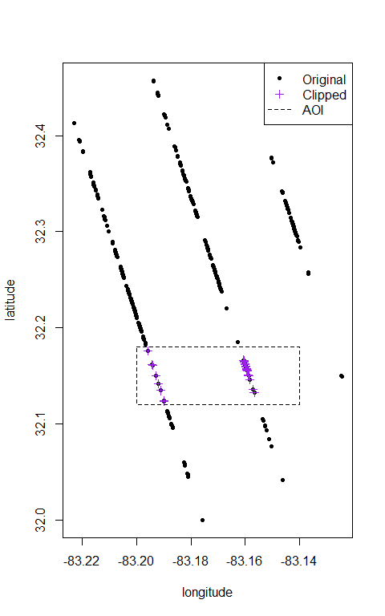
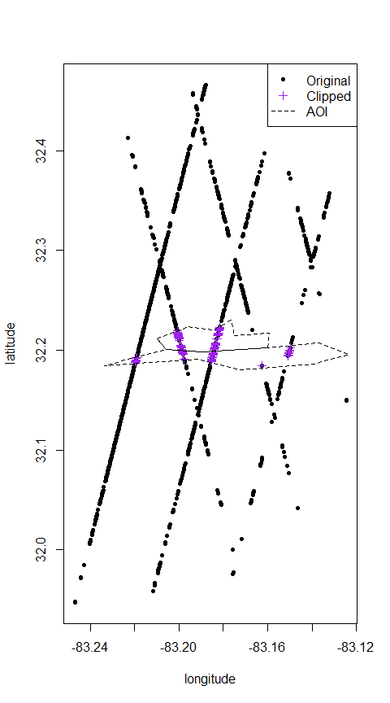
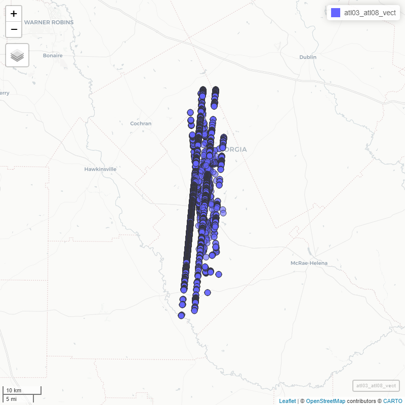
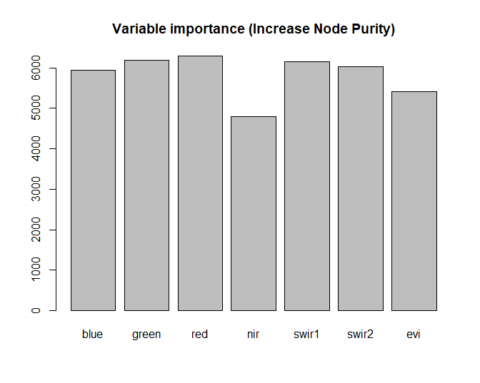
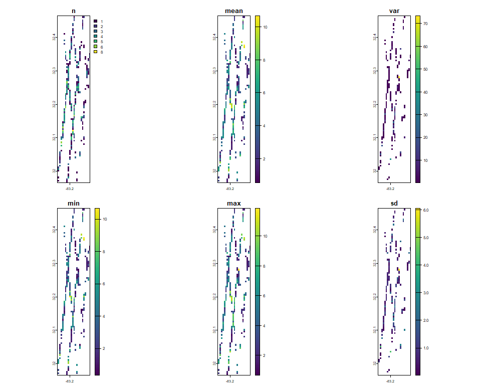

<br/>
[](https://github.com/carlos-alberto-silva/ICESat2VegR/actions/workflows/rhub.yaml)
[](https://cran.r-project.org/package=ICESat2VegR)


**ICESat2VegR: An R Package for NASA’s Ice, Cloud, and Elevation
Satellite (ICESat-2) Data Processing and Visualization for Land and
Vegetation Applications.**

Authors: Carlos Alberto Silva and Caio Hamamura

The ICESat2VegR package provides functions for downloading, reading,
visualizing, processing and exporting NASA’s ICESat-2 ATL03 (Global
Geolocated Photon Data) and ATL08 (Land and Vegetation Height) products
for Land and Vegetation Applications in R environment.

# Getting started

Install dependency for rasterizing functions:

    ## Installing package into 'C:/Users/caiohamamura/AppData/Local/Temp/RtmpQZgPvD/temp_libpath8041c7932b0'
    ## (as 'lib' is unspecified)

    ## package 'gdalBindings' successfully unpacked and MD5 sums checked
    ## 
    ## The downloaded binary packages are in
    ##  C:\Users\caiohamamura\AppData\Local\Temp\RtmpUvaE2c\downloaded_packages

``` r
# The r-universe version (recommended for the latest version)
install.packages("ICESat2VegR", , repos = c("https://caiohamamura.r-universe.dev", "https://cloud.r-project.org"))

# The CRAN version
install.packages("ICESat2VegR")
```

## Load the package

``` r
library(ICESat2VegR)
```

## Configuring the package

This package uses three Python packages through `reticulate`:

1.  [earthaccess](https://github.com/nsidc/earthaccess): allows reading
    directly from the cloud
2.  [h5py](https://github.com/h5py/h5py): for reading hdf5 content from
    the cloud
3.  [earthengine-api](https://github.com/google/earthengine-api):
    integration with Google Earth Engine for sampling and extracting
    raster data and upscalling models.

For configuring the package you can use:

``` r
ICESat2VegR_configure()
```

This will install miniconda if not available and the necessary packages.

### Notes

- There are some issues regarding some Python packages not being
  compatible with the Python version. The above configure function will
  also try to update python version in that case.
- The configure function may warn you about the need to restart R after
  installing some packages, restart if needed.

## Introduction

There are two different ways of working with the ICESat-2 data. Locally
or using cloud computing. Common users should work locally, unless they
are working within an AWS cloud computing within zone us-west-2.

## Opening the example dataset

As we will be working with multiple h5 granules, we will be using
`lapply` for reading and extracting information from the granules.

If you are working with a single granule you can execute the simpler
instructions without `lapply` as per the function documentation examples
instead.

``` r
# Load the ICESat2VegR package
library(ICESat2VegR)

# Set output directory
outdir <- tempdir()

# Download example dataset
ATLAS_dataDownload(
  "https://github.com/carlos-alberto-silva/ICESat2VegR/releases/download/example_datasets/Study_Site.zip",
  outdir
)
# Unzip the example dataset
unzip(file.path(outdir, "Study_Site.zip"), exdir = outdir)
```

## Search parameters

``` r
# Specifying bounding box coordinates
lower_left_lon <- -96.0
lower_left_lat <- 40.0
upper_right_lon <- -100
upper_right_lat <- 42.0


# Specifying the date range
daterange <- c("2021-10-02", "2021-10-03")
```

## Working locally

First we need to find the granules:

``` r
atl03_granules_local <- ATLAS_dataFinder(
  short_name = "ATL03",
  lower_left_lon,
  lower_left_lat,
  upper_right_lon,
  upper_right_lat,
  version = "006",
  daterange = daterange,
  persist = TRUE,
  cloud_computing = FALSE
)

head(atl03_granules_local)
```

    ##      C2596864127-NSIDC_CPRD                                                                                                                      
    ## [1,] "https://data.nsidc.earthdatacloud.nasa.gov/nsidc-cumulus-prod-protected/ATLAS/ATL03/006/2021/10/02/ATL03_20211002001658_01461302_006_01.h5"
    ## [2,] "https://data.nsidc.earthdatacloud.nasa.gov/nsidc-cumulus-prod-protected/ATLAS/ATL03/006/2021/10/02/ATL03_20211002004127_01461306_006_01.h5"
    ## [3,] "https://data.nsidc.earthdatacloud.nasa.gov/nsidc-cumulus-prod-protected/ATLAS/ATL03/006/2021/10/02/ATL03_20211002015115_01471302_006_01.h5"
    ## [4,] "https://data.nsidc.earthdatacloud.nasa.gov/nsidc-cumulus-prod-protected/ATLAS/ATL03/006/2021/10/02/ATL03_20211002021545_01471306_006_01.h5"
    ## [5,] "https://data.nsidc.earthdatacloud.nasa.gov/nsidc-cumulus-prod-protected/ATLAS/ATL03/006/2021/10/02/ATL03_20211002032533_01481302_006_01.h5"
    ## [6,] "https://data.nsidc.earthdatacloud.nasa.gov/nsidc-cumulus-prod-protected/ATLAS/ATL03/006/2021/10/02/ATL03_20211002035002_01481306_006_01.h5"

Now we download the granules:

``` r
# Download all granules
ATLAS_dataDownload(atl03_granules_local, outdir)
```

And then we can open and work with them

``` r
## ATL03
# Read the granules
atl03_files <- list.files(outdir, "ATL03.*h5", full.names = TRUE)
atl03_h5 <- lapply(atl03_files, ATL03_read)


## ATL08
# Read the granules
atl08_files <- list.files(outdir, "ATL08.*h5", full.names = TRUE)
atl08_h5 <- lapply(atl08_files, ATL08_read)

# List groups within first file of atl08_h5
atl08_h5[[1]]$ls()
```

    ## [1] "METADATA"           "ancillary_data"     "gt1r"              
    ## [4] "gt2r"               "gt3r"               "orbit_info"        
    ## [7] "quality_assessment"

## Working in the cloud

``` r
atl03_granules_cloud <- ATLAS_dataFinder(
  short_name = "ATL03",
  lower_left_lon,
  lower_left_lat,
  upper_right_lon,
  upper_right_lat,
  version = "006",
  daterange = daterange,
  persist = TRUE,
  cloud_computing = TRUE
)
```

In cloud computing you don’t need to download data, instead you can read
the data and start working with it.

``` r
# Read the granule (the ATL03_read can only read one granule per read)
atl03_h5_cloud <- ATL03_read(atl03_granules_cloud[1])

# List groups within the h5 in cloud
atl03_h5_cloud$beams
```

``` r
## gt1l gt1r gt2l gt2r gt3l gt3r
```

``` r
close(atl03_h5_cloud)
```

# Working with segments attributes form ATL03 and ATL08

## Extract attributes

``` r
# ATL03 seg attributes
atl03_seg_att_ls <- lapply(
  atl03_h5,
  ATL03_seg_attributes_dt,
  attributes = c("delta_time", "solar_elevation", "pitch", "h_ph", "ref_elev")
)
atl03_seg_dt <- rbindlist2(atl03_seg_att_ls)

# Remove segments above 20km
atl03_seg_dt <- atl03_seg_dt[h_ph < 20000]

head(atl03_seg_dt)
```

| delta_time | solar_elevation |      pitch |     h_ph | ref_elev | reference_photon_lon | reference_photon_lat | beam | strong_beam |
|-----------:|----------------:|-----------:|---------:|---------:|---------------------:|---------------------:|:-----|:------------|
|   40393396 |        15.39806 | -0.1688279 | 253.2678 | 1.564179 |            -83.17184 |             31.96591 | gt1r | TRUE        |
|   40393396 |        15.39806 | -0.1688280 | 268.9599 | 1.564179 |            -83.17186 |             31.96609 | gt1r | TRUE        |
|   40393396 |        15.39806 | -0.1688281 | 355.6263 | 1.564179 |            -83.17188 |             31.96627 | gt1r | TRUE        |
|   40393396 |        15.39806 | -0.1688282 | 276.9350 | 1.564180 |            -83.17190 |             31.96645 | gt1r | TRUE        |
|   40393396 |        15.39805 | -0.1688282 | 359.7021 | 1.564180 |            -83.17192 |             31.96663 | gt1r | TRUE        |
|   40393396 |        15.39805 | -0.1688283 | 292.5831 | 1.564180 |            -83.17194 |             31.96681 | gt1r | TRUE        |

``` r
# ATL08 seg attributes
atl08_seg_att_ls <- lapply(
  atl08_h5,
  ATL08_seg_attributes_dt,
  attributes = c("h_canopy", "h_te_mean", "terrain_slope", "canopy_openness", "night_flag")
)
atl08_seg_dt <- rbindlist2(atl08_seg_att_ls)

# Consider only segment with h_canopy < 100 and terrain height < 20000
atl08_seg_dt <- atl08_seg_dt[h_canopy < 100 & h_te_mean < 20000]

head(atl08_seg_dt)
```

| latitude | longitude | beam | strong_beam |  h_canopy | h_te_mean | terrain_slope | canopy_openness | night_flag |
|---------:|----------:|:-----|:------------|----------:|----------:|--------------:|----------------:|-----------:|
| 32.04510 | -83.18090 | gt1r | TRUE        | 13.640770 |  47.51598 |     0.0830011 |        3.445780 |          0 |
| 32.04690 | -83.18111 | gt1r | TRUE        | 11.407394 |  44.67390 |    -0.0053365 |        2.606891 |          0 |
| 32.09549 | -83.18666 | gt1r | TRUE        | 10.392395 |  65.23853 |     0.0053522 |        2.132361 |          0 |
| 32.09639 | -83.18677 | gt1r | TRUE        | 10.364945 |  65.63503 |     0.0097772 |        3.251597 |          0 |
| 32.10629 | -83.18790 | gt1r | TRUE        | 14.952076 |  58.39679 |     0.0042360 |        4.113675 |          0 |
| 32.10719 | -83.18800 | gt1r | TRUE        |  9.288475 |  59.01027 |     0.0017870 |        3.213291 |          0 |

### Plot histograms:

``` r
layout(t(1:2))

# ATL03 height histogram
hist(atl03_seg_dt$h_ph, col = "#bd8421", xlab = "Elevation (m)", main = "ATL03 h_ph")
hist(atl08_seg_dt$h_canopy, col = "green", xlab = "Height (m)", main = "ATL08 h_canopy")
```

<div align="center">

<div class="figure" style="text-align: center">


<p class="caption">
Histograms for ATL03 elevation and ATL08 h_canopy
</p>

</div>

</div>

## Export to vector

The function `to_vect()` will return a `terra::vect` object.

``` r
library(terra)

blueYellowRed <- function(n) grDevices::hcl.colors(n, "RdYlBu")

set.seed(123)
mask <- sample(seq_len(nrow(atl03_seg_dt)), 50)
atl03_seg_vect <- to_vect(atl03_seg_dt)

# Plot with terra::plet
mapview::mapView(
  atl03_seg_vect[mask],
  zcol = "h_ph",
  layer.name = "h_ph",
  breaks = 3,
  col.regions = blueYellowRed,
  map.types = c("Esri.WorldImagery")
)
```

<div align="center">


</div>

``` r
# Extract vector from atl08_seg_dt
atl08_seg_vect <- to_vect(atl08_seg_dt)

# Palette function
greenYellowRed <- function(n) {
  grDevices::hcl.colors(n, "RdYlGn")
}

# Plot with mapview
map_vect <- mapview::mapView(
  atl08_seg_vect,
  layer.name = "h_canopy",
  zcol = "h_canopy",
  col.regions = greenYellowRed,
  map.types = c("Esri.WorldImagery")
)

map_vect
```

<div align="center">


</div>

Save vector as geopackage file. The formats supported are as from GDAL
terra package.

``` r
terra::writeVector(atl03_seg_vect, file.path(outdir, "atl03_seg.gpkg"))
terra::writeVector(atl08_seg_vect, file.path(outdir, "atl08_seg.gpkg"))
```

## View ATL08 segments as raster

Single max_h_canopy:

``` r
redYellowGreen <- function(n) grDevices::hcl.colors(n, "RdYlGn")
max_h_canopy <- ATL08_seg_attributes_dt_gridStat(atl08_seg_dt, func = max(h_canopy), res = 0.01)

mapview::mapView(
  max_h_canopy,
  map = map_vect,
  col.regions = redYellowGreen
)
```

<div align="center">


</div>

### Multiple data:

``` r
multiple_data <- ATL08_seg_attributes_dt_gridStat(atl08_seg_dt, func = list(
  max_h_canopy = max(h_canopy),
  min_h_canopy = min(h_canopy),
  mean_canopy_openness = mean(canopy_openness),
  mean_h_te_mean = mean(h_te_mean)
), res = 0.01)

map_vect_openness <- mapview::mapView(
  atl08_seg_vect,
  zcol = "canopy_openness",
  layer.name = "canopy_openness",
  col.regions = redYellowGreen,
  map.types = c("Esri.WorldImagery")
)

blueYellowRed <- function(n) grDevices::hcl.colors(n, "RdYlBu", rev = TRUE)

map_vect_terrain <- mapview::mapView(
  atl08_seg_vect,
  zcol = "h_te_mean",
  layer.name = "h_te_mean",
  col.regions = blueYellowRed,
  map.types = c("Esri.WorldImagery")
)


m1 <- mapview::mapView(multiple_data[[1]], layer.name = "Max h_canopy", map = map_vect, col.regions = redYellowGreen)
m2 <- mapview::mapView(multiple_data[[2]], layer.name = "Min h_canopy", map = map_vect, col.regions = redYellowGreen)
m3 <- mapview::mapView(multiple_data[[3]], layer.name = "Mean canopy openness", map = map_vect_openness, col.regions = redYellowGreen)
m4 <- mapview::mapView(multiple_data[[4]], layer.name = "Mean h_te_mean", col.regions = blueYellowRed, map = map_vect_terrain)

leafsync::sync(m1, m2, m3, m4)
```

<div align="center" style="width:100%;">

<figure>

<figcaption aria-hidden="true">multi</figcaption>
</figure>

</div>

# Clipping ATL03 and ATL08 data

## Introduction

Now we will use the clipping functions. There are two ways of clipping
data in ICESat2VegR:

1.  Clipping raw hdf5 data from ATL03 and ATL08 files
2.  Clipping extracted attributes resulting from extraction functions: -
    `ATL03_seg_attributes_dt` - `ATL03_photon_attributes_dt` -
    `ATL08_seg_attributes_dt` - `ATL03_ATL08_photons_attributes_dt_join`

The second method is preffered as it is faster and more efficient
because it does not require reading the hdf5 and will clip only the
subset of extracted attributes, while hdf5 has a lot of attributes that
might not be needed.

There are multiple variants using either the bounding box or the geomtry
to clip the data suffixed with \_clipBox or \_clipGeometry:

1.  `ATL03_h5_clipBox`
2.  `ATL03_h5_clipGeometry`
3.  `ATL03_seg_attributes_dt_clipBox`
4.  `ATL03_seg_attributes_dt_clipGeometry`
5.  `ATL03_photon_attributes_dt_clipBox`
6.  `ATL03_photon_attributes_dt_clipGeometry`
7.  `ATL08_h5_clipBox`
8.  `ATL08_h5_clipGeometry`
9.  `ATL08_seg_attributes_dt_clipBox`
10. `ATL08_seg_attributes_dt_clipGeometry`
11. `ATL03_ATL08_photons_attributes_dt_join_clipBox`
12. `ATL03_ATL08_photons_attributes_dt_join_clipGeometry`

In the following two sections there are two small examples on how to
clip the raw HDF5 and the extracted attributes.

## Clipping raw hdf5 data from ATL08

``` r
# Define bbox
clip_region <- terra::ext(-83.2, -83.14, 32.12, 32.18)

# Define hdf5 output file
output <- tempfile(fileext = ".h5")

# Clip the data for only the first atl08 file
atl08_clipped <- ATL08_h5_clipBox(atl08_h5[[1]], output, bbox = clip_region)

atl08_seg_dt <- ATL08_seg_attributes_dt(atl08_h5[[1]], attributes = c("h_canopy"))
atl08_seg_dt_clip <- ATL08_seg_attributes_dt(atl08_clipped, attributes = c("h_canopy"))

# Display location of clipped data
plot(
  atl08_seg_dt$longitude,
  atl08_seg_dt$latitude,
  pch = 20,
  xlab = "longitude",
  ylab = "latitude"
)
points(atl08_seg_dt_clip$longitude, atl08_seg_dt_clip$latitude, col = "purple", pch = 3, cex = 1)
rect(clip_region$xmin, clip_region$ymin, clip_region$xmax, clip_region$ymax, lty = 2)

legend(col = c("black", "purple", "black"), legend = c("Original", "Clipped", "AOI"), pch = c(20, 3, NA), lty = c(NA, NA, 2), cex = 1, x = "topright")
```



## Clipping extracted attributes from ATL08 segments data

``` r
aoi <- file.path(outdir, "example_aoi.gpkg")
aoi_vect <- terra::vect(aoi)

# Extract the h_canopy attribute from the first ATL08 file
atl08_seg_dt <- lapply(atl08_h5, ATL08_seg_attributes_dt, attributes = c("h_canopy"))
atl08_seg_dt <- rbindlist2(atl08_seg_dt)

# Clip the data for only the first atl08 file
atl08_seg_dt_clip <- ATL08_seg_attributes_dt_clipGeometry(atl08_seg_dt, aoi_vect)

plot(
  atl08_seg_dt$longitude,
  atl08_seg_dt$latitude,
  pch = 20,
  xlab = "longitude",
  ylab = "latitude"
)
points(atl08_seg_dt_clip$longitude, atl08_seg_dt_clip$latitude, col = "purple", pch = 3, cex = 1)
aoi_geom <- terra::geom(aoi_vect)
polygon(aoi_geom[,"x"], aoi_geom[,"y"], lty = 2)
legend(col = c("black", "purple", "black"), legend = c("Original", "Clipped", "AOI"), pch = c(20, 3, NA), lty = c(NA, NA, 2), cex = 1, x = "topright")
```



# Joining ATL03 and ATL08 data

## Extract attributes

``` r
# Herein as we are working with list of h5 files we will need
# to loop over each file and extract the attributes and then
# concatenate them with rbindlist2
atl03_atl08_dts <- list()

for (ii in seq_along(atl03_h5)) {
  atl03_file <- atl03_h5[[ii]]
  atl08_file <- atl08_h5[[ii]]

  atl03_atl08_dts[[ii]] <- ATL03_ATL08_photons_attributes_dt_join(
    atl03_file,
    atl08_file
  )
}

atl03_atl08_dt <- rbindlist2(atl03_atl08_dts)

head(atl03_atl08_dt)
```

<div align="center" style="overflow-x: scroll;">

| ph_segment_id |    lon_ph |   lat_ph |     h_ph | quality_ph | solar_elevation | dist_ph_along | dist_ph_across | night_flag | classed_pc_indx | classed_pc_flag |       ph_h | d_flag | delta_time | orbit_number | beam | strong_beam |
|--------------:|----------:|---------:|---------:|-----------:|----------------:|--------------:|---------------:|-----------:|----------------:|----------------:|-----------:|-------:|-----------:|-------------:|:-----|:------------|
|        177488 | -83.17570 | 31.99959 | 44.61499 |          0 |        15.39738 |      3762.072 |       3169.208 |          0 |              44 |               2 |  4.3425255 |      1 |   40393396 |         3208 | gt1r | TRUE        |
|        177488 | -83.17570 | 31.99959 | 48.81370 |          0 |        15.39738 |      3762.074 |       3169.180 |          0 |              45 |               3 |  8.6167412 |      1 |   40393396 |         3208 | gt1r | TRUE        |
|        177488 | -83.17571 | 31.99962 | 43.38353 |          0 |        15.39738 |      3765.626 |       3169.205 |          0 |              49 |               2 |  3.2494583 |      1 |   40393396 |         3208 | gt1r | TRUE        |
|        177488 | -83.17571 | 31.99964 | 48.24021 |          0 |        15.39738 |      3767.768 |       3169.175 |          0 |              56 |               3 |  8.1592712 |      1 |   40393396 |         3208 | gt1r | TRUE        |
|        177488 | -83.17571 | 31.99964 | 56.24585 |          0 |        15.39738 |      3767.773 |       3169.122 |          0 |              57 |               3 | 16.2089348 |      1 |   40393396 |         3208 | gt1r | TRUE        |
|        177488 | -83.17571 | 31.99965 | 40.30040 |          0 |        15.39738 |      3769.191 |       3169.229 |          0 |              62 |               1 |  0.2985229 |      1 |   40393396 |         3208 | gt1r | TRUE        |

</div>

## Plotting the result:

``` r
oldpar <- par(no.readonly = TRUE)
par(oma = c(0, 0, 0, 0))
par(mar = c(2, 3, 1, 1))
layout(matrix(c(1, 2), ncol = 1))
plot(
  atl03_atl08_dt[orbit_number == 3208],
  y = "h_ph",
  colors = c("gray", "#bd8421", "forestgreen", "green"),
  xlim = c(25500, 28500),
  beam = "gt2r",
  cex = 0.5,
  pch = 16
)

par(mar = c(3, 3, 1, 1))

plot(
  atl03_atl08_dt[orbit_number == 3208],
  y = "ph_h",
  colors = c("gray", "#bd8421", "forestgreen", "green"),
  xlim = c(25500, 28500),
  beam = "gt2r",
  cex = 0.5,
  pch = 16,
  legend = FALSE
)

par(
  oldpar
)
```

<div align="center">

<div class="figure" style="text-align: center">


<p class="caption">
Classified ATL03 photons using ATL08 labels
</p>

</div>

</div>

## Calculating raster statistics

``` r
h_canopy <- ATL03_ATL08_photons_attributes_dt_gridStat(
  atl03_atl08_dt[ph_h < 50 & ph_h > 0],
  func = list(
    h_canopy = quantile(ph_h, 0.98),
    count = .N
  ),
  res = 0.01
)

plot(h_canopy,
  col = viridis::inferno(100),
  xlab = "Langitude (degree)",
  ylab = "Latitude (degree)",
  ylim = c(32.1, 32.4)
)
```

<div align="center">

<div class="figure" style="text-align: center">


<p class="caption">
Rasterized ATL03_ATL08 data for canopy height (h_canopy) and number of
photons (n)
</p>

</div>

</div>

# Calculating ATL08 metrics for different size segments other than 100m and 20m

## Introduction

In this section, we will demonstrate how to use the
`ATL03_ATL08_segment_create` function from the `ICESat2VegR` package.
This function is used to compute segment IDs for ICESat-2 `ATL03` and
`ATL08` data and create segments based on a specified segment length.

``` r
# Herein as we are working with list of h5 files we will need
# to loop over each file and extract the attributes and then
# concatenate them with rbindlist2
atl03_atl08_dts <- list()

for (ii in seq_along(atl03_h5)) {
  atl03_file <- atl03_h5[[ii]]
  atl08_file <- atl08_h5[[ii]]

  atl03_atl08_dts[[ii]] <- ATL03_ATL08_photons_attributes_dt_join(
    atl03_file,
    atl08_file
  )
}

atl03_atl08_dt <- rbindlist2(atl03_atl08_dts)

head(atl03_atl08_dt)
```

## Create Segments IDs

Now, we use the `ATL03_ATL08_segment_create` function to create segments
with a specified segment length.

``` r
atl03_atl08_photons_grouped_dt <- ATL03_ATL08_segment_create(atl03_atl08_dt,
  segment_length = 30,
  centroid = "mean",
  output = NA,
  overwrite = FALSE
)
```

## Compute Segment Statistics

``` r
atl03_atl08_seg_dt <- ATL03_ATL08_compute_seg_attributes_dt_segStat(
  atl03_atl08_photons_grouped_dt,
  list(
    h_canopy_ge0 = quantile(ph_h, 0.98),
    h_canopy_gt0 = quantile(ph_h[ph_h > 0], 0.98),
    n_ground = sum(classed_pc_flag == 1),
    n_mid_canopy = sum(classed_pc_flag == 2),
    n_top_canopy = sum(classed_pc_flag == 3),
    n_canopy_total = sum(classed_pc_flag >= 2)
  ),
  ph_class = c(1, 2, 3)
)

head(atl03_atl08_seg_dt)
```

<div align="center" style="overflow-x: scroll;">

| segment_id | beam | longitude | latitude | h_canopy_ge0 | h_canopy_gt0 | n_ground | n_mid_canopy | n_top_canopy | n_canopy_total |
|-----------:|:-----|----------:|---------:|-------------:|-------------:|---------:|-------------:|-------------:|---------------:|
|        126 | gt1r | -83.17571 | 31.99965 |    15.611358 |    15.611358 |        1 |            7 |            3 |             10 |
|        127 | gt1r | -83.17574 | 31.99986 |    18.311493 |    18.311493 |        1 |           12 |            1 |             13 |
|        128 | gt1r | -83.17577 | 32.00011 |    12.236551 |    12.236551 |        1 |            8 |            0 |              8 |
|        293 | gt1r | -83.18086 | 32.04469 |     3.518969 |     3.518969 |        0 |            1 |            5 |              6 |
|        294 | gt1r | -83.18087 | 32.04482 |     5.167805 |     5.167805 |        7 |            4 |            2 |              6 |
|        295 | gt1r | -83.18091 | 32.04511 |    12.113018 |    12.258518 |       12 |           10 |            0 |             10 |

</div>

## Convert to SpatVector

Now, we convert the data.table to a SpatVector object.

``` r
atl03_atl08_vect <- to_vect(atl03_atl08_seg_dt)
```

## Visualize the segments

Finally, we visualize the SpatVector interactively using mapview.

``` r
mapview::mapview(atl03_atl08_vect)
```

<div align="center">



</div>

# Upscalling ATL08 h_canopy data using Harmonized Landsat-Sentinel-2 (HLS) data

## Introduction

In this example we will model the `h_canopy` of the ICESat-2 using only
the Harmonized Landsat Sentinel-2 dataset (hls).

## Initialize Google Earth Engine API

``` r
ee_initialize()
```

## Extract ATL08 segment attributes h_canopy attribute

``` r
atl08_seg_dt <- lapply(atl08_h5, ATL08_seg_attributes_dt, attribute = "h_canopy")

atl08_seg_dt <- rbindlist2(atl08_seg_dt)

# Remove h_canopy values that are above 100m
atl08_seg_dt <- atl08_seg_dt[h_canopy < 100]

head(atl08_seg_dt)
```

latitude longitude beam strong_beam h_canopy <num> <num> <char> <lgcl>
<num> 1: 31.99992 -83.17574 gt1r TRUE 19.86016 2: 32.04510 -83.18090
gt1r TRUE 13.64077 3: 32.04600 -83.18101 gt1r TRUE 10.72907 4: 32.04690
-83.18111 gt1r TRUE 11.40739 5: 32.05770 -83.18234 gt1r TRUE 12.93657 6:
32.09549 -83.18666 gt1r TRUE 10.39240

### Visualizing the ‘h_canopy’ for the ATL08 dataset.

``` r
library(terra)

atl08_seg_vect <- to_vect(atl08_seg_dt)
terra::plet(atl08_seg_vect, "h_canopy", col = grDevices::hcl.colors(9, "RdYlGn"), tiles = c("Esri.WorldImagery"))
```

<div align="center" style="display:flex;justify-content:center">


</div>

### Querying the GEEs datasets for Harmonized Landsat Sentinel-2

``` r
hls_search <- search_datasets("Harmonized", "Landsat")
hls_search
```

    ##                      id
    ##                  <char>
    ## 1: NASA_HLS_HLSL30_v002
    ##                                                                                                    title
    ##                                                                                                   <char>
    ## 1: HLSL30: HLS-2 Landsat Operational Land Imager Surface Reflectance and TOA Brightness Daily Global 30m
    ##                                                                                                                                                                                                                                                                                                                          description
    ##                                                                                                                                                                                                                                                                                                                               <char>
    ## 1: The Harmonized Landsat Sentinel-2 (HLS) project provides consistent surface reflectance (SR) and top of atmosphere (TOA) brightness data from a virtual constellation of satellite sensors. The Operational Land Imager (OLI) is housed aboard the joint NASA/USGS Landsat 8 and Landsat 9 satellites, while the Multi-Spectral …

``` r
hls_id <- get_catalog_id(hls_search$id)
hls_id
```

    ## [1] "NASA/HLS/HLSL30/v002"

### Open the Google Earth Engine HLS catalog and get band names

``` r
hls_collection <- ee$ImageCollection(hls_id)
names(hls_collection)
```

    ##  [1] "B1"    "B2"    "B3"    "B4"    "B5"    "B6"    "B7"    "B9"    "B10"  
    ## [10] "B11"   "Fmask" "SZA"   "SAA"   "VZA"   "VAA"

### Define area of interest (aoi) clip boundaries and time and cloud mask for filtering.

``` r
bbox <- terra::ext(atl08_seg_vect)

aoi <- ee$Geometry$BBox(
  west = bbox$xmin,
  south = bbox$ymin,
  east = bbox$xmax,
  north = bbox$ymax
)

hls <- hls_collection$
  filterDate("2019-04-01", "2019-05-31")$
  filterBounds(aoi)$
  map(function(x) x$updateMask(!(x[["Fmask"]] & 14)))$
  median()


hls_unmasked <- hls_collection$
  filterDate("2019-04-01", "2019-05-31")$
  filterBounds(aoi)$
  median()
```

### Calculate EVI:

``` r
# Rename bands
hls_unmasked <- hls_unmasked[["B2", "B3", "B4", "B5", "B6", "B7"]]
names(hls_unmasked) <- c("blue", "green", "red", "nir", "swir1", "swir2")

hls <- hls[["B2", "B3", "B4", "B5", "B6", "B7"]]
names(hls) <- c("blue", "green", "red", "nir", "swir1", "swir2")

# Add evi
nir <- hls[["nir"]]
red <- hls[["red"]]
blue <- hls[["blue"]]

hls[["evi"]] <- (2.5 * (nir - red)) / (nir + 6 * red - 7.5 * blue + 1)
print(hls)
```

    ## ee.image.Image
    ## 
    ## Bands
    ## [1] "blue"  "green" "red"   "nir"   "swir1" "swir2" "evi"

## Visualize the resulting image

``` r
library(leaflet)

forest_height_palette <- c("#ffffff", "#99cc99", "#006600", "#004d00")
palette_colors <- colorNumeric(forest_height_palette, range(atl08_seg_dt$h_canopy))(atl08_seg_dt[order(h_canopy), h_canopy])

centroid <- mean(bbox)
map <- leaflet::leaflet() |>
  addEEImage(hls, bands = list("red", "green", "blue"), group = "masked", max = 0.6) |>
  addEEImage(hls_unmasked, bands = list("red", "green", "blue"), group = "unmasked", max = 0.6) |>
  setView(lng = centroid[1], lat = centroid[2], zoom = 13) |>
  addLayersControl(
    baseGroups = c("unmasked", "masked"),
    options = layersControlOptions(collapsed = FALSE)
  )

map
```

<div align="center" style="display:flex;justify-content:center">


</div>

## Extracting GEE data for segments

For each segment extract the hls data:

``` r
extracted_dt <- seg_gee_ancillary_dt_extract(hls, atl08_seg_vect)
```

    ## Processing 1-706 of 706

``` r
head(extracted_dt)
```

| idx | beam | h_canopy | strong_beam |     red |   green |    blue |     nir |   swir1 |   swir2 |       evi |
|----:|:-----|---------:|:------------|--------:|--------:|--------:|--------:|--------:|--------:|----------:|
|   1 | gt1r | 19.86016 | TRUE        | 0.03160 | 0.05070 | 0.02625 | 0.33685 | 0.14700 | 0.06840 | 0.5739616 |
|   2 | gt1r | 13.64077 | TRUE        | 0.09290 | 0.08440 | 0.06130 | 0.26820 | 0.36780 | 0.22780 | 0.3208625 |
|   3 | gt1r | 10.72907 | TRUE        | 0.08360 | 0.07990 | 0.05880 | 0.28860 | 0.33700 | 0.20360 | 0.3798547 |
|   4 | gt1r | 11.40739 | TRUE        | 0.09980 | 0.08920 | 0.05230 | 0.28910 | 0.35340 | 0.22130 | 0.3164176 |
|   5 | gt1r | 12.93657 | TRUE        | 0.06630 | 0.07555 | 0.03915 | 0.35055 | 0.26600 | 0.15005 | 0.4884944 |
|   6 | gt1r | 10.39240 | TRUE        | 0.17975 | 0.14520 | 0.09220 | 0.29535 | 0.40075 | 0.31370 | 0.1717835 |

## Fit the randomForest model

``` r
bandNames <- names(hls)
x <- extracted_dt[, .SD, .SDcols = bandNames]
y <- extracted_dt[["h_canopy"]]

# Mask the NA values
na_mask <- y < 100

x <- x[na_mask]
y <- y[na_mask]

set.seed(1)

rf_model <- randomForest::randomForest(x, y, ntree = 300, mtry = 1)
print(rf_model)
```

    ## 
    ## Call:
    ##  randomForest(x = x, y = y, ntree = 300, mtry = 1) 
    ##                Type of random forest: regression
    ##                      Number of trees: 300
    ## No. of variables tried at each split: 1
    ## 
    ##           Mean of squared residuals: 53.50407
    ##                     % Var explained: 16.65

``` r
library(randomForest)

rf_importance <- importance(rf_model)
barplot(rf_importance[, "IncNodePurity"], main = "Variable importance (Increase Node Purity)")
```

<div align="center">

<div class="figure" style="text-align: center">


<p class="caption">
Random forests variable importance (increase node impurity).
</p>

</div>

</div>

## Apply the model to Google Earth Engine WorldImagery

``` r
gee_model <- build_ee_forest(rf_model)
result <- hls$classify(gee_model)
min_hcanopy <- min(atl08_seg_dt$h_canopy)
max_hcanopy <- 20
atl08_seg_vect$h_canopy <- round(atl08_seg_vect$h_canopy, 3) # Round off to 3 decimal places

map <- terra::plet(
  atl08_seg_vect,
  "h_canopy",
  palette_colors,
  tiles = ""
)

modelled_map <- terra::plet(
  atl08_seg_vect,
  "h_canopy",
  palette_colors,
  tiles = ""
) |>
  addEEImage(
    hls,
    bands = c("red", "green", "blue"),
    group = "hls",
    min = min_hcanopy,
    max = 0.6
  ) |>
  addEEImage(
    result,
    bands = "classification",
    group = "classification",
    min = min_hcanopy,
    max = max_hcanopy,
    palette = forest_height_palette
  ) |>
  leaflet::addLegend(
    pal = colorNumeric(forest_height_palette, seq(min_hcanopy, max_hcanopy)),
    values = seq(min_hcanopy, max_hcanopy, length = 3),
    opacity = 1,
    title = "h_canopy",
    position = "bottomleft",
  ) |>
  setView(lng = centroid[1], lat = centroid[2], zoom = 12) |>
  addLayersControl(
    overlayGroups = c("classification"),
    options = layersControlOptions(collapsed = FALSE)
  )

modelled_map
```

<div align="center" style="display:flex;justify-content:center">


</div>

# Predicting and rasterizing ATL08 h_canopy data using Machine Learning models

## Creating a simple model for ATL08 data

Here, we will create a simple model to predict the canopy openness of
ATL08 data based on the height of the canopy. We will use the
`randomForest` package to create the model.

Let’s assume we will fit the model on a subset of the ATL08 data and
then predict the canopy openness for the rest of the data.

``` r
# Extract atl08 data from the first file
atl08_seg_dt <- ATL08_seg_attributes_dt(atl08_h5[[1]], attributes = c("h_canopy", "canopy_openness"))

# Avoid the weird NA values
atl08_seg_dt[h_canopy > 100, h_canopy := NA_real_]
atl08_seg_dt[is.na(h_canopy), canopy_openness := NA_real_]
atl08_seg_dt <- na.omit(atl08_seg_dt)

training <- sample(atl08_seg_dt, method = randomSampling(0.7))

# For the sake of the example, we will train and test the model with the same data
library(randomForest)
model <- randomForest::randomForest(canopy_openness ~ h_canopy, atl08_seg_dt)
```

## Predicting ATL08 data

Now we will predict the data for the entire ATL08 dataset, this can be
as large as you want. This will create or append the predicted values to
an H5 file.

``` r
out_h5 <- tempfile(fileext = ".h5")

for (atl08_h5_item in atl08_h5) {
  atl08_seg_dt <- ATL08_seg_attributes_dt(atl08_h5_item, attributes = c("h_canopy", "canopy_openness"))
  atl08_seg_dt[h_canopy > 100, h_canopy := NA_real_]
  atl08_seg_dt[is.na(h_canopy), canopy_openness := NA_real_]
  atl08_seg_dt <- na.omit(atl08_seg_dt)
  predicted_h5 <- predict_h5(model, atl08_seg_dt, out_h5)
}
```

## Rasterizing the predicted data

``` r
output_raster <- tempfile(fileext = ".tif")
x <- predicted_h5[["longitude"]][]
y <- predicted_h5[["latitude"]][]
bbox <- terra::ext(min(x), max(x), min(y), max(y))

# Creates the raster with statistics
res <- 0.005
rasterize_h5(predicted_h5, output_raster, bbox = bbox, res = res)
```

    ## Warning in sqrt(variance/(n - 1)): NaNs produced

``` r
# Open the raster by file path
out_rast <- terra::rast(output_raster)
names(out_rast) <- c("n", "mean", "var", "min", "max", "sd")
terra::plot(out_rast)
```



## Close the files

Do not forget to close the files to properly release them.

``` r
lapply(atl03_h5, close)

## Non lapply single file
# close(atl03_h5)
```

``` r
lapply(atl08_h5, close)

## Non lapply single file
# close(atl08_h5)
```

# Acknowledgements

We gratefully acknowledge funding from NASA’s ICESat-2 (ICESat-2, grant
22-ICESat2_22-0006), Carbon Monitoring System (CMS, grant 22-CMS22-0015)
and Commercial Smallsat Data Scientific Analysis(CSDSA, grant
22-CSDSA22_2-0080).

# Reporting Issues

Please report any issue regarding the ICESat2VegR package to Dr. Silva
(<c.silva@ufl.edu>)

# Citing ICESat2VegR

Silva,C.A; Hamamura,C. ICESat2VegR: An R Package for NASA’s Ice, Cloud,
and Elevation Satellite (ICESat-2) Data Processing and Visualization for
Terrestrial Applications.version 0.0.1, accessed on November. 22 2023,
available at: <https://CRAN.R-project.org/package=ICESat2VegR>

# Disclaimer

**ICESat2VegR package comes with no guarantee, expressed or implied, and
the authors hold no responsibility for its use or reliability of its
outputs.**
