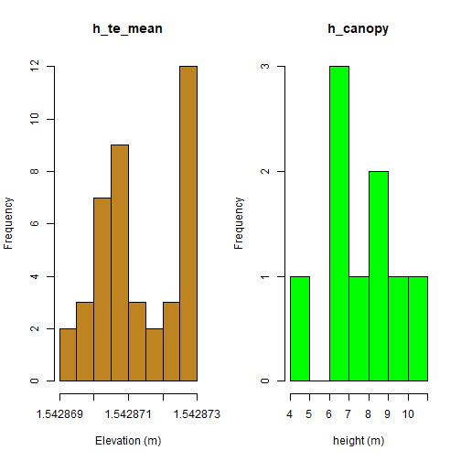
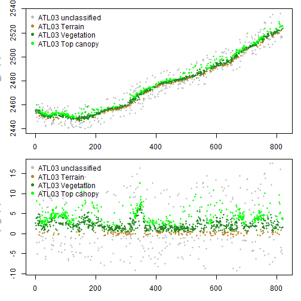
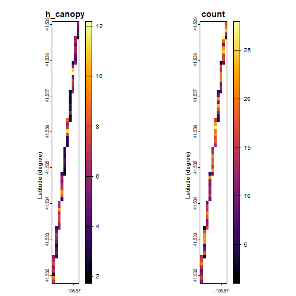
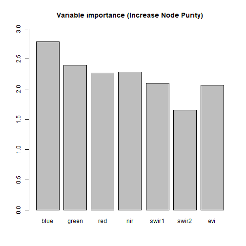

<br/>
[](https://github.com/carlos-alberto-silva/ICESat2VegR/actions/workflows/r.yml)
[](https://cran.r-project.org/package=ICESat2VegR)

 

[](https://travis-ci.com/carlos-alberto-silva/ICESat2VegR)

**ICESat2VegR: An R Package for NASA's Ice, Cloud, and Elevation Satellite (ICESat-2) Data Processing and Visualization for Land and Vegetation Applications.**

Authors: Carlos Alberto Silva and Caio Hamamura  

The ICESat2VegR package provides functions for downloading, reading, visualizing, processing and exporting 
NASA's ICESat-2 ATL03 (Global Geolocated Photon Data) and ATL08 (Land and Vegetation Height) 
products for Land and Vegetation Applications in R environment.

# Getting started


```r
# The CRAN version
install.packages("ICESat2VegR")

# Development version
remotes::install_github("https://github.com/carlos-alberto-silva/ICESat2VegR")
```


## Load the package


```r
library(ICESat2VegR)
```


## Configuring the package

This package uses three Python packages through `reticulate`:

1. [earthaccess](https://github.com/nsidc/earthaccess): allows reading directly from the cloud
2. [h5py](https://github.com/h5py/h5py): for reading hdf5 content from the cloud
3. [earthengine-api](https://github.com/google/earthengine-api): integration with Google Earth Engine for sampling and extracting raster data and upscalling models.

For configuring the package you can use:


```r
ICESat2VegR_configure()

```

This will install miniconda if not available and the necessary packages.

### Notes

 - There are some issues regarding some Python packages not being compatible with the Python version. The above configure function will also try to update python version in that case. 
 - The configure function will warn you about the need to restart R


## Introduction

There are two different ways of working with the ICESat-2 data. Locally or using cloud computing. Common users should work locally, unless they are working within an AWS cloud computing within zone us-west-2.


## Search parameters


```r
# Specifying bounding box coordinates
lower_left_lon <- -96.0
lower_left_lat <- 40.0
upper_right_lon <- -100
upper_right_lat <- 42.0


# Specifying the date range
daterange <- c("2021-10-02", "2021-10-03")
```

## Working locally

First we need to find the granules:


```r
atl03_granules_local <- ATLAS_dataFinder(
  short_name = "ATL03",
  lower_left_lon,
  lower_left_lat,
  upper_right_lon,
  upper_right_lat,
  version = "006",
  daterange = daterange,
  persist = TRUE,
  cloud_computing = FALSE
)

head(atl03_granules_local)
#>      C2596864127-NSIDC_CPRD                                                                                                                      
#> [1,] "https://data.nsidc.earthdatacloud.nasa.gov/nsidc-cumulus-prod-protected/ATLAS/ATL03/006/2021/10/02/ATL03_20211002001658_01461302_006_01.h5"
#> [2,] "https://data.nsidc.earthdatacloud.nasa.gov/nsidc-cumulus-prod-protected/ATLAS/ATL03/006/2021/10/02/ATL03_20211002004127_01461306_006_01.h5"
#> [3,] "https://data.nsidc.earthdatacloud.nasa.gov/nsidc-cumulus-prod-protected/ATLAS/ATL03/006/2021/10/02/ATL03_20211002015115_01471302_006_01.h5"
#> [4,] "https://data.nsidc.earthdatacloud.nasa.gov/nsidc-cumulus-prod-protected/ATLAS/ATL03/006/2021/10/02/ATL03_20211002021545_01471306_006_01.h5"
#> [5,] "https://data.nsidc.earthdatacloud.nasa.gov/nsidc-cumulus-prod-protected/ATLAS/ATL03/006/2021/10/02/ATL03_20211002032533_01481302_006_01.h5"
#> [6,] "https://data.nsidc.earthdatacloud.nasa.gov/nsidc-cumulus-prod-protected/ATLAS/ATL03/006/2021/10/02/ATL03_20211002035002_01481306_006_01.h5"
```

Now we download the granules:


```r
# Download all granules
ATLAS_dataDownload(atl03_granules_local, "/the/directory/to/save")
```

And then we can open and work with them


```r
# Read the granules
atl03_h5 <- ATL03_read("/the/directory/to/save/name_of_granule.h5")

# List groups within atl03_h5
atl03_h5$ls()
```


```
#> [1] "gt1r"       "orbit_info"
```

## Working in the cloud

```r
atl03_granules_cloud <- ATLAS_dataFinder(
  short_name = "ATL03",
  lower_left_lon,
  lower_left_lat,
  upper_right_lon,
  upper_right_lat,
  version = "006",
  daterange = daterange,
  persist = TRUE,
  cloud_computing = TRUE
)

head(atl03_granules_cloud)
#> Collection: {'EntryTitle': 'ATLAS/ICESat-2 L2A Global Geolocated Photon Data V006'}
#> Spatial coverage: {'HorizontalSpatialDomain': {'Geometry': {'GPolygons': [{'Boundary': {'Points': [{'Longitude': 167.89473, 'Latitude': 59.54564}, {'Longitude': 167.67404, 'Latitude': 59.53425}, {'Longitude': 167.81095, 'Latitude': 58.84718}, {'Longitude': 168.29123, 'Latitude': 56.32957}, {'Longitude': 168.82548, 'Latitude': 53.24275}, {'Longitude': 169.43429, 'Latitude': 49.36326}, {'Longitude': 169.987, 'Latitude': 45.51084}, {'Longitude': 170.50035, 'Latitude': 41.65845}, {'Longitude': 170.98695, 'Latitude': 37.77973}, {'Longitude': 171.54559, 'Latitude': 33.0688}, {'Longitude': 172.15242, 'Latitude': 27.69247}, {'Longitude': 172.23362, 'Latitude': 26.9541}, {'Longitude': 172.35961, 'Latitude': 26.96509}, {'Longitude': 172.27919, 'Latitude': 27.70353}, {'Longitude': 171.67947, 'Latitude': 33.08007}, {'Longitude': 171.12888, 'Latitude': 37.7909}, {'Longitude': 170.65047, 'Latitude': 41.66957}, {'Longitude': 170.14702, 'Latitude': 45.52198}, {'Longitude': 169.60642, 'Latitude': 49.37448}, {'Longitude': 169.01275, 'Latitude': 53.25412}, {'Longitude': 168.49331, 'Latitude': 56.34106}, {'Longitude': 168.02745, 'Latitude': 58.85889}, {'Longitude': 167.89473, 'Latitude': 59.54564}]}}]}}}
#> Temporal coverage: {'RangeDateTime': {'BeginningDateTime': '2021-10-02T00:16:58.259Z', 'EndingDateTime': '2021-10-02T00:25:28.858Z'}}
#> Size(MB): 1732.5397911071777
#> Data: ['https://data.nsidc.earthdatacloud.nasa.gov/nsidc-cumulus-prod-protected/ATLAS/ATL03/006/2021/10/02/ATL03_20211002001658_01461302_006_01.h5']
```

In cloud computing you don't need to download data, instead you can 
read the data and start working with it.


```r
# Read the granule (the ATL03_read can only read one granule per read)
atl03_h5 <- ATL03_read(atl03_granules_cloud[1])

# List groups within the h5 in cloud
atl03_h5$ls()
#>  [1] "METADATA"               "ancillary_data"         "atlas_impulse_response" "ds_surf_type"           "ds_xyz"                 "gt1l"                   "gt1r"                   "gt2l"                  
#>  [9] "gt2r"                   "gt3l"                   "gt3r"                   "orbit_info"             "quality_assessment"
```


```r
# Which are strong beams
print(atl03_h5$strong_beams)
#> [1] "gt1l" "gt2l" "gt3l"
```


```r
# Orientation 0=forward, 1=backwards, 2=transition
print(atl03_h5[["orbit_info/sc_orient"]][])
#> [1] 1
```


<style>
.html-widget {
    margin: auto;
}
</style>


## Extract attributes


```r
# ATL03 seg attributes
atl03_seg_dt <- ATL03_seg_attributes_dt(atl03_h5)

# ATL08 seg attributes
atl08_seg_dt <- ATL08_seg_attributes_dt(atl08_h5)

head(atl03_seg_dt)
head(atl08_seg_dt)
```


```r
# ATL03 seg attributes
atl03_seg_dt <- ATL03_seg_attributes_dt(atl03_h5)

# ATL08 seg attributes
atl08_seg_dt <- ATL08_seg_attributes_dt(atl08_h5)
```


```
#>    altitude_sc bounce_time_offset delta_time full_sat_fract near_sat_fract neutat_delay_derivative neutat_delay_total neutat_ht ph_index_beg       pitch podppd_flag range_bias_corr ref_azimuth ref_elev
#>          <num>              <num>      <num>          <num>          <num>                   <num>              <num>     <num>        <int>       <num>       <int>           <num>       <num>    <num>
#> 1:    487014.1        0.001616910  134086984              0     0.00000000           -0.0002238365           1.806910  2453.776            1 -0.03387016           0        3.935572   -1.612217 1.542873
#> 2:    487014.0        0.001616925  134086984              0     0.00000000           -0.0002239307           1.808016  2448.840          228 -0.03386863           0        3.935572   -1.612219 1.542873
#> 3:    487014.0        0.001616925  134086984              0     0.03571429           -0.0002239601           1.808378  2447.228          482 -0.03386715           0        3.935572   -1.612221 1.542873
#> 4:    487014.0        0.001616925  134086984              0     0.00000000           -0.0002239204           1.807897  2449.379          721 -0.03386567           0        3.935572   -1.612222 1.542873
#> 5:    487013.9        0.001616910  134086984              0     0.00000000           -0.0002238733           1.807353  2451.812          966 -0.03386413           0        3.935572   -1.612224 1.542873
#> 6:    487013.9        0.001616925  134086984              0     0.00000000           -0.0002239532           1.808296  2447.607         1229 -0.03386270           0        3.935572   -1.612226 1.542873
#>    reference_photon_index reference_photon_lat reference_photon_lon      roll segment_dist_x segment_id segment_length segment_ph_cnt sigma_across sigma_along   sigma_h sigma_lat    sigma_lon solar_azimuth
#>                     <int>                <num>                <num>     <num>          <num>      <int>          <num>          <int>        <num>       <num>     <num>     <num>        <num>         <num>
#> 1:                    100             41.53904            -106.5699 -1.138440       15447213     771236       20.04212            228            5           5 0.1437510   6.3e-05 4.830066e-05      243.1095
#> 2:                    124             41.53886            -106.5699 -1.138444       15447233     771237       20.04212            254            5           5 0.1437511   6.3e-05 4.830814e-05      243.1096
#> 3:                    118             41.53868            -106.5699 -1.138447       15447253     771238       20.04212            239            5           5 0.1437511   6.3e-05 4.831536e-05      243.1097
#> 4:                    133             41.53850            -106.5699 -1.138451       15447273     771239       20.04212            245            5           5 0.1437510   6.3e-05 4.832258e-05      243.1098
#> 5:                    144             41.53832            -106.5700 -1.138455       15447293     771240       20.04212            263            5           5 0.1437508   6.3e-05 4.833006e-05      243.1099
#> 6:                    121             41.53815            -106.5700 -1.138459       15447313     771241       20.04212            205            5           5 0.1437508   6.3e-05 4.833702e-05      243.1100
#>    solar_elevation tx_pulse_energy tx_pulse_skew_est tx_pulse_width_lower tx_pulse_width_upper      yaw   beam
#>              <num>           <num>             <num>                <num>                <num>    <num> <char>
#> 1:        33.53393    2.281639e-05      6.387678e-12         1.248990e-09         3.441356e-10 177.9055   gt1r
#> 2:        33.53402    2.281639e-05     -1.054574e-11         1.215642e-09         5.139665e-10 177.9055   gt1r
#> 3:        33.53411    2.281639e-05     -1.593324e-10         1.546297e-09         4.666480e-10 177.9055   gt1r
#> 4:        33.53419    2.281639e-05      1.270037e-11         1.331226e-09         3.778855e-10 177.9055   gt1r
#> 5:        33.53429    2.281639e-05      6.357746e-11         1.229747e-09         3.596123e-10 177.9055   gt1r
#> 6:        33.53437    2.281639e-05     -7.799637e-11         1.470383e-09         4.830605e-10 177.9055   gt1r
#>    latitude longitude   beam  h_canopy canopy_openness h_te_mean terrain_slope
#>       <num>     <num> <char>     <num>           <num>     <num>         <num>
#> 1: 41.53868 -106.5699   gt1r  6.623291       1.3961231  2448.891   -0.04105790
#> 2: 41.53778 -106.5700   gt1r 10.518555       2.0318608  2447.029    0.02563353
#> 3: 41.53689 -106.5701   gt1r  6.695557       1.2851287  2455.972    0.05849604
#> 4: 41.53599 -106.5703   gt1r  8.509766       2.2644644  2462.762    0.17064114
#> 5: 41.53509 -106.5704   gt1r  4.614258       0.9932709  2477.444    0.05844624
#> 6: 41.53419 -106.5705   gt1r  9.282227       2.1762936  2485.570    0.09301990
```

Plot histograms:


```r
layout(t(1:2))

# ATL03 height histogram
hist(atl03_seg_dt$ref_elev, col = "#bd8421", xlab = "Elevation (m)", main = "h_te_mean")

hist(atl08_seg_dt$h_canopy, col = "green", xlab = "height (m)", main = "h_canopy")
```

<div class="figure" style="text-align: center">

<p class="caption">plot of chunk unnamed-chunk-58</p>
</div>

## Export to vector
The function `to_vect()` will return a terra::vect object.


```r
library(terra)

atl03_seg_vect <- to_vect(atl03_seg_dt)

# Plot with terra::plet
terra::plet(
  atl03_seg_vect,
  "ref_elev",
  label = TRUE,
  breaks = 3,
  map = leaflet::leaflet() %>% leaflet::addProviderTiles("Esri.WorldImagery")
) |> leaflet::setView(zoom = 16, lat = 41.53545, lng = -106.5703)
#> Error in loadNamespace(name): there is no package called 'webshot'
```


```r
atl08_seg_vect <- to_vect(atl08_seg_dt)

# Plot with terra::plet
map_vect <- terra::plet(
  atl08_seg_vect,
  "h_canopy",
  col = grDevices::hcl.colors(100, "RdYlGn"),
  type = "interval",
  breaks = 3,
  tiles = c("Esri.WorldImagery"),
  label = TRUE
) |> leaflet::setView(zoom = 15, lat = 41.53545, lng = -106.5703)

map_vect
#> Error in loadNamespace(name): there is no package called 'webshot'
```

Save vector as geopackage file. The formats supported are as from GDAL terra package.


```r
terra::writeVector(atl03_seg_vect, "atl03_seg.gpkg")
terra::writeVector(atl08_seg_vect, "atl08_seg.gpkg")
```

## View ATL08 segments as raster

Single max_h_canopy:


```r
max_h_canopy <- ATL08_seg_attributes_dt_gridStat(atl08_seg_dt, func = max(h_canopy), res = 0.001)

terra::plet(max_h_canopy,
  main = "Max 'h_canopy'",
  map = map_vect
)
#> Error in loadNamespace(name): there is no package called 'webshot'
```

Multiple data:


```{.r style='display:inline-block;'}
multiple_data <- ATL08_seg_attributes_dt_gridStat(atl08_seg_dt, func = list(
  max_h_canopy = max(h_canopy),
  min_h_canopy = min(h_canopy),
  mean_canopy_openness = mean(canopy_openness),
  mean_h_te_mean = mean(h_te_mean)
), res = 0.002)

map_vect_openness <- terra::plet(
  atl08_seg_vect,
  "canopy_openness",
  col = grDevices::hcl.colors(100, "RdYlGn"),
  type = "interval",
  breaks = 3,
  tiles = c("Esri.WorldImagery"),
  label = TRUE
) |> leaflet::setView(zoom = 15, lat = 41.53545, lng = -106.5703)

map_vect_terrain <- terra::plet(
  atl08_seg_vect,
  "h_te_mean",
  col = grDevices::hcl.colors(100, "RdYlBu", rev = TRUE),
  type = "interval",
  breaks = 3,
  tiles = c("Esri.WorldImagery"),
  label = TRUE
) |> leaflet::setView(zoom = 15, lat = 41.53545, lng = -106.5703)


map1 <- terra::plet(multiple_data[[1]], legend = "bottomleft", map = map_vect)
map2 <- terra::plet(multiple_data[[2]], legend = "bottomleft", map = map_vect)
map3 <- terra::plet(multiple_data[[3]], legend = "bottomleft", map = map_vect_openness)
map4 <- terra::plet(multiple_data[[4]], col = grDevices::hcl.colors(100, "RdYlBu", rev = TRUE), legend = "bottomleft", map = map_vect_terrain)

if (require("leafsync") == TRUE) {
  sync(map1, map2, map3, map4)
}
```

<!--html_preserve--><div style="display:inline;width:49%;float:left;border-style:solid;border-color:#BEBEBE;border-width:1px 1px 1px 1px;">
<div class="leaflet html-widget html-fill-item" id="htmlwidget-7504" style="width:100%;height:400px;"></div>
<script type="application/json" data-for="htmlwidget-7504">{"x":{"options":{"crs":{"crsClass":"L.CRS.EPSG3857","code":null,"proj4def":null,"projectedBounds":null,"options":{}}},"calls":[{"method":"addProviderTiles","args":["Esri.WorldImagery",null,"Esri.WorldImagery",{"minZoom":0,"maxZoom":18,"tileSize":256,"subdomains":"abc","errorTileUrl":"","tms":false,"noWrap":false,"zoomOffset":0,"zoomReverse":false,"opacity":1,"zIndex":1,"detectRetina":false}]},{"method":"addCircleMarkers","args":[[41.5386848449707,41.53778457641602,41.53688812255859,41.53598785400391,41.53509140014648,41.5341911315918,41.53329467773438,41.53239440917969,41.53149795532227],[-106.5699081420898,-106.5700302124023,-106.5701446533203,-106.5702590942383,-106.5703811645508,-106.5704956054688,-106.5706176757812,-106.5707321166992,-106.5708541870117],1,null,"h_canopy",{"interactive":true,"className":"","stroke":true,"color":["#DC4A00","#338738","#E98E00","#AFD367","#A51122","#71AF45","#F1C363","#FAEDA9","#E6F09E"],"weight":5,"opacity":1,"fill":true,"fillColor":["#DC4A00","#338738","#E98E00","#AFD367","#A51122","#71AF45","#F1C363","#FAEDA9","#E6F09E"],"fillOpacity":0.2},null,null,["h_canopy: 6.623291015625","h_canopy: 10.5185546875","h_canopy: 6.695556640625","h_canopy: 8.509765625","h_canopy: 4.6142578125","h_canopy: 9.2822265625","h_canopy: 6.71435546875","h_canopy: 7.25732421875","h_canopy: 8.128173828125"],null,["6.623291015625","10.5185546875","6.695556640625","8.509765625","4.6142578125","9.2822265625","6.71435546875","7.25732421875","8.128173828125"],{"interactive":false,"permanent":false,"direction":"auto","opacity":1,"offset":[0,0],"textsize":"10px","textOnly":false,"className":"","sticky":true},null]},{"method":"addLayersControl","args":[[],"h_canopy",{"collapsed":false,"autoZIndex":true,"position":"topright"}]},{"method":"addLegend","args":[{"colors":["#A51122","#DC4A00","#E98E00","#F1C363","#FAEDA9","#E6F09E","#AFD367","#71AF45","#338738"],"labels":["4.6142578125","6.623291015625","6.695556640625","6.71435546875","7.25732421875","8.128173828125","8.509765625","9.2822265625","10.5185546875"],"na_color":null,"na_label":"NA","opacity":1,"position":"bottomright","type":"unknown","title":"h_canopy","extra":null,"layerId":null,"className":"info legend","group":null}]},{"method":"addRasterImage","args":["data:image/png;base64,iVBORw0KGgoAAAANSUhEUgAAAAEAAAAECAYAAABP2FU6AAAAHUlEQVQImWNgWMbwn+mdyGIGhmd3uf4zfPr06T8AUDkJ7mLWOckAAAAASUVORK5CYII=",[[41.53949795532226,-106.5708541870117],[41.53149795532226,-106.5688541870117]],0.8,null,null,null]},{"method":"addLegend","args":[{"colors":["#00A600 , #3ABA00 15.5551016239404%, #9CD500 36.4722704524563%, #E7C924 57.3894392809723%, #EDB387 78.3066081094883%, #F2EEEE 99.2237769380043%, #F2F2F2 "],"labels":["10.5","10.0","9.5","9.0","8.5"],"na_color":null,"na_label":"NA","opacity":1,"position":"bottomleft","type":"numeric","title":"max_h_canopy","extra":{"p_1":0.1555510162394035,"p_n":0.9922377693800429},"layerId":null,"className":"info legend","group":null}]}],"limits":{"lat":[41.53149795532226,41.53949795532226],"lng":[-106.5708541870117,-106.5688541870117]},"setView":[[41.53545,-106.5703],15,[]]},"evals":[],"jsHooks":[]}</script>
</div>
<div style="display:inline;width:49%;float:left;border-style:solid;border-color:#BEBEBE;border-width:1px 1px 1px 1px;">
<div class="leaflet html-widget html-fill-item" id="htmlwidget-1258" style="width:100%;height:400px;"></div>
<script type="application/json" data-for="htmlwidget-1258">{"x":{"options":{"crs":{"crsClass":"L.CRS.EPSG3857","code":null,"proj4def":null,"projectedBounds":null,"options":{}}},"calls":[{"method":"addProviderTiles","args":["Esri.WorldImagery",null,"Esri.WorldImagery",{"minZoom":0,"maxZoom":18,"tileSize":256,"subdomains":"abc","errorTileUrl":"","tms":false,"noWrap":false,"zoomOffset":0,"zoomReverse":false,"opacity":1,"zIndex":1,"detectRetina":false}]},{"method":"addCircleMarkers","args":[[41.5386848449707,41.53778457641602,41.53688812255859,41.53598785400391,41.53509140014648,41.5341911315918,41.53329467773438,41.53239440917969,41.53149795532227],[-106.5699081420898,-106.5700302124023,-106.5701446533203,-106.5702590942383,-106.5703811645508,-106.5704956054688,-106.5706176757812,-106.5707321166992,-106.5708541870117],1,null,"h_canopy",{"interactive":true,"className":"","stroke":true,"color":["#DC4A00","#338738","#E98E00","#AFD367","#A51122","#71AF45","#F1C363","#FAEDA9","#E6F09E"],"weight":5,"opacity":1,"fill":true,"fillColor":["#DC4A00","#338738","#E98E00","#AFD367","#A51122","#71AF45","#F1C363","#FAEDA9","#E6F09E"],"fillOpacity":0.2},null,null,["h_canopy: 6.623291015625","h_canopy: 10.5185546875","h_canopy: 6.695556640625","h_canopy: 8.509765625","h_canopy: 4.6142578125","h_canopy: 9.2822265625","h_canopy: 6.71435546875","h_canopy: 7.25732421875","h_canopy: 8.128173828125"],null,["6.623291015625","10.5185546875","6.695556640625","8.509765625","4.6142578125","9.2822265625","6.71435546875","7.25732421875","8.128173828125"],{"interactive":false,"permanent":false,"direction":"auto","opacity":1,"offset":[0,0],"textsize":"10px","textOnly":false,"className":"","sticky":true},null]},{"method":"addLayersControl","args":[[],"h_canopy",{"collapsed":false,"autoZIndex":true,"position":"topright"}]},{"method":"addLegend","args":[{"colors":["#A51122","#DC4A00","#E98E00","#F1C363","#FAEDA9","#E6F09E","#AFD367","#71AF45","#338738"],"labels":["4.6142578125","6.623291015625","6.695556640625","6.71435546875","7.25732421875","8.128173828125","8.509765625","9.2822265625","10.5185546875"],"na_color":null,"na_label":"NA","opacity":1,"position":"bottomright","type":"unknown","title":"h_canopy","extra":null,"layerId":null,"className":"info legend","group":null}]},{"method":"addRasterImage","args":["data:image/png;base64,iVBORw0KGgoAAAANSUhEUgAAAAEAAAAECAYAAABP2FU6AAAAHUlEQVQImWPgX83wn+nLHwYGhk+fPv1nYFjG8B8AVwQJJr8JAVsAAAAASUVORK5CYII=",[[41.53949795532226,-106.5708541870117],[41.53149795532226,-106.5688541870117]],0.8,null,null,null]},{"method":"addLegend","args":[{"colors":["#00A600 , #46BE00 18.3678214368751%, #BBDC00 42.1762380841665%, #EAB64C 65.9846547314578%, #F0C9BF 89.7930713787491%, #F2F2F2 "],"labels":["6.5","6.0","5.5","5.0"],"na_color":null,"na_label":"NA","opacity":1,"position":"bottomleft","type":"numeric","title":"min_h_canopy","extra":{"p_1":0.1836782143687515,"p_n":0.8979307137874912},"layerId":null,"className":"info legend","group":null}]}],"limits":{"lat":[41.53149795532226,41.53949795532226],"lng":[-106.5708541870117,-106.5688541870117]},"setView":[[41.53545,-106.5703],15,[]]},"evals":[],"jsHooks":[]}</script>
</div>
<div style="display:inline;width:49%;float:left;border-style:solid;border-color:#BEBEBE;border-width:1px 1px 1px 1px;">
<div class="leaflet html-widget html-fill-item" id="htmlwidget-9565" style="width:100%;height:400px;"></div>
<script type="application/json" data-for="htmlwidget-9565">{"x":{"options":{"crs":{"crsClass":"L.CRS.EPSG3857","code":null,"proj4def":null,"projectedBounds":null,"options":{}}},"calls":[{"method":"addProviderTiles","args":["Esri.WorldImagery",null,"Esri.WorldImagery",{"minZoom":0,"maxZoom":18,"tileSize":256,"subdomains":"abc","errorTileUrl":"","tms":false,"noWrap":false,"zoomOffset":0,"zoomReverse":false,"opacity":1,"zIndex":1,"detectRetina":false}]},{"method":"addCircleMarkers","args":[[41.5386848449707,41.53778457641602,41.53688812255859,41.53598785400391,41.53509140014648,41.5341911315918,41.53329467773438,41.53239440917969,41.53149795532227],[-106.5699081420898,-106.5700302124023,-106.5701446533203,-106.5702590942383,-106.5703811645508,-106.5704956054688,-106.5706176757812,-106.5707321166992,-106.5708541870117],1,null,"canopy_openness",{"interactive":true,"className":"","stroke":true,"color":["#E98E00","#AFD367","#DC4A00","#338738","#A51122","#71AF45","#FAEDA9","#F1C363","#E6F09E"],"weight":5,"opacity":1,"fill":true,"fillColor":["#E98E00","#AFD367","#DC4A00","#338738","#A51122","#71AF45","#FAEDA9","#F1C363","#E6F09E"],"fillOpacity":0.2},null,null,["canopy_openness: 1.39612305164337","canopy_openness: 2.03186082839966","canopy_openness: 1.28512871265411","canopy_openness: 2.26446437835693","canopy_openness: 0.993270933628082","canopy_openness: 2.17629361152649","canopy_openness: 1.60613429546356","canopy_openness: 1.55304074287415","canopy_openness: 1.96179401874542"],null,["1.39612305164337","2.03186082839966","1.28512871265411","2.26446437835693","0.993270933628082","2.17629361152649","1.60613429546356","1.55304074287415","1.96179401874542"],{"interactive":false,"permanent":false,"direction":"auto","opacity":1,"offset":[0,0],"textsize":"10px","textOnly":false,"className":"","sticky":true},null]},{"method":"addLayersControl","args":[[],"canopy_openness",{"collapsed":false,"autoZIndex":true,"position":"topright"}]},{"method":"addLegend","args":[{"colors":["#A51122","#DC4A00","#E98E00","#F1C363","#FAEDA9","#E6F09E","#AFD367","#71AF45","#338738"],"labels":["0.993270933628082","1.28512871265411","1.39612305164337","1.55304074287415","1.60613429546356","1.96179401874542","2.03186082839966","2.17629361152649","2.26446437835693"],"na_color":null,"na_label":"NA","opacity":1,"position":"bottomright","type":"unknown","title":"canopy_openness","extra":null,"layerId":null,"className":"info legend","group":null}]},{"method":"addRasterImage","args":["data:image/png;base64,iVBORw0KGgoAAAANSUhEUgAAAAEAAAAECAYAAABP2FU6AAAAHUlEQVQImWNoO8/wn4FhGcN/hk+fPv1nWvaIjwEAXfUJZw9dADAAAAAASUVORK5CYII=",[[41.53949795532226,-106.5708541870117],[41.53149795532226,-106.5688541870117]],0.8,null,null,null]},{"method":"addLegend","args":[{"colors":["#00A600 , #1CB000 8.00872860138342%, #47BE00 18.5342537063072%, #77CB00 29.0597788112309%, #ADD900 39.5853039161547%, #E6E303 50.1108290210783%, #E8C133 60.6363541260021%, #EBB165 71.1618792309258%, #EEB697 81.6874043358496%, #F0D1CB 92.2129294407733%, #F2F2F2 "],"labels":["1.76","1.74","1.72","1.70","1.68","1.66","1.64","1.62","1.60"],"na_color":null,"na_label":"NA","opacity":1,"position":"bottomleft","type":"numeric","title":"mean_canopy_openness","extra":{"p_1":0.08008728601383421,"p_n":0.9221292944077332},"layerId":null,"className":"info legend","group":null}]}],"limits":{"lat":[41.53149795532226,41.53949795532226],"lng":[-106.5708541870117,-106.5688541870117]},"setView":[[41.53545,-106.5703],15,[]]},"evals":[],"jsHooks":[]}</script>
</div>
<div style="display:inline;width:49%;float:left;border-style:solid;border-color:#BEBEBE;border-width:1px 1px 1px 1px;">
<div class="leaflet html-widget html-fill-item" id="htmlwidget-1901" style="width:100%;height:400px;"></div>
<script type="application/json" data-for="htmlwidget-1901">{"x":{"options":{"crs":{"crsClass":"L.CRS.EPSG3857","code":null,"proj4def":null,"projectedBounds":null,"options":{}}},"calls":[{"method":"addProviderTiles","args":["Esri.WorldImagery",null,"Esri.WorldImagery",{"minZoom":0,"maxZoom":18,"tileSize":256,"subdomains":"abc","errorTileUrl":"","tms":false,"noWrap":false,"zoomOffset":0,"zoomReverse":false,"opacity":1,"zIndex":1,"detectRetina":false}]},{"method":"addCircleMarkers","args":[[41.5386848449707,41.53778457641602,41.53688812255859,41.53598785400391,41.53509140014648,41.5341911315918,41.53329467773438,41.53239440917969,41.53149795532227],[-106.5699081420898,-106.5700302124023,-106.5701446533203,-106.5702590942383,-106.5703811645508,-106.5704956054688,-106.5706176757812,-106.5707321166992,-106.5708541870117],1,null,"h_te_mean",{"interactive":true,"className":"","stroke":true,"color":["#0088A7","#324DA0","#4EB2A9","#ACD2BB","#E5F0D6","#F9EAA4","#F1BF5B","#E88900","#D94300"],"weight":5,"opacity":1,"fill":true,"fillColor":["#0088A7","#324DA0","#4EB2A9","#ACD2BB","#E5F0D6","#F9EAA4","#F1BF5B","#E88900","#D94300"],"fillOpacity":0.2},null,null,["h_te_mean: 2448.89086914062","h_te_mean: 2447.02856445312","h_te_mean: 2455.97241210938","h_te_mean: 2462.76196289062","h_te_mean: 2477.44409179688","h_te_mean: 2485.56982421875","h_te_mean: 2496.45288085938","h_te_mean: 2513.07495117188","h_te_mean: 2526.89965820312"],null,["2448.89086914062","2447.02856445312","2455.97241210938","2462.76196289062","2477.44409179688","2485.56982421875","2496.45288085938","2513.07495117188","2526.89965820312"],{"interactive":false,"permanent":false,"direction":"auto","opacity":1,"offset":[0,0],"textsize":"10px","textOnly":false,"className":"","sticky":true},null]},{"method":"addLayersControl","args":[[],"h_te_mean",{"collapsed":false,"autoZIndex":true,"position":"topright"}]},{"method":"addLegend","args":[{"colors":["#324DA0","#0088A7","#4EB2A9","#ACD2BB","#E5F0D6","#F9EAA4","#F1BF5B","#E88900","#D94300"],"labels":["2447.02856445312","2448.89086914062","2455.97241210938","2462.76196289062","2477.44409179688","2485.56982421875","2496.45288085938","2513.07495117188","2526.89965820312"],"na_color":null,"na_label":"NA","opacity":1,"position":"bottomright","type":"unknown","title":"h_te_mean","extra":null,"layerId":null,"className":"info legend","group":null}]},{"method":"addRasterImage","args":["data:image/png;base64,iVBORw0KGgoAAAANSUhEUgAAAAEAAAAECAYAAABP2FU6AAAAHUlEQVQImWMw8l3wn+l+KAcDw98f2/8zLBVU+g8AVG8I36CkdDAAAAAASUVORK5CYII=",[[41.53949795532226,-106.5708541870117],[41.53149795532226,-106.5688541870117]],0.8,null,null,null]},{"method":"addLegend","args":[{"colors":["#A51122 , #B72201 3.17886387093339%, #E67B00 18.7593669406273%, #F2C76B 34.3398700103211%, #FDFCC1 49.920373080015%, #B5D5BE 65.5008761497089%, #27A7A9 81.0813792194028%, #0362A3 96.6618822890967%, #324DA0 "],"labels":["2,510","2,500","2,490","2,480","2,470","2,460","2,450"],"na_color":null,"na_label":"NA","opacity":1,"position":"bottomleft","type":"numeric","title":"mean_h_te_mean","extra":{"p_1":0.03178863870933392,"p_n":0.9666188228909667},"layerId":null,"className":"info legend","group":null}]}],"limits":{"lat":[41.53149795532226,41.53949795532226],"lng":[-106.5708541870117,-106.5688541870117]},"setView":[[41.53545,-106.5703],15,[]]},"evals":[],"jsHooks":[]}</script>
</div>
<script>
HTMLWidgets.addPostRenderHandler(function() {
var leaf_widgets = {};
                Array.prototype.map.call(
                 document.querySelectorAll(".leaflet"),
                   function(ldiv){
                     if (HTMLWidgets.find("#" + ldiv.id) && HTMLWidgets.find("#" + ldiv.id).getMap()) {
                        leaf_widgets[ldiv.id] = HTMLWidgets.find("#" + ldiv.id).getMap();
                     }
                   }
                );
               

leaf_widgets['htmlwidget-1258'].sync(leaf_widgets['htmlwidget-7504'],{syncCursor: true, noInitialSync: true});
leaf_widgets['htmlwidget-9565'].sync(leaf_widgets['htmlwidget-7504'],{syncCursor: true, noInitialSync: true});
leaf_widgets['htmlwidget-1901'].sync(leaf_widgets['htmlwidget-7504'],{syncCursor: true, noInitialSync: true});
leaf_widgets['htmlwidget-7504'].sync(leaf_widgets['htmlwidget-1258'],{syncCursor: true, noInitialSync: true});

leaf_widgets['htmlwidget-9565'].sync(leaf_widgets['htmlwidget-1258'],{syncCursor: true, noInitialSync: true});
leaf_widgets['htmlwidget-1901'].sync(leaf_widgets['htmlwidget-1258'],{syncCursor: true, noInitialSync: true});
leaf_widgets['htmlwidget-7504'].sync(leaf_widgets['htmlwidget-9565'],{syncCursor: true, noInitialSync: true});
leaf_widgets['htmlwidget-1258'].sync(leaf_widgets['htmlwidget-9565'],{syncCursor: true, noInitialSync: true});

leaf_widgets['htmlwidget-1901'].sync(leaf_widgets['htmlwidget-9565'],{syncCursor: true, noInitialSync: true});
leaf_widgets['htmlwidget-7504'].sync(leaf_widgets['htmlwidget-1901'],{syncCursor: true, noInitialSync: true});
leaf_widgets['htmlwidget-1258'].sync(leaf_widgets['htmlwidget-1901'],{syncCursor: true, noInitialSync: true});
leaf_widgets['htmlwidget-9565'].sync(leaf_widgets['htmlwidget-1901'],{syncCursor: true, noInitialSync: true});

});
</script><!--/html_preserve-->


<style>
.html-widget {
    margin: auto;
}
</style>


## Extract attributes


```r
atl03_atl08_dt <- ATL03_ATL08_photons_attributes_dt_join(atl03_h5, atl08_h5, beam = "gt1r")

head(atl03_atl08_dt)
```


```
#>    ph_segment_id    lon_ph   lat_ph     h_ph quality_ph solar_elevation dist_ph_along dist_ph_across night_flag classed_pc_indx   beam classed_pc_flag      ph_h d_flag delta_time
#>            <int>     <num>    <num>    <num>      <int>           <num>         <num>          <num>      <int>           <int> <char>           <int>     <num>  <int>      <num>
#> 1:        771236 -106.5699 41.53912 2454.684          0        33.53393      1.148141       12579.52          0               6   gt1r               2  2.619385      1  134086984
#> 2:        771236 -106.5699 41.53911 2453.936          0        33.53393      1.854454       12579.54          0              12   gt1r               2  2.018066      1  134086984
#> 3:        771236 -106.5699 41.53911 2455.669          0        33.53393      1.861945       12579.50          0              13   gt1r               2  3.890869      1  134086984
#> 4:        771236 -106.5699 41.53911 2452.849          0        33.53393      2.560772       12579.57          0              20   gt1r               2  1.206787      1  134086984
#> 5:        771236 -106.5699 41.53909 2459.739          0        33.53393      4.717131       12579.39          0              45   gt1r               3  8.225098      1  134086984
#> 6:        771236 -106.5699 41.53909 2449.157          0        33.53393      4.676751       12579.68          0              46   gt1r               0 -2.237305      1  134086984
```

## Plotting the result:

```r
oldpar <- par(no.readonly = TRUE)
par(oma = c(0, 0, 0, 0))
par(mar = c(2, 3, 1, 1))
layout(matrix(c(1, 2), ncol = 1))
plot(
  atl03_atl08_dt,
  y = "h_ph",
  colors = c("gray", "#bd8421", "forestgreen", "green"),
  xlim = range(atl03_atl08_dt$dist_ph_along),
  ylim = range(atl03_atl08_dt$h_ph),
  beam = "gt1r",
  cex = 0.5,
  pch = 16
)

par(mar = c(3, 3, 1, 1))

plot(
  atl03_atl08_dt,
  y = "ph_h",
  colors = c("gray", "#bd8421", "forestgreen", "green"),
  xlim = range(atl03_atl08_dt$dist_ph_along),
  ylim = range(atl03_atl08_dt$ph_h),
  beam = "gt1r",
  cex = 0.5,
  pch = 16
)
```

<div class="figure" style="text-align: center">

<p class="caption">plot of chunk unnamed-chunk-90</p>
</div>

```r

par(
  oldpar
)
```

## Calculating raster statistics


```r
h_canopy <- ATL03_ATL08_photons_attributes_dt_gridStat(
  atl03_atl08_dt,
  func = list(h_canopy = quantile(ph_h, 0.98), count = .N),
  res = 0.0001
)

plot(h_canopy,
  col = viridis::inferno(100),
  xlab = "Langitude (degree)",
  ylab = "Latitude (degree)"
)
```

<div class="figure" style="text-align: center">

<p class="caption">plot of chunk unnamed-chunk-91</p>
</div>


<style>
.html-widget {
    margin: auto;
}
</style>


In this example we will model the `h_canopy` of the ICESat-2 using only the Harmonized Landsat Sentinel-2 dataset (hls).


## Extract ATL08 segment attributes h_canopy attribute


```r
atl08_seg_dt <- ATL08_seg_attributes_dt(atl08_h5, attribute = "h_canopy")
head(atl08_seg_dt)
```


```r
atl08_seg_dt <- ATL08_seg_attributes_dt(atl08_h5, attribute = "h_canopy")
```


```
#>    latitude longitude   beam  h_canopy
#>       <num>     <num> <char>     <num>
#> 1: 41.53868 -106.5699   gt1r  6.623291
#> 2: 41.53778 -106.5700   gt1r 10.518555
#> 3: 41.53689 -106.5701   gt1r  6.695557
#> 4: 41.53599 -106.5703   gt1r  8.509766
#> 5: 41.53509 -106.5704   gt1r  4.614258
#> 6: 41.53419 -106.5705   gt1r  9.282227
```


Visualizing the 'h_canopy' for the ATL08 dataset.


```r
library(terra)

atl08_seg_vect <- to_vect(atl08_seg_dt)
terra::plet(atl08_seg_vect, "h_canopy", col = grDevices::hcl.colors(9, "RdYlGn"), tiles = c("Esri.WorldImagery"))
#> Error in loadNamespace(name): there is no package called 'webshot'
```

Querying the GEEs datasets for Harmonized Landsat Sentinel-2


```r
hls_search <- search_datasets("Harmonized", "Landsat")
hls_search
#>                      id                                                                                                 title
#>                  <char>                                                                                                <char>
#> 1: NASA_HLS_HLSL30_v002 HLSL30: HLS-2 Landsat Operational Land Imager Surface Reflectance and TOA Brightness Daily Global 30m
#>                                                                                                                                                                                                                                                                                                                          description
#>                                                                                                                                                                                                                                                                                                                               <char>
#> 1: The Harmonized Landsat Sentinel-2 (HLS) project provides consistent surface reflectance (SR) and top of atmosphere (TOA) brightness data from a virtual constellation of satellite sensors. The Operational Land Imager (OLI) is housed aboard the joint NASA/USGS Landsat 8 and Landsat 9 satellites, while the Multi-Spectral …
```


```r
hls_id <- get_catalog_id(hls_search$id)
hls_id
#> [1] "NASA/HLS/HLSL30/v002"
```

Open the Google Earth Engine HLS catalog and get band names


```r
hls_collection <- ee$ImageCollection(hls_id)
names(hls_collection)
#>  [1] "B1"    "B2"    "B3"    "B4"    "B5"    "B6"    "B7"    "B9"    "B10"   "B11"   "Fmask" "SZA"   "SAA"   "VZA"   "VAA"
```

Define area of interest (aoi) clip boundaries and time and cloud mask for filtering.


```r
bbox <- terra::ext(atl08_seg_vect)

aoi <- ee$Geometry$BBox(
  west = bbox$xmin,
  south = bbox$ymin,
  east = bbox$xmax,
  north = bbox$ymax
)

hls <- hls_collection$
  filterDate("2022-04-01", "2022-04-30")$
  filterBounds(aoi)$
  map(function(x) x$updateMask(!(x[["Fmask"]] & 14)))$
  median()


hls_unmasked <- hls_collection$
  filterDate("2022-04-01", "2022-04-30")$
  filterBounds(aoi)$
  median()
```

Visualize the resulting image

Calculate EVI:


```r
# Rename bands
hls_unmasked <- hls_unmasked[["B2", "B3", "B4", "B5", "B6", "B7"]]
names(hls_unmasked) <- c("blue", "green", "red", "nir", "swir1", "swir2")

hls <- hls[["B2", "B3", "B4", "B5", "B6", "B7"]]
names(hls) <- c("blue", "green", "red", "nir", "swir1", "swir2")

# Add evi
nir <- hls[["nir"]]
red <- hls[["red"]]
blue <- hls[["blue"]]

hls[["evi"]] <- (2.5 * (nir - red)) / (nir + 6 * red - 7.5 * blue + 1)
print(hls)
#> ee.image.Image
#> 
#> Bands
#> [1] "blue"  "green" "red"   "nir"   "swir1" "swir2" "evi"
```


```r
library(leaflet)

forest_height_palette <- c("#ffffff", "#8b4513", "#99cc99", "#006600", "#004d00")
palette_colors <- colorNumeric(forest_height_palette, range(atl08_seg_dt$h_canopy))(atl08_seg_dt[order(h_canopy), h_canopy])

centroid <- mean(bbox)
map <- leaflet::leaflet() |>
  addEEImage(hls, bands = list("red", "green", "blue"), group = "masked", max = 0.6) |>
  addEEImage(hls_unmasked, bands = list("red", "green", "blue"), group = "unmasked", max = 0.6) |>
  setView(lng = centroid[1], lat = centroid[2], zoom = 13) |>
  addLayersControl(
    baseGroups = c("masked", "unmasked"),
    options = layersControlOptions(collapsed = FALSE)
  )
#> [1] "https://earthengine.googleapis.com/v1/projects/earthengine-legacy/maps/5e769dffe79e51494b46bb766cf629ab-ae43e27bad639de5603d5a06e516ed20/tiles/{z}/{x}/{y}"
#> [1] "https://earthengine.googleapis.com/v1/projects/earthengine-legacy/maps/df8bf9f99e280d364bbdec0fd3bf5265-997937008d5b0073ebff6b84100f1f27/tiles/{z}/{x}/{y}"

map
#> Error in loadNamespace(name): there is no package called 'webshot'
```

## Extracting GEE data for segments

For each segment extract the hls data:


```r
extracted_dt <- seg_gee_ancillary_dt_extract(hls, atl08_seg_vect)
#> Processing 1-9 of 9

head(extracted_dt)
#>      idx   beam  h_canopy     red   green    blue     nir   swir1   swir2         evi
#>    <int> <char>     <num>   <num>   <num>   <num>   <num>   <num>   <num>       <num>
#> 1:     1   gt1r  6.623291 0.69625 0.67005 0.64725 0.67485 0.05005 0.03855 -0.05360856
#> 2:     2   gt1r 10.518555 0.43980 0.42210 0.39670 0.51935 0.05140 0.03460  0.16812495
#> 3:     3   gt1r  6.695557 0.39235 0.39130 0.36095 0.47015 0.04505 0.02975  0.17410764
#> 4:     4   gt1r  8.509766 0.34855 0.34120 0.31205 0.40995 0.05280 0.03950  0.13222785
#> 5:     5   gt1r  4.614258 0.47720 0.46660 0.45450 0.49330 0.04385 0.03400  0.04246901
#> 6:     6   gt1r  9.282227 0.24345 0.24430 0.20735 0.36385 0.06070 0.04180  0.23711523
```

## Fit the randomForest model


```r
bandNames <- names(hls)
x <- extracted_dt[, .SD, .SDcols = bandNames]
y <- extracted_dt[["h_canopy"]]

rf_model <- model_fit(x, y, ntree = 500, mtry = 1)
print(rf_model)
#> 
#> Call:
#>  randomForest(x = x, y = y, ntree = 500, mtry = 1) 
#>                Type of random forest: regression
#>                      Number of trees: 500
#> No. of variables tried at each split: 1
#> 
#>           Mean of squared residuals: 4.471855
#>                     % Var explained: -67.4
```


```r
library(randomForest)

rf_importance <- importance(rf_model)

barplot(rf_importance[, "IncNodePurity"], ylim = c(0, 3), main = "Variable importance (Increase Node Purity)")
```

<div class="figure" style="text-align: center">

<p class="caption">plot of chunk unnamed-chunk-126</p>
</div>


## Apply the model to Google Earth Engine WorldImagery


```r
gee_model <- build_ee_forest(rf_model)
result <- hls$classify(gee_model)
min_hcanopy <- min(atl08_seg_dt$h_canopy)
max_hcanopy <- max(atl08_seg_dt$h_canopy)
atl08_seg_vect$h_canopy <- round(atl08_seg_vect$h_canopy, 3) # Round off to 3 decimal places

terra::plet(
  atl08_seg_vect,
  "h_canopy",
  palette_colors,
  tiles = ""
) |>
  addEEImage(
    hls,
    bands = c("red", "green", "blue"),
    group = "hls",
    min = 0, 
    max = 0.6
  ) |>
  addEEImage(
    result,
    bands = "classification",
    group = "classification",
    min = min_hcanopy,
    max = max_hcanopy,
    palette = forest_height_palette
  ) |>
  leaflet::addLegend(
    pal = colorNumeric(forest_height_palette, seq(min_hcanopy, max_hcanopy)),
    values = seq(min_hcanopy, max_hcanopy, length = 3),
    opacity = 1,
    title = "h_canopy",
    position = "bottomleft",
  ) |>
  setView(lng = centroid[1], lat = centroid[2], zoom = 13) |>
  addLayersControl(
    overlayGroups = c("classification"),
    options = layersControlOptions(collapsed = FALSE)
  )
#> Warning in pal(c(r[1], cuts, r[2])): Some values were outside the color scale and will be treated as NA
#> [1] "https://earthengine.googleapis.com/v1/projects/earthengine-legacy/maps/5e769dffe79e51494b46bb766cf629ab-e88fcdf2d080b6327412c8badced5597/tiles/{z}/{x}/{y}"
#> [1] "https://earthengine.googleapis.com/v1/projects/earthengine-legacy/maps/29e78450f34a2e8606314b272231a80d-da7a6b21cb2ecb59059254fcf709eefd/tiles/{z}/{x}/{y}"
#> Error in loadNamespace(name): there is no package called 'webshot'
```

# Acknowledgements
We gratefully acknowledge funding from NASA’s ICESat-2 (ICESat-2, grant 22-ICESat2_22-0006), Carbon Monitoring System (CMS, grant 22-CMS22-0015) and Commercial Smallsat Data Scientific Analysis(CSDSA, grant 22-CSDSA22_2-0080). 

# Reporting Issues 
Please report any issue regarding the ICESat2VegR package to Dr. Silva (c.silva@ufl.edu)

# Citing ICESat2VegR
Silva,C.A; Hamamura,C.ICESat2VegR: An R Package for NASA's Ice, Cloud, and Elevation Satellite (ICESat-2) Data Processing and Visualization for Terrestrial Applications.version 0.0.1, accessed on November. 22 2023, available at: <https://CRAN.R-project.org/package=ICESat2VegR>

# Disclaimer
**ICESat2VegR package comes with no guarantee, expressed or implied, and the authors hold no responsibility for its use or reliability of its outputs.**

