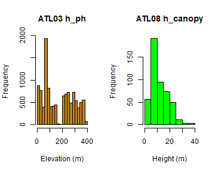
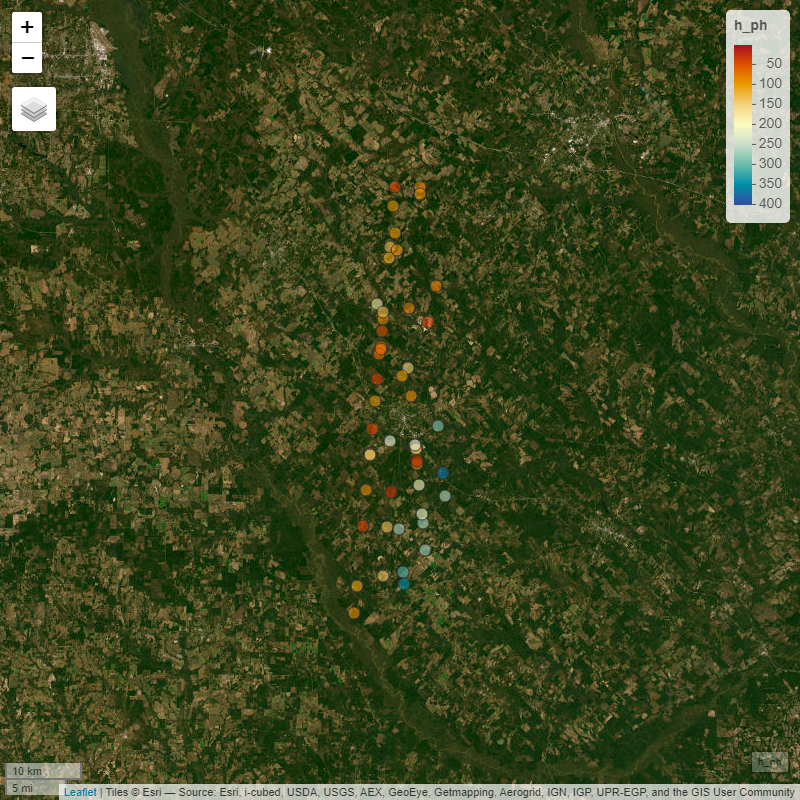
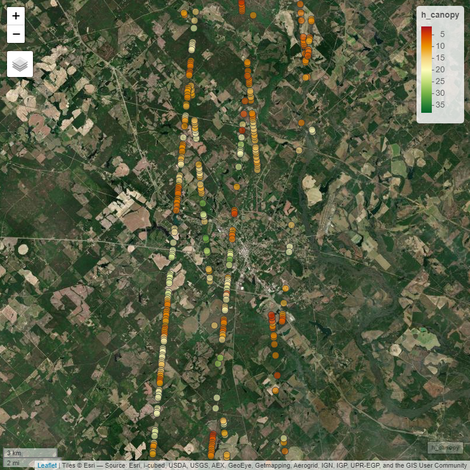
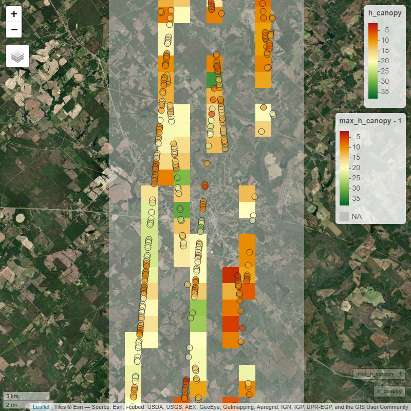
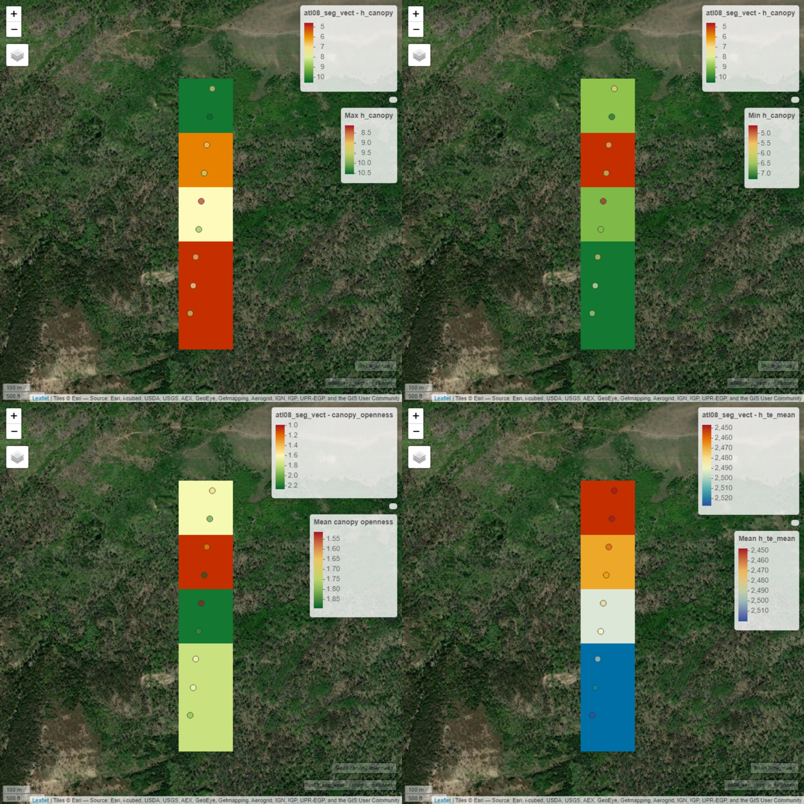
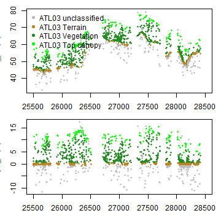
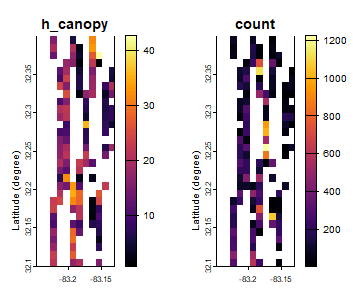
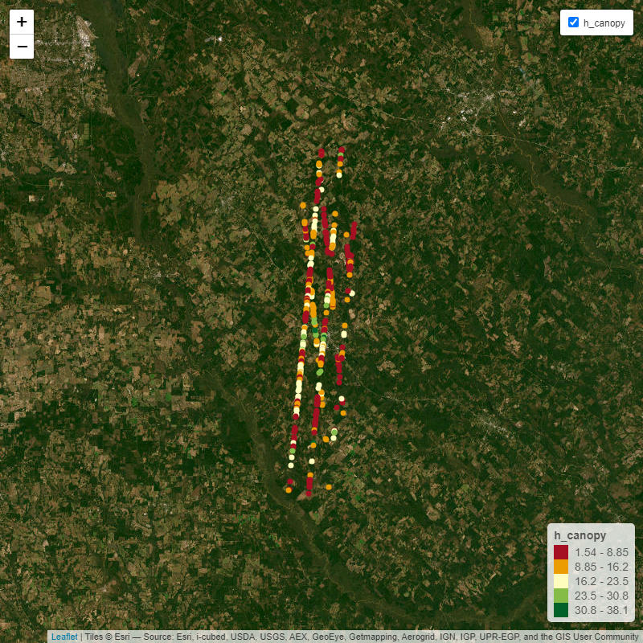
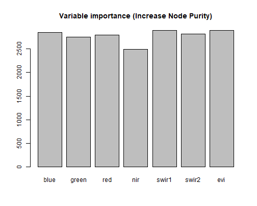
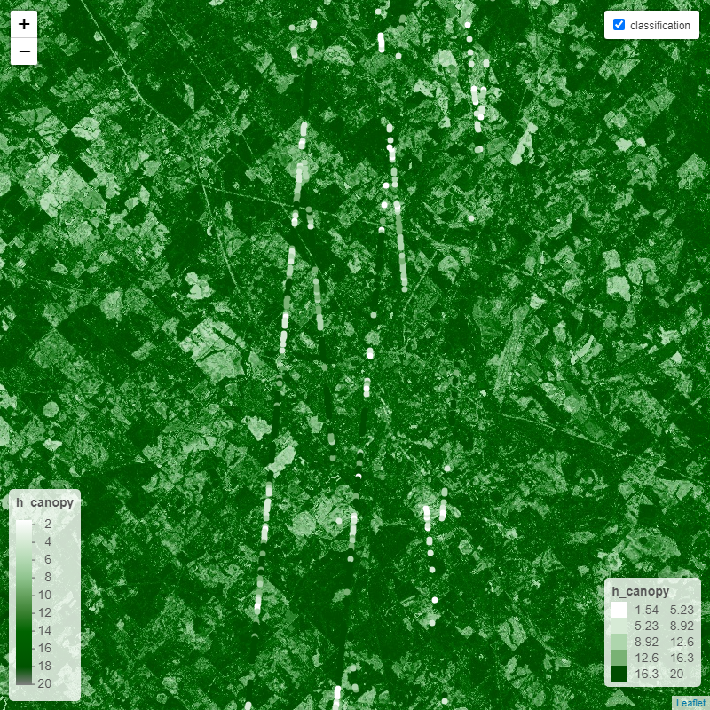

<br/>
[](https://github.com/carlos-alberto-silva/ICESat2VegR/actions/workflows/r.yml)
[](https://cran.r-project.org/package=ICESat2VegR)

 

[](https://travis-ci.com/carlos-alberto-silva/ICESat2VegR)

**ICESat2VegR: An R Package for NASA's Ice, Cloud, and Elevation Satellite (ICESat-2) Data Processing and Visualization for Land and Vegetation Applications.**

Authors: Carlos Alberto Silva and Caio Hamamura  

The ICESat2VegR package provides functions for downloading, reading, visualizing, processing and exporting 
NASA's ICESat-2 ATL03 (Global Geolocated Photon Data) and ATL08 (Land and Vegetation Height) 
products for Land and Vegetation Applications in R environment.

# Getting started


```r
# The CRAN version
install.packages("ICESat2VegR")

# Development version
remotes::install_github("https://github.com/carlos-alberto-silva/ICESat2VegR")
```

## Load the package


```r
library(ICESat2VegR)
```


## Configuring the package

This package uses three Python packages through `reticulate`:

1. [earthaccess](https://github.com/nsidc/earthaccess): allows reading directly from the cloud
2. [h5py](https://github.com/h5py/h5py): for reading hdf5 content from the cloud
3. [earthengine-api](https://github.com/google/earthengine-api): integration with Google Earth Engine for sampling and extracting raster data and upscalling models.

For configuring the package you can use:


```r
ICESat2VegR_configure()

```

This will install miniconda if not available and the necessary packages.

### Notes

 - There are some issues regarding some Python packages not being compatible with the Python version. The above configure function will also try to update python version in that case. 
 - The configure function will warn you about the need to restart R


## Introduction

There are two different ways of working with the ICESat-2 data. Locally or using cloud computing. Common users should work locally, unless they are working within an AWS cloud computing within zone us-west-2.


## Opening the example datasetAs we will be working with multiple h5 granules, we will be using `lapply` for reading
and extracting information from the granules.


```r
# Download example dataset
ATLAS_dataDownload(
  "https://github.com/carlos-alberto-silva/ICESat2VegR/releases/download/example_datasets/Study_Site.zip",
  outdir
)

# Unzip the example dataset
unzip(file.path(outdir, "Study_Site.zip"), exdir = outdir)
```


## Search parameters


```r
# Specifying bounding box coordinates
lower_left_lon <- -96.0
lower_left_lat <- 40.0
upper_right_lon <- -100
upper_right_lat <- 42.0


# Specifying the date range
daterange <- c("2021-10-02", "2021-10-03")
```

## Working locally

First we need to find the granules:


```r
atl03_granules_local <- ATLAS_dataFinder(
  short_name = "ATL03",
  lower_left_lon,
  lower_left_lat,
  upper_right_lon,
  upper_right_lat,
  version = "006",
  daterange = daterange,
  persist = TRUE,
  cloud_computing = FALSE
)

head(atl03_granules_local)
#>      C2596864127-NSIDC_CPRD                                                                                                                      
#> [1,] "https://data.nsidc.earthdatacloud.nasa.gov/nsidc-cumulus-prod-protected/ATLAS/ATL03/006/2021/10/02/ATL03_20211002001658_01461302_006_01.h5"
#> [2,] "https://data.nsidc.earthdatacloud.nasa.gov/nsidc-cumulus-prod-protected/ATLAS/ATL03/006/2021/10/02/ATL03_20211002004127_01461306_006_01.h5"
#> [3,] "https://data.nsidc.earthdatacloud.nasa.gov/nsidc-cumulus-prod-protected/ATLAS/ATL03/006/2021/10/02/ATL03_20211002015115_01471302_006_01.h5"
#> [4,] "https://data.nsidc.earthdatacloud.nasa.gov/nsidc-cumulus-prod-protected/ATLAS/ATL03/006/2021/10/02/ATL03_20211002021545_01471306_006_01.h5"
#> [5,] "https://data.nsidc.earthdatacloud.nasa.gov/nsidc-cumulus-prod-protected/ATLAS/ATL03/006/2021/10/02/ATL03_20211002032533_01481302_006_01.h5"
#> [6,] "https://data.nsidc.earthdatacloud.nasa.gov/nsidc-cumulus-prod-protected/ATLAS/ATL03/006/2021/10/02/ATL03_20211002035002_01481306_006_01.h5"
```

Now we download the granules:


```r
# Download all granules
ATLAS_dataDownload(atl03_granules_local, "/the/directory/to/save")
```

And then we can open and work with them


```r
# Read the granules
atl03_h5 <- ATL03_read("/the/directory/to/save/name_of_granule.h5")

# List groups within atl03_h5
atl03_h5$ls()
```


```
#> [1] "METADATA"               "ancillary_data"         "atlas_impulse_response" "gt1r"                  
#> [5] "gt2r"                   "gt3r"                   "orbit_info"             "quality_assessment"
```

## Working in the cloud

```r
atl03_granules_cloud <- ATLAS_dataFinder(
  short_name = "ATL03",
  lower_left_lon,
  lower_left_lat,
  upper_right_lon,
  upper_right_lat,
  version = "006",
  daterange = daterange,
  persist = TRUE,
  cloud_computing = TRUE
)

head(atl03_granules_cloud)
#> Collection: {'EntryTitle': 'ATLAS/ICESat-2 L2A Global Geolocated Photon Data V006'}
#> Spatial coverage: {'HorizontalSpatialDomain': {'Geometry': {'GPolygons': [{'Boundary': {'Points': [{'Longitude': 167.89473, 'Latitude': 59.54564}, {'Longitude': 167.67404, 'Latitude': 59.53425}, {'Longitude': 167.81095, 'Latitude': 58.84718}, {'Longitude': 168.29123, 'Latitude': 56.32957}, {'Longitude': 168.82548, 'Latitude': 53.24275}, {'Longitude': 169.43429, 'Latitude': 49.36326}, {'Longitude': 169.987, 'Latitude': 45.51084}, {'Longitude': 170.50035, 'Latitude': 41.65845}, {'Longitude': 170.98695, 'Latitude': 37.77973}, {'Longitude': 171.54559, 'Latitude': 33.0688}, {'Longitude': 172.15242, 'Latitude': 27.69247}, {'Longitude': 172.23362, 'Latitude': 26.9541}, {'Longitude': 172.35961, 'Latitude': 26.96509}, {'Longitude': 172.27919, 'Latitude': 27.70353}, {'Longitude': 171.67947, 'Latitude': 33.08007}, {'Longitude': 171.12888, 'Latitude': 37.7909}, {'Longitude': 170.65047, 'Latitude': 41.66957}, {'Longitude': 170.14702, 'Latitude': 45.52198}, {'Longitude': 169.60642, 'Latitude': 49.37448}, {'Longitude': 169.01275, 'Latitude': 53.25412}, {'Longitude': 168.49331, 'Latitude': 56.34106}, {'Longitude': 168.02745, 'Latitude': 58.85889}, {'Longitude': 167.89473, 'Latitude': 59.54564}]}}]}}}
#> Temporal coverage: {'RangeDateTime': {'BeginningDateTime': '2021-10-02T00:16:58.259Z', 'EndingDateTime': '2021-10-02T00:25:28.858Z'}}
#> Size(MB): 1732.5397911071777
#> Data: ['https://data.nsidc.earthdatacloud.nasa.gov/nsidc-cumulus-prod-protected/ATLAS/ATL03/006/2021/10/02/ATL03_20211002001658_01461302_006_01.h5']
```

In cloud computing you don't need to download data, instead you can 
read the data and start working with it.


```r
# Read the granule (the ATL03_read can only read one granule per read)
atl03_h5_cloud <- ATL03_read(atl03_granules_cloud[1])

# List groups within the h5 in cloud
atl03_h5_cloud$ls()
#>  [1] "METADATA"               "ancillary_data"         "atlas_impulse_response" "ds_surf_type"          
#>  [5] "ds_xyz"                 "gt1l"                   "gt1r"                   "gt2l"                  
#>  [9] "gt2r"                   "gt3l"                   "gt3r"                   "orbit_info"            
#> [13] "quality_assessment"
```


```r
# Which are strong beams
print(atl03_h5_cloud$strong_beams)
#> [1] "gt1l" "gt2l" "gt3l"
```


```r
# Orientation 0=forward, 1=backwards, 2=transition
print(atl03_h5_cloud[["orbit_info/sc_orient"]][])
#> [1] 1
```


## Close the files
Do not forget to close the files to properly release them.


```r
close(atl03_h5)
```


```r
close(atl03_h5_cloud)
```


## Extract attributes


```r
# ATL03 seg attributes
atl03_seg_att_ls <- lapply(
  atl03_h5,
  ATL03_seg_attributes_dt,
  attributes = c("delta_time", "solar_elevation", "pitch", "h_ph", "ref_elev")
)
atl03_seg_dt <- rbindlist2(atl03_seg_att_ls)

# Remove segments above 20km
atl03_seg_dt <- atl03_seg_dt[h_ph < 20000]

head(atl03_seg_dt)
```


| delta_time| solar_elevation|      pitch|     h_ph| ref_elev| reference_photon_lon| reference_photon_lat|beam |
|----------:|---------------:|----------:|--------:|--------:|--------------------:|--------------------:|:----|
|   40393396|        15.39806| -0.1688279| 253.2678| 1.564179|            -83.17184|             31.96591|gt1r |
|   40393396|        15.39806| -0.1688280| 244.4757| 1.564179|            -83.17186|             31.96609|gt1r |
|   40393396|        15.39806| -0.1688281| 206.9639| 1.564179|            -83.17188|             31.96627|gt1r |
|   40393396|        15.39806| -0.1688282| 364.4886| 1.564180|            -83.17190|             31.96645|gt1r |
|   40393396|        15.39805| -0.1688282| 273.6021| 1.564180|            -83.17192|             31.96663|gt1r |
|   40393396|        15.39805| -0.1688283| 293.0188| 1.564180|            -83.17194|             31.96681|gt1r |


```r
# ATL08 seg attributes
atl08_seg_att_ls <- lapply(
  atl08_h5,
  ATL08_seg_attributes_dt,
  attributes = c("h_canopy", "h_te_mean", "terrain_slope", "canopy_openness", "night_flag")
)
atl08_seg_dt <- rbindlist2(atl08_seg_att_ls)

# Consider only segment with h_canopy < 100 and terrain height < 20000
atl08_seg_dt <- atl08_seg_dt[h_canopy < 100 & h_te_mean < 20000]

head(atl08_seg_dt)
```


| latitude| longitude|beam |  h_canopy| h_te_mean| terrain_slope| canopy_openness| night_flag|
|--------:|---------:|:----|---------:|---------:|-------------:|---------------:|----------:|
| 32.04510| -83.18090|gt1r | 13.640770|  47.51598|     0.0830011|        3.445780|          0|
| 32.04690| -83.18111|gt1r | 11.407394|  44.67390|    -0.0053365|        2.606891|          0|
| 32.09549| -83.18666|gt1r | 10.392395|  65.23853|     0.0053522|        2.132361|          0|
| 32.09639| -83.18677|gt1r | 10.364945|  65.63503|     0.0097772|        3.251597|          0|
| 32.10629| -83.18790|gt1r | 14.952076|  58.39679|     0.0042360|        4.113675|          0|
| 32.10719| -83.18800|gt1r |  9.288475|  59.01027|     0.0017870|        3.213291|          0|


### Plot histograms:


```r
layout(t(1:2))

# ATL03 height histogram
hist(atl03_seg_dt$h_ph, col = "#bd8421", xlab = "Elevation (m)", main = "ATL03 h_ph")
hist(atl08_seg_dt$h_canopy, col = "green", xlab = "Height (m)", main = "ATL08 h_canopy")
```

<div align="center">

<div class="figure" style="text-align: center">

<p class="caption">Histograms for ATL03 elevation and ATL08 h_canopy</p>
</div>

</div>

## Export to vector
The function `to_vect()` will return a `terra::vect` object.


```r
library(terra)

blueYellowRed <- function(n) grDevices::hcl.colors(n, "RdYlBu")

set.seed(123)
mask <- sample(seq_len(nrow(atl03_seg_dt)), 50)
atl03_seg_vect <- to_vect(atl03_seg_dt)

# Plot with terra::plet
mapview::mapView(
  atl03_seg_vect[mask],
  zcol = "h_ph",
  layer.name = "h_ph",
  breaks = 3,
  col.regions = blueYellowRed,
  map.types = c("Esri.WorldImagery")
)
```

<div align="center">





</div>


```r
greenYellowRed <- function(n) {
  grDevices::hcl.colors(n, "RdYlGn")
}

# Plot with mapview
map_vect <- mapview::mapView(
  atl08_seg_vect,
  layer.name = "h_canopy",
  zcol = "h_canopy",
  col.regions = greenYellowRed,
  map.types = c("Esri.WorldImagery")
)

map_vect
```

<div align="center">




</div>

Save vector as geopackage file. The formats supported are as from GDAL terra package.


```r
terra::writeVector(atl03_seg_vect, "atl03_seg.gpkg")
terra::writeVector(atl08_seg_vect, "atl08_seg.gpkg")
```

## View ATL08 segments as raster

Single max_h_canopy:


```r
redYellowGreen <- function(n) grDevices::hcl.colors(n, "RdYlGn")
max_h_canopy <- ATL08_seg_attributes_dt_gridStat(atl08_seg_dt, func = max(h_canopy), res = 0.01)

mapview::mapView(
  max_h_canopy,
  map = map_vect,
  col.regions = redYellowGreen
)
```

<div align="center">




</div>

### Multiple data:


```r
multiple_data <- ATL08_seg_attributes_dt_gridStat(atl08_seg_dt, func = list(
  max_h_canopy = max(h_canopy),
  min_h_canopy = min(h_canopy),
  mean_canopy_openness = mean(canopy_openness),
  mean_h_te_mean = mean(h_te_mean)
), res = 0.01)

map_vect_openness <- mapview::mapView(
  atl08_seg_vect,
  zcol = "canopy_openness",
  layer.name = "canopy_openness",
  col.regions = redYellowGreen,
  map.types = c("Esri.WorldImagery")
)

blueYellowRed <- function(n) grDevices::hcl.colors(n, "RdYlBu", rev = TRUE)

map_vect_terrain <- mapview::mapView(
  atl08_seg_vect,
  zcol = "h_te_mean",
  layer.name = "h_te_mean",
  col.regions = blueYellowRed,
  map.types = c("Esri.WorldImagery")
)


m1 <- mapview::mapView(multiple_data[[1]], layer.name = "Max h_canopy", map = map_vect, col.regions = redYellowGreen)
m2 <- mapview::mapView(multiple_data[[2]], layer.name = "Min h_canopy", map = map_vect, col.regions = redYellowGreen)
m3 <- mapview::mapView(multiple_data[[3]], layer.name = "Mean canopy openness", map = map_vect_openness, col.regions = redYellowGreen)
m4 <- mapview::mapView(multiple_data[[4]], layer.name = "Mean h_te_mean", col.regions = blueYellowRed, map = map_vect_terrain)

leafsync::sync(m1, m2, m3, m4)
```

<div align="center" style="width:100%;">





</div>


## Close the files
Do not forget to close the files to properly release them.


```r
close(atl03_h5)
```


## Extract attributes


```r
atl03_atl08_dt <- ATL03_ATL08_photons_attributes_dt_join(atl03_h5, atl08_h5, beam = "gt1r")

head(atl03_atl08_dt)
```

<div align="center" style="overflow-x: scroll;">


| ph_segment_id|    lon_ph|   lat_ph|     h_ph| quality_ph| solar_elevation| dist_ph_along| dist_ph_across| night_flag| classed_pc_indx|beam | classed_pc_flag|       ph_h| d_flag| delta_time| rgt|
|-------------:|---------:|--------:|--------:|----------:|---------------:|-------------:|--------------:|----------:|---------------:|:----|---------------:|----------:|------:|----------:|---:|
|        177488| -83.17570| 31.99959| 44.61499|          0|        15.39738|      3762.072|       3169.208|          0|              44|gt1r |               2|  4.3425255|      1|   40393396| 233|
|        177488| -83.17570| 31.99959| 48.81370|          0|        15.39738|      3762.074|       3169.180|          0|              45|gt1r |               3|  8.6167412|      1|   40393396| 233|
|        177488| -83.17571| 31.99962| 43.38353|          0|        15.39738|      3765.626|       3169.205|          0|              49|gt1r |               2|  3.2494583|      1|   40393396| 233|
|        177488| -83.17571| 31.99964| 48.24021|          0|        15.39738|      3767.768|       3169.175|          0|              56|gt1r |               3|  8.1592712|      1|   40393396| 233|
|        177488| -83.17571| 31.99964| 56.24585|          0|        15.39738|      3767.773|       3169.122|          0|              57|gt1r |               3| 16.2089348|      1|   40393396| 233|
|        177488| -83.17571| 31.99965| 40.30040|          0|        15.39738|      3769.191|       3169.229|          0|              62|gt1r |               1|  0.2985229|      1|   40393396| 233|

</div>

## Plotting the result:

```r
oldpar <- par(no.readonly = TRUE)
par(oma = c(0, 0, 0, 0))
par(mar = c(2, 3, 1, 1))
layout(matrix(c(1, 2), ncol = 1))
plot(
  atl03_atl08_dt[rgt == 233],
  y = "h_ph",
  colors = c("gray", "#bd8421", "forestgreen", "green"),
  xlim = c(25500, 28500),
  beam = "gt2r",
  cex = 0.5,
  pch = 16
)

par(mar = c(3, 3, 1, 1))

plot(
  atl03_atl08_dt[rgt == 233],
  y = "ph_h",
  colors = c("gray", "#bd8421", "forestgreen", "green"),
  xlim = c(25500, 28500),
  beam = "gt2r",
  cex = 0.5,
  pch = 16,
  legend = FALSE
)

par(
  oldpar
)
```

<div align="center">

<div class="figure" style="text-align: center">

<p class="caption">Classified ATL03 photons using ATL08 labels</p>
</div>

</div>

## Calculating raster statistics


```r
h_canopy <- ATL03_ATL08_photons_attributes_dt_gridStat(
  atl03_atl08_dt[ph_h < 50 & ph_h > 0],
  func = list(
    h_canopy = quantile(ph_h, 0.98),
    count = .N
  ),
  res = 0.01
)

plot(h_canopy,
  col = viridis::inferno(100),
  xlab = "Langitude (degree)",
  ylab = "Latitude (degree)",
  ylim = c(32.1, 32.4)
)
```

<div align="center">

<div class="figure" style="text-align: center">

<p class="caption">Rasterized ATL03_ATL08 data for canopy height (h_canopy) and number of photons (n)</p>
</div>

</div>


## Close the files
Do not forget to close the files to properly release them.


```r
close(atl03_h5)
```


In this example we will model the `h_canopy` of the ICESat-2 using only the Harmonized Landsat Sentinel-2 dataset (hls).


## Extract ATL08 segment attributes h_canopy attribute


```r
atl08_seg_dt <- ATL08_seg_attributes_dt(atl08_h5, attribute = "h_canopy")
head(atl08_seg_dt)
```


```r
head(atl08_seg_dt)
```


| latitude| longitude|beam |  h_canopy| h_te_mean| terrain_slope| canopy_openness| night_flag| cells|
|--------:|---------:|:----|---------:|---------:|-------------:|---------------:|----------:|-----:|
| 32.04510| -83.18090|gt1r | 13.640770|  47.51598|     0.0830011|        3.445780|          0|   499|
| 32.04690| -83.18111|gt1r | 11.407394|  44.67390|    -0.0053365|        2.606891|          0|   499|
| 32.09549| -83.18666|gt1r | 10.392395|  65.23853|     0.0053522|        2.132361|          0|   438|
| 32.09639| -83.18677|gt1r | 10.364945|  65.63503|     0.0097772|        3.251597|          0|   438|
| 32.10629| -83.18790|gt1r | 14.952076|  58.39679|     0.0042360|        4.113675|          0|   426|
| 32.10719| -83.18800|gt1r |  9.288475|  59.01027|     0.0017870|        3.213291|          0|   426|


### Visualizing the 'h_canopy' for the ATL08 dataset.


```r
library(terra)

atl08_seg_vect <- to_vect(atl08_seg_dt)
terra::plet(atl08_seg_vect, "h_canopy", col = grDevices::hcl.colors(9, "RdYlGn"), tiles = c("Esri.WorldImagery"))
```

<div align="center" style="display:flex;justify-content:center">





</div>

### Querying the GEEs datasets for Harmonized Landsat Sentinel-2


```r
hls_search <- search_datasets("Harmonized", "Landsat")
hls_search
#>                      id
#>                  <char>
#> 1: NASA_HLS_HLSL30_v002
#>                                                                                                    title
#>                                                                                                   <char>
#> 1: HLSL30: HLS-2 Landsat Operational Land Imager Surface Reflectance and TOA Brightness Daily Global 30m
#>                                                                                                                                                                                                                                                                                                                          description
#>                                                                                                                                                                                                                                                                                                                               <char>
#> 1: The Harmonized Landsat Sentinel-2 (HLS) project provides consistent surface reflectance (SR) and top of atmosphere (TOA) brightness data from a virtual constellation of satellite sensors. The Operational Land Imager (OLI) is housed aboard the joint NASA/USGS Landsat 8 and Landsat 9 satellites, while the Multi-Spectral …
```


```r
hls_id <- get_catalog_id(hls_search$id)
hls_id
#> [1] "NASA/HLS/HLSL30/v002"
```

### Open the Google Earth Engine HLS catalog and get band names


```r
hls_collection <- ee$ImageCollection(hls_id)
names(hls_collection)
#>  [1] "B1"    "B2"    "B3"    "B4"    "B5"    "B6"    "B7"    "B9"    "B10"   "B11"   "Fmask" "SZA"   "SAA"   "VZA"  
#> [15] "VAA"
```

### Define area of interest (aoi) clip boundaries and time and cloud mask for filtering.


```r
bbox <- terra::ext(atl08_seg_vect)

aoi <- ee$Geometry$BBox(
  west = bbox$xmin,
  south = bbox$ymin,
  east = bbox$xmax,
  north = bbox$ymax
)

hls <- hls_collection$
  filterDate("2019-04-01", "2019-05-31")$
  filterBounds(aoi)$
  map(function(x) x$updateMask(!(x[["Fmask"]] & 14)))$
  median()


hls_unmasked <- hls_collection$
  filterDate("2019-04-01", "2019-05-31")$
  filterBounds(aoi)$
  median()
```

### Calculate EVI:


```r
# Rename bands
hls_unmasked <- hls_unmasked[["B2", "B3", "B4", "B5", "B6", "B7"]]
names(hls_unmasked) <- c("blue", "green", "red", "nir", "swir1", "swir2")

hls <- hls[["B2", "B3", "B4", "B5", "B6", "B7"]]
names(hls) <- c("blue", "green", "red", "nir", "swir1", "swir2")

# Add evi
nir <- hls[["nir"]]
red <- hls[["red"]]
blue <- hls[["blue"]]

hls[["evi"]] <- (2.5 * (nir - red)) / (nir + 6 * red - 7.5 * blue + 1)
print(hls)
#> ee.image.Image
#> 
#> Bands
#> [1] "blue"  "green" "red"   "nir"   "swir1" "swir2" "evi"
```

## Visualize the resulting image


```r
library(leaflet)

forest_height_palette <- c("#ffffff", "#8b4513", "#99cc99", "#006600", "#004d00")
palette_colors <- colorNumeric(forest_height_palette, range(atl08_seg_dt$h_canopy))(atl08_seg_dt[order(h_canopy), h_canopy])

centroid <- mean(bbox)
map <- leaflet::leaflet() |>
  addEEImage(hls, bands = list("red", "green", "blue"), group = "masked", max = 0.6) |>
  addEEImage(hls_unmasked, bands = list("red", "green", "blue"), group = "unmasked", max = 0.6) |>
  setView(lng = centroid[1], lat = centroid[2], zoom = 13) |>
  addLayersControl(
    baseGroups = c("unmasked", "masked"),
    options = layersControlOptions(collapsed = FALSE)
  )

map
```

<div align="center" style="display:flex;justify-content:center">


</div>

## Extracting GEE data for segments

For each segment extract the hls data:


```r
extracted_dt <- seg_gee_ancillary_dt_extract(hls, atl08_seg_vect)
#> Processing 1-481 of 481

head(extracted_dt)
```


| idx| canopy_openness|beam | cells| h_te_mean| terrain_slope|  h_canopy| night_flag|     red|   green|    blue|     nir|   swir1|  swir2|       evi|
|---:|---------------:|:----|-----:|---------:|-------------:|---------:|----------:|-------:|-------:|-------:|-------:|-------:|------:|---------:|
|   1|        3.445780|gt1r |   499|  47.51598|     0.0830011| 13.640770|          0| 0.09290| 0.08440| 0.06130| 0.26820| 0.36780| 0.2278| 0.3208625|
|   2|        2.606891|gt1r |   499|  44.67390|    -0.0053365| 11.407394|          0| 0.09980| 0.08920| 0.05230| 0.28910| 0.35340| 0.2213| 0.3164176|
|   3|        2.132361|gt1r |   438|  65.23853|     0.0053522| 10.392395|          0| 0.17975| 0.14520| 0.09220| 0.29535| 0.40075| 0.3137| 0.1717835|
|   4|        3.251597|gt1r |   438|  65.63503|     0.0097772| 10.364945|          0| 0.12935| 0.11065| 0.06335| 0.33105| 0.32645| 0.2278| 0.3089720|
|   5|        4.113675|gt1r |   426|  58.39679|     0.0042360| 14.952076|          0| 0.03680| 0.05410| 0.02270| 0.26540| 0.12610| 0.0608| 0.4342870|
|   6|        3.213291|gt1r |   426|  59.01027|     0.0017870|  9.288475|          0| 0.02530| 0.03460| 0.01310| 0.13110| 0.06950| 0.0405| 0.2232727|


## Fit the randomForest model


```r
bandNames <- names(hls)
x <- extracted_dt[, .SD, .SDcols = bandNames]
y <- extracted_dt[["h_canopy"]]

rf_model <- model_fit(x, y, ntree = 500, mtry = 1)
print(rf_model)
#> 
#> Call:
#>  randomForest(x = x, y = y, ntree = 500, mtry = 1) 
#>                Type of random forest: regression
#>                      Number of trees: 500
#> No. of variables tried at each split: 1
#> 
#>           Mean of squared residuals: 41.065
#>                     % Var explained: 10.97
```


```r
library(randomForest)

rf_importance <- importance(rf_model)
barplot(rf_importance[, "IncNodePurity"], main = "Variable importance (Increase Node Purity)")
```

<div align="center">

<div class="figure" style="text-align: center">

<p class="caption">Random forests variable importance (increase node impurity).</p>
</div>

</div>

## Apply the model to Google Earth Engine WorldImagery


```r
gee_model <- build_ee_forest(rf_model)
result <- hls$classify(gee_model)
min_hcanopy <- min(atl08_seg_dt$h_canopy)
max_hcanopy <- max(atl08_seg_dt$h_canopy)
atl08_seg_vect$h_canopy <- round(atl08_seg_vect$h_canopy, 3) # Round off to 3 decimal places

modelled_map <- terra::plet(
  atl08_seg_vect,
  "h_canopy",
  palette_colors,
  tiles = ""
) |>
  addEEImage(
    hls,
    bands = c("red", "green", "blue"),
    group = "hls",
    min = 0,
    max = 0.6
  ) |>
  addEEImage(
    result,
    bands = "classification",
    group = "classification",
    min = min_hcanopy,
    max = max_hcanopy,
    palette = forest_height_palette
  ) |>
  leaflet::addLegend(
    pal = colorNumeric(forest_height_palette, seq(min_hcanopy, max_hcanopy)),
    values = seq(min_hcanopy, max_hcanopy, length = 3),
    opacity = 1,
    title = "h_canopy",
    position = "bottomleft",
  ) |>
  setView(lng = centroid[1], lat = centroid[2], zoom = 12) |>
  addLayersControl(
    overlayGroups = c("classification"),
    options = layersControlOptions(collapsed = FALSE)
  )

modelled_map
```

<div align="center" style="display:flex;justify-content:center">




</div>


## Close the files
Do not forget to close the files to properly release them.


```r
close(atl03_h5)
```


# Acknowledgements
We gratefully acknowledge funding from NASA’s ICESat-2 (ICESat-2, grant 22-ICESat2_22-0006), Carbon Monitoring System (CMS, grant 22-CMS22-0015) and Commercial Smallsat Data Scientific Analysis(CSDSA, grant 22-CSDSA22_2-0080). 

# Reporting Issues 
Please report any issue regarding the ICESat2VegR package to Dr. Silva (c.silva@ufl.edu)

# Citing ICESat2VegR
Silva,C.A; Hamamura,C.ICESat2VegR: An R Package for NASA's Ice, Cloud, and Elevation Satellite (ICESat-2) Data Processing and Visualization for Terrestrial Applications.version 0.0.1, accessed on November. 22 2023, available at: <https://CRAN.R-project.org/package=ICESat2VegR>

# Disclaimer
**ICESat2VegR package comes with no guarantee, expressed or implied, and the authors hold no responsibility for its use or reliability of its outputs.**

