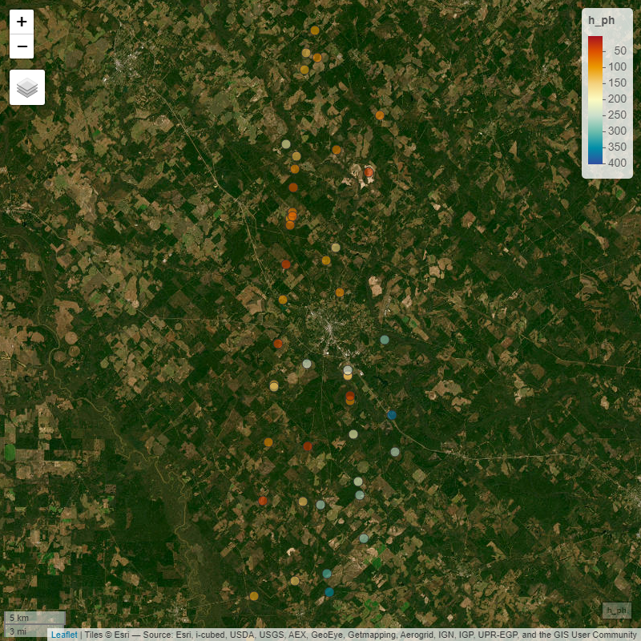
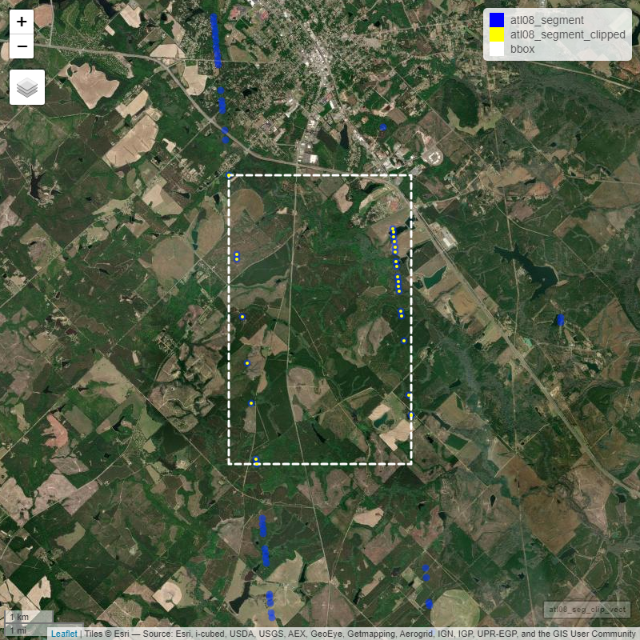
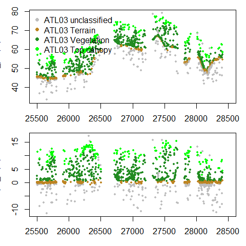

<br/>
[](https://carlos-alberto-silva.r-universe.dev/ICESat2VegR)
[](https://github.com/carlos-alberto-silva/ICESat2VegR/actions/workflows/rhub.yaml)
[](https://cran.r-project.org/package=ICESat2VegR)


**ICESat2VegR: An R Package for NASA’s Ice, Cloud, and Elevation
Satellite (ICESat-2) Data Processing and Visualization for Land and
Vegetation Applications.**

Authors: Carlos Alberto Silva and Caio Hamamura

The ICESat2VegR package provides functions for downloading, reading, visualizing, processing, and exporting NASA’s ICESat-2 ATL03 (Global Geolocated Photon Data) and 
ATL08 (Land and Vegetation Height) products for land and vegetation applications in the R environment.

# Getting started

``` r
# The r-universe version (recommended for the latest version)
install.packages("ICESat2VegR", , repos = c("https://caiohamamura.r-universe.dev", "https://cloud.r-project.org"))

# The CRAN version
install.packages("ICESat2VegR")

# Required additional libraries
need_pkgs <- c(                                                                       # Packages required by the workflow
  "reticulate",   # Python <-> R interface
  "leaflet",      # interactive maps
  "sf",           # spatial vectors
  "terra",        # rasters & vectors
  "data.table",   # fast tables
  "dplyr"         # tidy helpers
)
missing <- need_pkgs[!need_pkgs %in% rownames(installed.packages())]                 # Identify missing packages
if (length(missing)) {                                                                # If any are missing
  message("Installing missing R packages: ", paste(missing, collapse = ", "))         # Inform the user
  install.packages(missing, repos = repos, dependencies = TRUE)                       # Install from repos with dependencies
}
```

## Load the package

``` r
suppressPackageStartupMessages({                                                       # Suppress startup messages for clean logs
  library(ICESat2VegR)                                                                 # ICESat-2 vegetation tools
  library(reticulate)                                                                  # Interface to Python
  library(leaflet)                                                                     # Interactive maps
  library(sf)                                                                          # Simple Features for vector data
  library(terra)                                                                       # Raster + vector geospatial ops
  library(data.table)                                                                  # Fast data tables
  library(dplyr)                                                                       # Tidy verbs
})
cat("Loading libraries... done.\n")                                                    # Confirm loading

```

## Configuring the package

This package uses three Python packages through `reticulate`:

1.  [earthaccess](https://github.com/nsidc/earthaccess): allows reading
    directly from the cloud
2.  [h5py](https://github.com/h5py/h5py): for reading hdf5 content from
    the cloud
3.  [earthengine-api](https://github.com/google/earthengine-api):
    integration with Google Earth Engine for sampling, extracting raster data, and upscaling models.

To configure the package, use:

``` r
ICESat2VegR_configure()
```

This will install Miniconda if it is not already available, along with the necessary Python packages.

``` r
Verify configuration status

# Helper safely() runs an expression and returns a default value if an error occurs
safely <- function(expr, default = NA) tryCatch(expr, error = function(e) default)

# Check if 'reticulate' is installed
have_reticulate <- requireNamespace("reticulate", quietly = TRUE)

# Attempt to discover which Python executable is being used
py_path <- if (have_reticulate) safely(reticulate::py_discover_config()$python, NA) else NA

# Verify if Python is properly initialized and available
py_ready <- have_reticulate && !inherits(try(reticulate::py_config(), silent = TRUE), "try-error")

# Build a list summarizing the environment and module status
status <- list(
  ICESat2VegR_loaded = "package:ICESat2VegR" %in% search(),  # Is package loaded in current session?
  python_used        = py_path,                              # Path to active Python binary
  h5py               = if (py_ready) reticulate::py_module_available("h5py")        else FALSE,
  earthaccess        = if (py_ready) reticulate::py_module_available("earthaccess") else FALSE,
  ee                 = if (py_ready) reticulate::py_module_available("ee")          else FALSE
)

# Print the collected environment information to the console
print(status)
```


### Notes

- Some Python packages may not be compatible with the installed Python version. 
  The configuration function will attempt to update Python automatically if needed.

- The configuration function may warn you about the need to restart R after installing some packages. 
  Please restart R if advised.

## Introduction

There are two different ways of working with ICESat-2 data: locally or using cloud computing. 
Most users should work locally unless they are operating within an AWS cloud-computing environment in the us-west-2 region.

## Opening the example dataset

As we will be working with multiple HDF5 granules, we will use `lapply()` for reading and extracting information from the granules.
If you are working with a single granule, you can follow the simpler instructions provided in the function documentation examples without using `lapply()`.

``` r
# Load the ICESat2VegR package
library(ICESat2VegR)

# Set output directory
outdir <- tempdir()

# Download example dataset
url <- "https://github.com/carlos-alberto-silva/ICESat2VegR/releases/download/example_datasets/Study_Site.zip"
zip_file <- file.path(outdir, "Study_Site.zip")
download.file(url, zip_file, mode = "wb")

# Unzip the example dataset
unzip(zip_file, exdir = outdir)
```

## Search parameters

``` r
# Specifying bounding box coordinates
lower_left_lon <- -96.0
lower_left_lat <- 40.0
upper_right_lon <- -100
upper_right_lat <- 42.0


# Specifying the date range
daterange <- c("2021-10-02", "2021-10-03")
```

## Working locally

First we need to find the granules:

``` r
atl03_granules_local <- ATLAS_dataFinder(
  short_name = "ATL03",
  lower_left_lon,
  lower_left_lat,
  upper_right_lon,
  upper_right_lat,
  version = "006",
  daterange = daterange,
  persist = TRUE,
  cloud_computing = FALSE
)

head(atl03_granules_local)
```

    ##      C2596864127-NSIDC_CPRD                                                                                                                      
    ## [1,] "https://data.nsidc.earthdatacloud.nasa.gov/nsidc-cumulus-prod-protected/ATLAS/ATL03/006/2021/10/02/ATL03_20211002001658_01461302_006_01.h5"
    ## [2,] "https://data.nsidc.earthdatacloud.nasa.gov/nsidc-cumulus-prod-protected/ATLAS/ATL03/006/2021/10/02/ATL03_20211002004127_01461306_006_01.h5"
    ## [3,] "https://data.nsidc.earthdatacloud.nasa.gov/nsidc-cumulus-prod-protected/ATLAS/ATL03/006/2021/10/02/ATL03_20211002015115_01471302_006_01.h5"
    ## [4,] "https://data.nsidc.earthdatacloud.nasa.gov/nsidc-cumulus-prod-protected/ATLAS/ATL03/006/2021/10/02/ATL03_20211002021545_01471306_006_01.h5"
    ## [5,] "https://data.nsidc.earthdatacloud.nasa.gov/nsidc-cumulus-prod-protected/ATLAS/ATL03/006/2021/10/02/ATL03_20211002032533_01481302_006_01.h5"
    ## [6,] "https://data.nsidc.earthdatacloud.nasa.gov/nsidc-cumulus-prod-protected/ATLAS/ATL03/006/2021/10/02/ATL03_20211002035002_01481306_006_01.h5"

``` r
atl08_granules_local <- ATLAS_dataFinder(
  short_name = "ATL08",
  lower_left_lon,
  lower_left_lat,
  upper_right_lon,
  upper_right_lat,
  version = "006",
  daterange = daterange,
  persist = TRUE,
  cloud_computing = FALSE
)

head(atl08_granules_local)
```

    ##      C2613553260-NSIDC_CPRD                                                                                                                     
    ## [1,] "https://data.nsidc.earthdatacloud.nasa.gov/nsidc-cumulus-prod-protected/ATLAS/ATL08/006/2021/10/02/ATL08_20211002004127_01461306_006_01.h5"
    ## [2,] "https://data.nsidc.earthdatacloud.nasa.gov/nsidc-cumulus-prod-protected/ATLAS/ATL08/006/2021/10/02/ATL08_20211002032533_01481302_006_01.h5"
    ## [3,] "https://data.nsidc.earthdatacloud.nasa.gov/nsidc-cumulus-prod-protected/ATLAS/ATL08/006/2021/10/02/ATL08_20211002045950_01491302_006_01.h5"
    ## [4,] "https://data.nsidc.earthdatacloud.nasa.gov/nsidc-cumulus-prod-protected/ATLAS/ATL08/006/2021/10/02/ATL08_20211002052420_01491306_006_01.h5"
    ## [5,] "https://data.nsidc.earthdatacloud.nasa.gov/nsidc-cumulus-prod-protected/ATLAS/ATL08/006/2021/10/02/ATL08_20211002063408_01501302_006_01.h5"
    ## [6,] "https://data.nsidc.earthdatacloud.nasa.gov/nsidc-cumulus-prod-protected/ATLAS/ATL08/006/2021/10/02/ATL08_20211002065837_01501306_006_01.h5"

Now we download the granules:

``` r
# Download all granules
ATLAS_dataDownload(atl03_granules_local[1:3], outdir)
ATLAS_dataDownload(atl08_granules_local[c(2,4,5)],  outdir)
```

And then we can open and work with them

``` r
## ATL03
# Read the granules
atl03_files <- list.files(outdir, "ATL03.*h5", full.names = TRUE)
atl03_h5 <- lapply(atl03_files, ATL03_read)


## ATL08
# Read the granules
atl08_files <- list.files(outdir, "ATL08.*h5", full.names = TRUE)
atl08_h5 <- lapply(atl08_files, ATL08_read)

# List groups within first file of atl08_h5
atl08_h5[[1]]$ls()
```

    ## [1] "METADATA"           "ancillary_data"     "gt1r"              
    ## [4] "gt2r"               "gt3r"               "orbit_info"        
    ## [7] "quality_assessment"

## Working in the cloud

``` r
atl03_granules_cloud <- ATLAS_dataFinder(
  short_name = "ATL03",
  lower_left_lon,
  lower_left_lat,
  upper_right_lon,
  upper_right_lat,
  version = "006",
  daterange = daterange,
  persist = TRUE,
  cloud_computing = TRUE
)
```

In cloud computing you don’t need to download data, instead you can read
the data and start working with it.

``` r
# Read the granule (the ATL03_read can only read one granule per read)
atl03_h5_cloud <- ATL03_read(atl03_granules_cloud[1])

# List groups within the h5 in cloud
atl03_h5_cloud$beams
```

``` r
## gt1l gt1r gt2l gt2r gt3l gt3r
```

``` r
close(atl03_h5_cloud)
```

# Extracting ATL03 photons attributes

``` r
atl03_photons_dt <- lapply(atl03_h5,ATL03_photons_attributes_dt)
atl03_photons_dt <- rbindlist2(atl03_photons_dt)

head(atl03_photons_dt)
``` 
| beam | strong_beam |    lon_ph |   lat_ph |    h_ph | quality_ph | solar_elevation | dist_ph_along | nid |
|:-----|:------------|----------:|---------:|--------:|------------:|----------------:|---------------:|----:|
| gt1r | TRUE        | -106.5700 | 41.53862 | 2586.681 |           0 |        33.53411 |       57.03034 |   1 |
| gt1r | TRUE        | -106.5700 | 41.53862 | 2590.325 |           0 |        33.53411 |       57.04520 |   2 |
| gt1r | TRUE        | -106.5700 | 41.53862 | 2569.251 |           0 |        33.53411 |       56.96353 |   3 |
| gt1r | TRUE        | -106.5700 | 41.53862 | 2547.401 |           0 |        33.53411 |       56.88038 |   4 |
| gt1r | TRUE        | -106.5700 | 41.53862 | 2548.977 |           0 |        33.53411 |       56.88631 |   5 |
| gt1r | TRUE        | -106.5699 | 41.53862 | 2476.900 |           0 |        33.53411 |       56.61007 |   6 |

``` r
plot(atl03_photons_dt$dist_ph_along,atl03_photons_dt$h_ph, xlab="dist_ph_along", ylab="Elevation (m)", pch=16, cex=0.2)
``` 

# Segment-Level Extraction of ATL03 Metadata and ATL08 Attributes

``` r
# ATL03 seg attributes
atl03_seg_att_ls <- lapply(
  atl03_h5,
  ATL03_seg_metadata_dt,
  attributes = c("delta_time", "solar_elevation", "pitch", "h_ph", "ref_elev")
)
atl03_seg_dt <- rbindlist2(atl03_seg_att_ls)

# Remove segments above 20km
atl03_seg_dt <- atl03_seg_dt[h_ph < 20000]

head(atl03_seg_dt)
```

| delta_time | solar_elevation |      pitch |     h_ph | ref_elev | reference_photon_lon | reference_photon_lat | beam | strong_beam |
|-----------:|----------------:|-----------:|---------:|---------:|---------------------:|---------------------:|:-----|:------------|
|   40393396 |        15.39806 | -0.1688279 | 253.2678 | 1.564179 |            -83.17184 |             31.96591 | gt1r | TRUE        |
|   40393396 |        15.39806 | -0.1688280 | 268.9599 | 1.564179 |            -83.17186 |             31.96609 | gt1r | TRUE        |
|   40393396 |        15.39806 | -0.1688281 | 355.6263 | 1.564179 |            -83.17188 |             31.96627 | gt1r | TRUE        |
|   40393396 |        15.39806 | -0.1688282 | 276.9350 | 1.564180 |            -83.17190 |             31.96645 | gt1r | TRUE        |
|   40393396 |        15.39805 | -0.1688282 | 359.7021 | 1.564180 |            -83.17192 |             31.96663 | gt1r | TRUE        |
|   40393396 |        15.39805 | -0.1688283 | 292.5831 | 1.564180 |            -83.17194 |             31.96681 | gt1r | TRUE        |

``` r
# ATL08 seg attributes
atl08_seg_att_ls <- lapply(
  atl08_h5,
  ATL08_seg_attributes_dt,
  attributes = c("h_canopy", "h_te_mean", "terrain_slope", "canopy_openness", "night_flag")
)


atl08_seg_dt <- rbindlist2(atl08_seg_att_ls)


# Consider only segment with h_canopy < 100 and terrain height < 20000
atl08_seg_dt <- atl08_seg_dt[h_canopy < 100 & h_te_mean < 20000]

head(atl08_seg_dt)
```

| latitude | longitude | beam | strong_beam |  h_canopy | h_te_mean | terrain_slope | canopy_openness | night_flag |
|---------:|----------:|:-----|:------------|----------:|----------:|--------------:|----------------:|-----------:|
| 32.04510 | -83.18090 | gt1r | TRUE        | 13.640770 |  47.51598 |     0.0830011 |        3.445780 |          0 |
| 32.04690 | -83.18111 | gt1r | TRUE        | 11.407394 |  44.67390 |    -0.0053365 |        2.606891 |          0 |
| 32.09549 | -83.18666 | gt1r | TRUE        | 10.392395 |  65.23853 |     0.0053522 |        2.132361 |          0 |
| 32.09639 | -83.18677 | gt1r | TRUE        | 10.364945 |  65.63503 |     0.0097772 |        3.251597 |          0 |
| 32.10629 | -83.18790 | gt1r | TRUE        | 14.952076 |  58.39679 |     0.0042360 |        4.113675 |          0 |
| 32.10719 | -83.18800 | gt1r | TRUE        |  9.288475 |  59.01027 |     0.0017870 |        3.213291 |          0 |

### Plot histograms:

``` r
layout(t(1:2))

# ATL03 height histogram
hist(atl03_seg_dt$h_ph, col = "#bd8421", xlab = "Elevation (m)", main = "ATL03 h_ph")
hist(atl08_seg_dt$h_canopy, col = "green", xlab = "Height (m)", main = "ATL08 h_canopy")
```

<div align="center">

<div class="figure" style="text-align: center">


<p class="caption">
Histograms for ATL03 elevation and ATL08 h_canopy
</p>

</div>

</div>

## Export to vector

The function `to_vect()` will return a `terra::vect` object.

``` r
library(terra)

blueYellowRed <- function(n) grDevices::hcl.colors(n, "RdYlBu")

set.seed(123)
mask <- base::sample(seq_len(nrow(atl03_seg_dt)), 50)
atl03_seg_vect <- to_vect(atl03_seg_dt)

# Plot with mapview
mapview::mapview(
  atl03_seg_vect[mask],
  zcol = "h_ph",
  layer.name = "h_ph",
  breaks = 3,
  col.regions = blueYellowRed,
  map.types = c("Esri.WorldImagery")
)
```

<div align="center">



</div>

``` r
# Extract vector from atl08_seg_dt
class(atl08_seg_dt)
atl08_seg_vect <- to_vect(atl08_seg_dt)

# Palette function
greenYellowRed <- function(n) {
  grDevices::hcl.colors(n, "RdYlGn")
}


# Plot with mapview
leaflet_available <- require("leaflet")
if (!leaflet_available) stop("leaflet not found!")

map_vect <- mapview::mapView(
  atl08_seg_vect,
  layer.name = "h_canopy",
  zcol = "h_canopy",
  col.regions = greenYellowRed,
  map.types = c("Esri.WorldImagery")
)

map_vect
```

<div align="center">


</div>

Save vector as geopackage file. The formats supported are as from GDAL
terra package.

``` r
terra::writeVector(atl03_seg_vect, file.path(outdir, "atl03_seg.gpkg"))
terra::writeVector(atl08_seg_vect, file.path(outdir, "atl08_seg.gpkg"))
```

## View ATL08 segments as raster

Single max_h_canopy:

``` r
redYellowGreen <- function(n) grDevices::hcl.colors(n, "RdYlGn")
max_h_canopy <- ATL08_seg_attributes_dt_gridStat(atl08_seg_dt, func = max(h_canopy), res = 0.01)

mapview::mapView(
  max_h_canopy,
  map = map_vect,
  col.regions = redYellowGreen
)
```

<div align="center">


</div>


Multiple attributes:

``` r
multiple_attributes <- ATL08_seg_attributes_dt_gridStat(atl08_seg_dt, func = list(
  max_h_canopy = max(h_canopy),
  min_h_canopy = min(h_canopy),
  mean_canopy_openness = mean(canopy_openness),
  mean_h_te_mean = mean(h_te_mean)
), res = 0.01)

map_vect_openness <- mapview::mapView(
  atl08_seg_vect,
  zcol = "canopy_openness",
  layer.name = "canopy_openness",
  col.regions = redYellowGreen,
  map.types = c("Esri.WorldImagery")
)

blueYellowRed <- function(n) grDevices::hcl.colors(n, "RdYlBu", rev = TRUE)

map_vect_terrain <- mapview::mapView(
  atl08_seg_vect,
  zcol = "h_te_mean",
  layer.name = "h_te_mean",
  col.regions = blueYellowRed,
  map.types = c("Esri.WorldImagery")
)


m1 <- mapview::mapView(multiple_attributes[[1]], layer.name = "Max h_canopy", map = map_vect, col.regions = redYellowGreen)
m2 <- mapview::mapView(multiple_attributes[[2]], layer.name = "Min h_canopy", map = map_vect, col.regions = redYellowGreen)
m3 <- mapview::mapView(multiple_attributes[[3]], layer.name = "Mean canopy openness", map = map_vect_openness, col.regions = redYellowGreen)
m4 <- mapview::mapView(multiple_attributes[[4]], layer.name = "Mean h_te_mean", col.regions = blueYellowRed, map = map_vect_terrain)

leafsync::sync(m1, m2, m3, m4)
```

<div align="center" style="width:100%;">

<figure>

<figcaption aria-hidden="true">multi</figcaption>
</figure>

</div>

# Clipping ATL03 and ATL08 data

Now we will use the clipping functions. There are two ways of clipping data in ICESat2VegR:

1.Clipping raw HDF5 data from ATL03 and ATL08 files
2.Clipping extracted attributes produced by the extraction functions, such as:

`ATL03_seg_metadata_dt`
`ATL03_photon_attributes_dt`
`ATL08_seg_attributes_dt`
`ATL03_ATL08_photons_attributes_dt_join`

The second method is preferred because it is faster and more efficient. It does not require re-reading the HDF5 file and clips only the extracted attributes, whereas the raw HDF5 structure contains many additional variables that may not be needed.
There are multiple clipping variants that operate either on a bounding box or a geometry, using the suffixes _clipBox or _clipGeometry:

1.`ATL03_h5_clipBox`
2.`ATL03_h5_clipGeometry`
3.`ATL03_seg_metadata_dt_clipBox`
4.`ATL03_seg_metadata_dt_clipGeometry`
5.`ATL03_photon_attributes_dt_clipBox`
6.`ATL03_photon_attributes_dt_clipGeometry`
7.`ATL08_h5_clipBox`
8.`ATL08_h5_clipGeometry`
9.`ATL08_seg_attributes_dt_clipBox`
10.`ATL08_seg_attributes_dt_clipGeometry`
11.`ATL03_ATL08_photons_attributes_dt_join_clipBox`
12.`ATL03_ATL08_photons_attributes_dt_join_clipGeometry`


In the following two sections there are two small examples on how to
clip the raw HDF5 and the extracted attributes.

## Clipping raw hdf5 data from ATL08

``` r
# Define bbox
clip_region <- terra::ext(-83.2, -83.14, 32.12, 32.18)
aoi <- file.path(outdir, "example_aoi.gpkg")
aoi_vect <- terra::vect(aoi)

# Define hdf5 output file
output <- tempfile(pattern = "alt08_h5_clip_", fileext = ".h5")

# Clip the data for only the first ATL08 file
atl08_clipped <- ATL08_h5_clipBox(atl08_h5[[1]], output, clip_obj = clip_region)

##atl08_clippeds <- ATL08_h5_clipGeometry(atl08_h5[[2]], output, clip_obj = aoi_vect, split_by="id")

atl08_seg_dt <- ATL08_seg_attributes_dt(atl08_h5[[1]], attributes = c("h_canopy"))
atl08_seg_dt_clip <- ATL08_seg_attributes_dt(atl08_clipped, attributes = c("h_canopy"))

# Display location of clipped data
atl08_seg_vect <- to_vect(atl08_seg_dt)
atl08_seg_clip_vect <- to_vect(atl08_seg_dt_clip)

bbox <- terra::vect(terra::ext(atl08_seg_clip_vect), crs = "epsg:4326")
centroid <- terra::geom(terra::centroids(bbox))

map1 <- mapview::mapview(
  atl08_seg_clip_vect,
  col.regions = "yellow",
  alpha.regions = 1,
  lwd = 5,
  map.types = c("Esri.WorldImagery"),
  alpha = 0,
  cex = 2,
  legend = FALSE
)

map1

dplyr_available <- require("dplyr")
if (!dplyr_available) stop("dplyr not found!")

# Final map
final_map <- map1@map %>%
  leaflet::addCircleMarkers(data = atl08_seg_vect, radius = 2) %>%
  leaflet::addPolygons(
    data = bbox, fillOpacity = 0, weight = 3, color = "white",
    opacity = 1, dashArray = "5, 1, 0"
  ) %>%
  leaflet::addLegend(
    position = "topright",
    colors = c("blue", "yellow", "white"),
    labels = c("atl08_segment", "atl08_segment_clipped", "bbox"),
    opacity = 1
  ) %>%
  leaflet::setView(centroid[, "x"][[1]], centroid[, "y"][[1]], zoom = 13)

final_map
```
  
<div align="center">



</div>

## Clipping extracted attributes from ATL08 segments data

``` r
aoi <- file.path(outdir, "example_aoi.gpkg")
aoi_vect <- terra::vect(aoi)

centroid <- terra::geom(terra::centroids(aoi_vect))

# Extract the h_canopy attribute from the first ATL08 file
atl08_seg_dt <- lapply(atl08_h5, ATL08_seg_attributes_dt, attributes = c("h_canopy"))
atl08_seg_dt <- rbindlist2(atl08_seg_dt)
atl08_seg_vect <- to_vect(atl08_seg_dt)

# Clip using geometry
atl08_seg_dt_clip <- ATL08_seg_attributes_dt_clipGeometry(
  atl08_seg_dt, aoi_vect, split_by = "id"
)

atl08_seg_clip_vect <- to_vect(atl08_seg_dt_clip)

colors <- c("#00FF00", "#FF00FF")

map1 <- mapview::mapview(
  atl08_seg_clip_vect,
  alpha = 0,
  col.regions = colors,
  alpha.regions = 1,
  zcol = "poly_id",
  lwd = 5,
  map.types = c("Esri.WorldImagery"),
  cex = 2,
  legend = FALSE
)

# Final map
final_map <- map1@map %>%
  leaflet::addCircleMarkers(data = atl08_seg_vect, color = "blue", radius = 2) %>%
  leaflet::addPolygons(
    data = aoi_vect, fillOpacity = 0, weight = 3, color = colors,
    opacity = 1, dashArray = "5, 1, 0"
  ) %>%
  leaflet::addLegend(
    position = "topright",
    colors = c("blue", "yellow", colors),
    labels = c("atl08_segment", "atl08_segment_clipped", "aoi_1", "aoi_2"),
    opacity = 1
  ) %>%
  leaflet::setView(centroid[, "x"][[1]], centroid[, "y"][[1]], zoom = 13)
  
final_map
```

Using the Generic clip() Function

Instead of manually choosing from the many _clipBox or _clipGeometry functions, ICESat2VegR provides a unified clipping interface using the generic clip() function. The generic automatically:
detects the class of the input object (x),
determines whether the clipping object is a bounding box or a geometry,
dispatches to the appropriate helper function internally.

This allows simpler and cleaner code:

```r
clipped <- clip(data_object, clip_obj = aoi)
```
which internally routes the request to the correct clipping function — for example, ATL08_seg_attributes_dt_clipGeometry() or ATL03_h5_clipBox(), depending on the objects supplied.


The clip() function automatically:

detects the class of the ICESat-2 object (x),
determines whether the clipping object is a bounding box or a geometry,
and dispatches to the appropriate specialized clipping helper.

This makes your workflow much simpler and more consistent, especially when switching between ATL03/ATL08 HDF5 objects and extracted attribute tables.

Example 1: Using clip() on Extracted ATL08 Segment Attributes
```r
# Extract ATL08 segment attributes
atl08_seg <- ATL08_seg_attributes_dt(atl08_h5[[1]], attributes = "h_canopy")

# Define area of interest
aoi <- file.path(outdir, "example_aoi.gpkg")
aoi_vect <- terra::vect(aoi)

# Clip using the generic function
atl08_seg_clip <- clip(atl08_seg, clip_obj = aoi_vect)

# Convert to vector for visualization
atl08_seg_clip_vect <- to_vect(atl08_seg_clip)
```


Example 2: Using clip() on Raw ATL03 HDF5 Data
```r
# ATL03 HDF5 object
atl03 <- ATL03_read(atl03_files[[1]])

# Define bounding box
bbox <- ext(c(-83.2, -83.14, 32.12, 32.18))

# Clip using generic clip()
atl03_clipped <- clip(atl03, output, clip_obj = bbox)
```


Comparison: Generic `clip()` vs. Direct Helper Functions

| Task                                      | Generic `clip()`              | Specific Helper Function                                                   |
|-------------------------------------------|-------------------------------|-----------------------------------------------------------------------------|
| Clip ATL03 HDF5 by bounding box           | `clip(atl03, bbox)`          | `ATL03_h5_clipBox(atl03, bbox)`                                            |
| Clip ATL03 HDF5 by geometry               | `clip(atl03, geom)`          | `ATL03_h5_clipGeometry(atl03, geom)`                                       |
| Clip ATL03 extracted attributes           | `clip(atl03_dt, geom)`       | `ATL03_photon_attributes_dt_clipGeometry(atl03_dt, geom)`                  |
| Clip ATL08 extracted attributes           | `clip(atl08_dt, geom)`       | `ATL08_seg_attributes_dt_clipGeometry(atl08_dt, geom)`                     |
| Clip ATL03–ATL08 joined attributes        | `clip(join_obj, geom)`       | `ATL03_ATL08_photons_attributes_dt_join_clipGeometry(join_obj, geom)`      |

---

Why Use `clip()`?

- Avoids memorizing many different clipping helper function names  
- Ensures consistent behavior across ATL03, ATL08, and joined datasets  
- Reduces code duplication and improves maintainability  
- Automatically selects the correct clipping method based on inputs  
- Produces cleaner and more readable workflows  


<div align="center">


</div>

# Joining ATL03 and ATL08 data

## Extract attributes

``` r

# Herein as we are working with list of h5 files we will need
# to loop over each file and extract the attributes and then
# concatenate them with rbindlist2

atl03_atl08_dts <- lapply(
  seq_along(atl03_h5),
  function(ii) {
    ATL03_ATL08_photons_attributes_dt_join(
      atl03_h5[[ii]],
      atl08_h5[[ii]]
    )
  }
)

atl03_atl08_dt <- rbindlist2(atl03_atl08_dts)

head(atl03_atl08_dt)
```

<div align="center" style="overflow-x: scroll;">

| ph_segment_id |    lon_ph |   lat_ph |     h_ph | quality_ph | solar_elevation | dist_ph_along | dist_ph_across | night_flag | classed_pc_indx | classed_pc_flag |       ph_h | d_flag | delta_time | orbit_number | beam | strong_beam |
|--------------:|----------:|---------:|---------:|-----------:|----------------:|--------------:|---------------:|-----------:|----------------:|----------------:|-----------:|-------:|-----------:|-------------:|:-----|:------------|
|        177488 | -83.17570 | 31.99959 | 44.61499 |          0 |        15.39738 |      3762.072 |       3169.208 |          0 |              44 |               2 |  4.3425255 |      1 |   40393396 |         3208 | gt1r | TRUE        |
|        177488 | -83.17570 | 31.99959 | 48.81370 |          0 |        15.39738 |      3762.074 |       3169.180 |          0 |              45 |               3 |  8.6167412 |      1 |   40393396 |         3208 | gt1r | TRUE        |
|        177488 | -83.17571 | 31.99962 | 43.38353 |          0 |        15.39738 |      3765.626 |       3169.205 |          0 |              49 |               2 |  3.2494583 |      1 |   40393396 |         3208 | gt1r | TRUE        |
|        177488 | -83.17571 | 31.99964 | 48.24021 |          0 |        15.39738 |      3767.768 |       3169.175 |          0 |              56 |               3 |  8.1592712 |      1 |   40393396 |         3208 | gt1r | TRUE        |
|        177488 | -83.17571 | 31.99964 | 56.24585 |          0 |        15.39738 |      3767.773 |       3169.122 |          0 |              57 |               3 | 16.2089348 |      1 |   40393396 |         3208 | gt1r | TRUE        |
|        177488 | -83.17571 | 31.99965 | 40.30040 |          0 |        15.39738 |      3769.191 |       3169.229 |          0 |              62 |               1 |  0.2985229 |      1 |   40393396 |         3208 | gt1r | TRUE        |

</div>

## Plotting the result:

``` r
oldpar <- par(no.readonly = TRUE)
par(oma = c(0, 0, 0, 0))
par(mar = c(2, 3, 1, 1))
layout(matrix(c(1, 2), ncol = 1))
plot(
  atl03_atl08_dt[orbit_number == 3208],
  y = "h_ph",
  colors = c("gray", "#bd8421", "forestgreen", "green"),
  xlim = c(25500, 28500),
  beam = "gt2r",
  cex = 0.5,
  pch = 16
)

par(mar = c(3, 3, 1, 1))

plot(
  atl03_atl08_dt[orbit_number == 3208],
  y = "ph_h",
  colors = c("gray", "#bd8421", "forestgreen", "green"),
  xlim = c(25500, 28500),
  beam = "gt2r",
  cex = 0.5,
  pch = 16,
  legend = FALSE
)

par(
  oldpar
)
```

<div align="center">

<div class="figure" style="text-align: center">


<p class="caption">
Classified ATL03 photons using ATL08 labels
</p>

</div>

</div>

## Calculating raster statistics

``` r
h_canopy <- ATL03_ATL08_photons_attributes_dt_gridStat(
  atl03_atl08_dt[ph_h < 50 & ph_h > 0],
  func = list(
    h_canopy = quantile(ph_h, 0.98),
    count = .N
  ),
  res = 0.01
)

plot(h_canopy,
  col = viridis::inferno(100),
  xlab = "Langitude (degree)",
  ylab = "Latitude (degree)",
  ylim = c(32.1, 32.4)
)
```

<div align="center">

<div class="figure" style="text-align: center">


<p class="caption">
Rasterized ATL03_ATL08 data for canopy height (h_canopy) and number of
photons (n)
</p>

</div>

</div>

# Calculating ATL08 metrics for different size segments other than 100m and 20m

## Introduction

In this section, we will demonstrate how to use the
`ATL03_ATL08_segment_create` function from the `ICESat2VegR` package.
This function is used to compute segment IDs for ICESat-2 `ATL03` and
`ATL08` data and create segments based on a specified segment length.

``` r
# Herein as we are working with list of h5 files we will need
# to loop over each file and extract the attributes and then
# concatenate them with rbindlist2

stopifnot(length(atl03_h5) == length(atl08_h5))

atl03_atl08_dts <- lapply(
  seq_along(atl03_h5),
  function(ii) {
    ATL03_ATL08_photons_attributes_dt_join(
      atl03_h5[[ii]],
      atl08_h5[[ii]]
    )
  }
)

atl03_atl08_dt <- rbindlist2(atl03_atl08_dts)
head(atl03_atl08_dt)

```

## Create Segments IDs

Now, we use the `ATL03_ATL08_segment_create` function to create segments
with a specified segment length.

``` r
atl03_atl08_photons_grouped_dt <- ATL03_ATL08_segment_create(atl03_atl08_dt,
  segment_length = 30,
  centroid = "mean",
  output = NA,
  overwrite = FALSE
)
```

## Compute Segment Statistics

``` r
atl03_atl08_seg_dt <- ATL03_ATL08_compute_seg_attributes_dt_segStat(
  atl03_atl08_photons_grouped_dt,
  list(
    h_canopy_ge0 = quantile(ph_h, 0.98),
    h_canopy_gt0 = quantile(ph_h[ph_h > 0], 0.98),
    n_ground = sum(classed_pc_flag == 1),
    n_mid_canopy = sum(classed_pc_flag == 2),
    n_top_canopy = sum(classed_pc_flag == 3),
    n_canopy_total = sum(classed_pc_flag >= 2)
  ),
  ph_class = c(1, 2, 3)
)

head(atl03_atl08_seg_dt)
```

<div align="center" style="overflow-x: scroll;">

| segment_id | beam | longitude | latitude | h_canopy_ge0 | h_canopy_gt0 | n_ground | n_mid_canopy | n_top_canopy | n_canopy_total |
|-----------:|:-----|----------:|---------:|-------------:|-------------:|---------:|-------------:|-------------:|---------------:|
|        126 | gt1r | -83.17571 | 31.99965 |    15.611358 |    15.611358 |        1 |            7 |            3 |             10 |
|        127 | gt1r | -83.17574 | 31.99986 |    18.311493 |    18.311493 |        1 |           12 |            1 |             13 |
|        128 | gt1r | -83.17577 | 32.00011 |    12.236551 |    12.236551 |        1 |            8 |            0 |              8 |
|        293 | gt1r | -83.18086 | 32.04469 |     3.518969 |     3.518969 |        0 |            1 |            5 |              6 |
|        294 | gt1r | -83.18087 | 32.04482 |     5.167805 |     5.167805 |        7 |            4 |            2 |              6 |
|        295 | gt1r | -83.18091 | 32.04511 |    12.113018 |    12.258518 |       12 |           10 |            0 |             10 |

</div>

## Convert to SpatVector

Now, we convert the data.table to a SpatVector object.

``` r
atl03_atl08_vect <- to_vect(atl03_atl08_seg_dt[h_canopy_gt0 <= 31])
```

## Visualize the segments

Finally, we visualize the SpatVector interactively using mapview.

``` r
centroid <- atl03_atl08_dt[, .(x = mean(lon_ph), y = mean(lat_ph))]

map_output <- mapview::mapview(
  atl03_atl08_vect,
  zcol = "h_canopy_gt0",
  col.regions = grDevices::hcl.colors(9, "RdYlGn"),
  alpha = 0,
  layer.name = "h_canopy",
  map.types = c("Esri.WorldImagery"),
  cex = 4
)@map %>%
  setView(lng = centroid$x, lat = centroid$y, zoom = 13)
## 
## map_output
```

<div align="center">


</div>

# Predicting and rasterizing ATL08 h_canopy data using machine learning models

## Creating a simple model for ATL08 data

Here, we will create a simple model to predict the AGBD of ATL08 data
based on the height of the canopy. We will use the `randomForest`
package to create the model.

Let’s assume we have the following tabular data from ATL08 and field
data.

``` r
# For the sake of the example, we will train and test the model with the same data
library(randomForest)

h_canopy <- c(
  13.9, 3.1, 2.2, 4.6, 21.6,
  7.2, 5, 7.7, 0.8, 9.7,
  11, 11.3, 15.5, 5.1, 10.4,
  0.6, 14.6, 13.3, 9.8, 14.7
)

agbd <- c(
  144.8, 27.5, 51.6, 60.5, 232.3,
  102.8, 33.1, 91.3, 23, 120.1,
  125.7, 127.2, 147.4, 48.8, 103.3,
  55.9, 181.8, 139.9, 120.1, 162.8
)

set.seed(172783946)
model <- randomForest::randomForest(data.frame(h_canopy = h_canopy), agbd)
```

## Predicting ATL08 data

Now we will predict the data for the entire ATL08 dataset, this can be
as large as you want. This will create or append the predicted values to
an H5 file.

``` r
out_h5 <- tempfile(fileext = ".h5")

for (atl08_h5_item in atl08_h5) {
  atl08_seg_dt <- ATL08_seg_attributes_dt(atl08_h5_item, attributes = c("h_canopy"))
  atl08_seg_dt[h_canopy > 100, h_canopy := NA_real_]
  atl08_seg_dt <- na.omit(atl08_seg_dt)
  predicted_h5 <- predict_h5(model, atl08_seg_dt, out_h5)
}
```

## Rasterizing the predicted data

``` r
output_raster <- tempfile(fileext = ".tif")
x <- predicted_h5[["longitude"]][]
y <- predicted_h5[["latitude"]][]
bbox <- terra::ext(min(x), max(x), min(y), max(y))

# Creates the raster with statistics
res <- 0.005
rasterize_h5(predicted_h5, output_raster, bbox = bbox, res = res)

# Open the raster by file path
forest_height_palette <- c("#ffffff", "#4d994d", "#004d00")

# Open band 2 only (mean AGBD)
library(leaflet)

stars_rast <- stars::read_stars(output_raster, RasterIO = list(bands = 2))
res_map <- mapview::mapview(
  stars_rast,
  layer.name = "AGBD mean",
  col.regions = forest_height_palette,
  na.alpha = 0.1,
  map = leaflet::leaflet() %>% leaflet::addProviderTiles("Esri.WorldImagery")
)

#res_map
```

<div align="center">


</div>

# Upscalling ATL08 h_canopy data using Harmonized Landsat-Sentinel-2 (HLS) data

## Introduction

In this example we will model the `h_canopy` of the ICESat-2 using only
the Harmonized Landsat Sentinel-2 dataset (hls).

## Initialize Google Earth Engine API

``` r
ee_initialize()
```


## Extract ATL08 segment-level h_canopy attribute

``` r
atl08_seg_dt <- lapply(atl08_h5, ATL08_seg_attributes_dt, attribute = "h_canopy")

atl08_seg_dt <- rbindlist2(atl08_seg_dt)

# Remove h_canopy values that are above 100m
atl08_seg_dt <- atl08_seg_dt[h_canopy < 100]

head(atl08_seg_dt)
```

| latitude | longitude | beam | strong_beam |  h_canopy |
|---------:|----------:|:-----|:------------|----------:|
| 32.35687 | -83.13213 | gt1r | TRUE        |  3.375763 |
| 32.34967 | -83.13296 | gt1r | TRUE        |  3.256882 |
| 32.34877 | -83.13306 | gt1r | TRUE        |  4.273857 |
| 32.34787 | -83.13316 | gt1r | TRUE        |  2.742630 |
| 32.34427 | -83.13358 | gt1r | TRUE        |  6.318420 |
| 32.34337 | -83.13367 | gt1r | TRUE        | 16.272888 |

### Visualizing the ‘h_canopy’ for the ATL08 dataset.

``` r
library(terra)
library(leaflet)

atl08_seg_vect <- to_vect(atl08_seg_dt)
centroid <- geom(centroids(vect(ext(atl08_seg_vect))))

map <- terra::plet(atl08_seg_vect, "h_canopy", col = grDevices::hcl.colors(9, "RdYlGn"), tiles = c("Esri.WorldImagery")) %>%
  setView(lng = centroid[, "x"][[1]], lat = centroid[, "y"][[1]], zoom = 12)

# map
```

<div align="center" style="display:flex;justify-content:center">


</div>

### Querying the GEEs datasets for Harmonized Landsat Sentinel-2

``` r
hls_search <- search_datasets("Harmonized", "Landsat")
hls_search
```

    ##                      id
    ##                  <char>
    ## 1: NASA_HLS_HLSL30_v002
    ##                                                                                                    title
    ##                                                                                                   <char>
    ## 1: HLSL30: HLS-2 Landsat Operational Land Imager Surface Reflectance and TOA Brightness Daily Global 30m
    ##                                                                                                                                                                                                                                                                                                                          description
    ##                                                                                                                                                                                                                                                                                                                               <char>
    ## 1: The Harmonized Landsat Sentinel-2 (HLS) project provides consistent surface reflectance (SR) and top of atmosphere (TOA) brightness data from a virtual constellation of satellite sensors. The Operational Land Imager (OLI) is housed aboard the joint NASA/USGS Landsat 8 and Landsat 9 satellites, while the Multi-Spectral …

``` r
hls_id <- get_catalog_id(hls_search$id)
hls_id
```

    ## [1] "NASA/HLS/HLSL30/v002"

### Open the Google Earth Engine HLS catalog and get band names

``` r
hls_collection <- ee$ImageCollection(hls_id)
names(hls_collection)
```

    ##  [1] "B1"    "B2"    "B3"    "B4"    "B5"    "B6"    "B7"    "B9"    "B10"  
    ## [10] "B11"   "Fmask" "SZA"   "SAA"   "VZA"   "VAA"

### Define area of interest (aoi) clip boundaries and time and cloud mask for filtering.

``` r
bbox <- terra::ext(atl08_seg_vect)

aoi <- ee$Geometry$BBox(
  west = bbox$xmin,
  south = bbox$ymin,
  east = bbox$xmax,
  north = bbox$ymax
)

hls <- hls_collection$
  filterDate("2019-04-01", "2019-05-31")$
  filterBounds(aoi)$
  map(function(x) x$updateMask(!(x[["Fmask"]] & 14)))$
  median()


hls_unmasked <- hls_collection$
  filterDate("2019-04-01", "2019-05-31")$
  filterBounds(aoi)$
  median()
```

### Calculate EVI:

``` r
# Rename bands
hls_unmasked <- hls_unmasked[["B2", "B3", "B4", "B5", "B6", "B7"]]
names(hls_unmasked) <- c("blue", "green", "red", "nir", "swir1", "swir2")

hls <- hls[["B2", "B3", "B4", "B5", "B6", "B7"]]
names(hls) <- c("blue", "green", "red", "nir", "swir1", "swir2")

# Add evi
nir <- hls[["nir"]]
red <- hls[["red"]]
blue <- hls[["blue"]]

hls[["evi"]] <- (2.5 * (nir - red)) / (nir + 6 * red - 7.5 * blue + 1)
print(hls)
```

    ## ee.image.Image
    ## 
    ## Bands
    ## [1] "blue"  "green" "red"   "nir"   "swir1" "swir2" "evi"

## Visualize the resulting image

``` r
library(leaflet)

forest_height_palette <- c("#ffffff", "#99cc99", "#006600", "#004d00")
palette_colors <- colorNumeric(forest_height_palette, range(atl08_seg_dt$h_canopy))(atl08_seg_dt[order(h_canopy), h_canopy])

centroid <- mean(bbox)
map <- leaflet::leaflet() |>
  addEEImage(hls, bands = list("red", "green", "blue"), group = "masked", max = 0.6) |>
  addEEImage(hls_unmasked, bands = list("red", "green", "blue"), group = "unmasked", max = 0.6) |>
  setView(lng = centroid[1], lat = centroid[2], zoom = 13) |>
  addLayersControl(
    baseGroups = c("unmasked", "masked"),
    options = layersControlOptions(collapsed = FALSE)
  )

# map
```

<div align="center" style="display:flex;justify-content:center">

<figure>

<figcaption aria-hidden="true">multi</figcaption>
</figure>

</div>

## Extracting GEE data for segments

For each segment extract the hls data:

``` r
extracted_dt <- seg_gee_ancillary_dt_extract(hls, atl08_seg_vect)

head(extracted_dt)
```

| idx | beam |  h_canopy | strong_beam |    red |  green |   blue |    nir |  swir1 |  swir2 |       evi |
|----:|:-----|----------:|:------------|-------:|-------:|-------:|-------:|-------:|-------:|----------:|
|   1 | gt1r |  3.375763 | TRUE        | 0.0652 | 0.0675 | 0.0390 | 0.3125 | 0.2251 | 0.1265 | 0.4381023 |
|   2 | gt1r |  3.256882 | TRUE        | 0.1435 | 0.1206 | 0.0768 | 0.2780 | 0.3518 | 0.3000 | 0.2151312 |
|   3 | gt1r |  4.273857 | TRUE        | 0.1973 | 0.1675 | 0.1060 | 0.3066 | 0.4445 | 0.3807 | 0.1611714 |
|   4 | gt1r |  2.742630 | TRUE        | 0.0667 | 0.0723 | 0.0337 | 0.2721 | 0.2431 | 0.1444 | 0.3617344 |
|   5 | gt1r |  6.318420 | TRUE        | 0.0489 | 0.0488 | 0.0263 | 0.2571 | 0.1929 | 0.0994 | 0.3846296 |
|   6 | gt1r | 16.272888 | TRUE        | 0.0719 | 0.0624 | 0.0323 | 0.2634 | 0.2349 | 0.1326 | 0.3295928 |


## Stack Alpha Earth embedding and terrain ancillary layers

library(sf)

``` r
# --------------------------------------------------------------------------
# Example 1 - Using the ee_build_AlphaEarth_embedding_terrain_stack function
# --------------------------------------------------------------------------

# Simple AOI polygon (WGS84)
aoi <- st_as_sfc(st_bbox(c(
  xmin = -82.4, xmax = -82.2,
  ymin =  29.6, ymax =  29.8
), crs = 4326))

img <- ee_build_AlphaEarth_embedding_terrain_stack(
  geom       = aoi,
  start_year = 2018,
  end_year   = 2020
)


# -------------------------------------------------------------
# Example 2 - Full standalone script
# -------------------------------------------------------------

library(reticulate)
ee <- import("ee")
ICESat2VegR:::.ee_ping(ee)

# AOI geometry (sf → EE geometry)
library(sf)
aoi <- st_as_sfc(
  st_bbox(c(
    xmin = -82.4,
    xmax = -82.2,
    ymin = 29.6,
    ymax = 29.8
  ), crs = 4326)
)

ee_geom <- ICESat2VegR:::.as_ee_geom(aoi)

# -------------------------------------------------------------
# AlphaEarth annual embedding
# -------------------------------------------------------------
start_year <- 2018
end_year   <- 2020

emb_ic <- ee$ImageCollection("GOOGLE/SATELLITE_EMBEDDING/V1/ANNUAL")$
  filterDate(
    sprintf("%04d-01-01", start_year),
    sprintf("%04d-12-31", end_year)
  )$
  filterBounds(ee_geom)

embedding <- emb_ic$median()$clip(ee_geom)


# -------------------------------------------------------------
# Terrain DEM via ICESat2VegR dataset search (NASA DEM)
# -------------------------------------------------------------
dem_search   <- search_datasets("nasa", "dem")
dem_id       <- get_catalog_id(dem_search)
elevation    <- ee$Image(dem_id)$clip(ee_geom)

# Compute slope and aspect using package helpers
terrain_scale <- 30

# Reproject elevation to target scale (if desired)
elev_proj <- elevation$reproject("EPSG:4326", scale = terrain_scale)

slp <- slope(elev_proj)    # returns ee.Image with band "slope"
asp <- aspect(elev_proj)   # returns ee.Image with band "aspect"

# Optional scaling by 10
slp <- slp$multiply(10)
asp <- asp$multiply(10)

slp <- slp$clip(ee_geom)
asp <- asp$clip(ee_geom)


# -------------------------------------------------------------
# Lon/lat bands
# -------------------------------------------------------------
lonlat <- ee$Image$pixelLonLat()$clip(ee_geom)
lon    <- lonlat$select("longitude")$rename("lon")
lat    <- lonlat$select("latitude")$rename("lat")


# -------------------------------------------------------------
# Final stack: embeddings + terrain + lon/lat
# -------------------------------------------------------------
stack <- embedding$
  addBands(elevation$rename("elevation"))$
  addBands(slp)$
  addBands(asp)$
  addBands(lon)$
  addBands(lat)

# Optional mask outside AOI
mask  <- ee$Image$constant(1)$clip(ee_geom)
stack <- stack$updateMask(mask)

print(stack)
 
```

## Build HLS, Sentinel-1C and terrain ancillary stack in Earth Engine
```r
 # ================================================================
 # Example 1 — ee_build_hls_s1c_terrain_stack
 # ================================================================
 res <- ee_build_hls_s1c_terrain_stack(
   x          = system.file("extdata", "all_boundary.shp", package = "ICESat2VegR"),
   start_date = "2019-04-01",
   end_date   = "2019-05-31"
 )

 full_stack <- res$stack


 # ================================================================
 # Example 2 — Standalone functions
 # Users may copy/paste and modify as needed
 # ================================================================

 library(ICESat2VegR)
 library(terra)

 # AOI
 geom <- terra::vect(system.file("extdata", "all_boundary.shp", package="ICESat2VegR"))
 bbox <- terra::ext(geom)

 aoi <- ee$Geometry$BBox(
   west  = bbox$xmin,
   south = bbox$ymin,
   east  = bbox$xmax,
   north = bbox$ymax
 )$buffer(30)

 # ---------------------------------------------------------------
 # HLS
 # ---------------------------------------------------------------
 search <- search_datasets("hls")
 id     <- get_catalog_id(search)

 cloudMask <- 2^1 + 2^2 + 2^3

 hlsMask <- function(image) image$updateMask(!(image[["Fmask"]] & cloudMask))
 waterMask <- function(image) image$updateMask(image[["B5"]] >= 0.2)

 hls <- ee$ImageCollection(id)$
   filterBounds(aoi)$
   filterDate("2019-04-01", "2019-05-31")$
   filter("CLOUD_COVERAGE < 10")$
   map(hlsMask)$
   map(waterMask)$
   median()$
   clip(aoi)

 hls <- hls[["B2","B3","B4","B5","B6","B7"]]
 names(hls) <- c("blue","green","red","nir","swir1","swir2")

 # Vegetation indices
 nir     <- hls[["nir"]]
 red     <- hls[["red"]]
 blue    <- hls[["blue"]]
 green   <- hls[["green"]]
 swir1   <- hls[["swir1"]]
 swir2   <- hls[["swir2"]]
 nir_red <- nir - red

 hls[["ndvi"]] <- (nir - red) / (nir + red)

 sigma <- 1
 knr <- exp((nir_red)^2 / (2*sigma^2))
 hls[["kndvi"]] <- (1 - knr) / (1 + knr)

 hls[["evi"]]  <- 2.5 * nir_red / (nir + 6*red - 7.5*blue + 1)
 hls[["savi"]] <- 1.5 * nir_red / (nir + red + 0.5)

 p1 <- 2*nir + 1
 hls[["msavi"]] <- p1 - sqrt(p1^2 - 8*nir_red)/2

 # Spectral unmixing
 soil  <- c(0.14, 0.16, 0.22, 0.39, 0.45, 0.27)
 veg   <- c(0.086,0.062,0.043,0.247,0.109,0.039)
 water <- c(0.07,0.039,0.023,0.031,0.011,0.007)

 img <- hls[[c("blue","green","red","nir","swir1","swir2")]]
 unmixing <- img$unmix(list(soil,veg,water))
 names(unmixing) <- c("f_soil","f_veg","f_water")

 hls <- c(hls, unmixing)

 # More indices
 hls[["sri"]]  <- nir / red
 hls[["ndwi"]] <- (green - nir)/(green + nir)
 hls[["gci"]]  <- nir/green - 1
 hls[["wdrvi"]] <- ((0.1*nir) - red)/((0.1*nir) + red)
 hls[["gvmi"]]  <- ((nir+0.1)-(swir1+0.02))/((nir+0.1)+(swir1+0.02))
 hls[["cvi"]]   <- nir * (red/(green^2))
 hls[["cmr"]]   <- swir1/swir2


 # ---------------------------------------------------------------
 # DEM (NASA)
 # ---------------------------------------------------------------
 dem_search <- search_datasets("nasa","dem")
 dem_id     <- get_catalog_id(dem_search)

 elevation <- ee$Image(dem_id)
 the_slope  <- as.integer(slope(as.integer(elevation)) * 1000)
 the_aspect <- aspect(elevation)

 stackDem <- c(elevation, the_slope, the_aspect)$clip(aoi)


 # ---------------------------------------------------------------
 # Sentinel-1C
 # ---------------------------------------------------------------
 s1c <- ee$ImageCollection("COPERNICUS/S1_GRD")$
   filterBounds(aoi)$
   filterDate("2019-04-01","2019-05-31")$
   filter(ee$Filter$listContains("transmitterReceiverPolarisation","VV"))$
   filter(ee$Filter$listContains("transmitterReceiverPolarisation","VH"))$
   filter(ee$Filter$eq("instrumentMode","IW"))

 s1c <- s1c$sort("system:time_start", FALSE)
 s1c <- s1c$reduce(ee$Reducer$firstNonNull())
 s1c <- s1c[["VV_first","VH_first"]]
 names(s1c) <- c("vv","vh")

 s1c <- as.integer(s1c * 100)
 vv <- s1c[["vv"]]
 vh <- s1c[["vh"]]

 s1c[["rvi"]]   <- as.integer(sqrt(vv/(vv+vh)) * (vv/vh) * 10000)
 s1c[["copol"]] <- as.integer((vv/vh) * 10000)
 s1c[["copol2"]] <- as.integer(((vv - vh)/(vv + vh)) * 10000)
 s1c[["copol3"]] <- as.integer((vh/vv) * 10000)


 # ---------------------------------------------------------------
 # Final stack + neighborhood + texture
 # ---------------------------------------------------------------
 fullStack <- c(hls, s1c, stackDem)

 kernel <- ee$Kernel$fixed(
   3, 3,
   list(c(1,1,1), c(1,1,1), c(1,1,1)),
   3, 3, FALSE
 )

 for (nm in c("mean","min","max","stdDev")) {
   reducer <- ee$Reducer[[nm]]()

   fullStack <- c(
     fullStack,
     hls$reduceNeighborhood(reducer, kernel),
     stackDem$reduceNeighborhood(reducer, kernel)
   )
 }

 img_tex <- as.integer(
   (hls[[c("blue","green","red","nir","swir1","swir2")]]) * 1e4
 )

 tex <- img_tex$glcmTexture(size=3)

 fullStack <- c(fullStack, tex)

 # fullStack is the ancillary layers image
 fullStack
 }
```


## Fit the randomForest model

``` r
bandNames <- names(hls)
x <- extracted_dt[, .SD, .SDcols = bandNames]
y <- extracted_dt[["h_canopy"]]

# Mask the NA values
na_mask <- y < 100

x <- x[na_mask]
y <- y[na_mask]

set.seed(1)

rf_fit <- fit_model(x, y, rf_args = list(ntree = 400, mtry = 2))
rf_fit$stats_train
rf_model<-rf_fit$full_fit
print(rf_model)
```

    ## 
    ## Call:
    ##  randomForest(x = x, y = y, ntree = 300, mtry = 1) 
    ##                Type of random forest: regression
    ##                      Number of trees: 300
    ## No. of variables tried at each split: 1
    ## 
    ##           Mean of squared residuals: 48.81011
    ##                     % Var explained: 16.5

``` r
library(randomForest)

rf_importance <- importance(rf_model)
barplot(rf_importance[, "IncNodePurity"], main = "Variable importance (Increase Node Purity)")
```

<div align="center">

<div class="figure" style="text-align: center">


<p class="caption">
Random forests variable importance (increase node impurity).
</p>

</div>

</div>

## Apply the model to Google Earth Engine WorldImagery

``` r

pred_2018 <- map_create(                                                      # Predict with trained model on EE stack
  model   = rf_model,
  stack   = hls,
  aoi     = aoi_ee,
  reducer = "mosaic",
  mode    = "auto",
  to_float = TRUE
)


pal_fun2 <- leaflet::colorNumeric(c("#00441B","#1B7837","#A6DBA0","#E7E1EF","#762A83"),    # Alternative 5-color palette
                                  domain = c(min_hcanopy, max_hcanopy))

centroid <- mean(terra::ext(-83.2, -83.18, 32.12, 32.16))                                  # Quick centroid for initial map view

modelled_map <- leaflet::leaflet() |>                                                       # Start a leaflet map
  ICESat2VegR::addEEImage(                                                                  # Add EE tile from prediction
    pred_2018,
    bands   = "prediction_layer",
    group   = "map",
    min     = min_hcanopy,
    max     = max_hcanopy,
    palette = forest_height_palette
  ) |>
  leaflet::addLegend(                                                                       # Add legend
    pal      = pal_fun,
    values   = c(min_hcanopy, max_hcanopy),
    opacity  = 1,
    title    = "h_canopy",
    position = "bottomleft"
  ) |>
  leaflet::setView(lng = centroid[1], lat = centroid[2], zoom = 12) |>                      # Center map
  leaflet::addLayersControl(                                                                # Add layer control
    overlayGroups = c("map"),
    options = leaflet::layersControlOptions(collapsed = FALSE)
  )

modelled_map                                                                                # Render the map

out_tif <- ICESat2VegR::map_download(                                                       # Export predicted raster to Drive and local temp path
  ee_image = pred_2018, method = "drive",
  region = aoi_ee, scale = 10,
  file_name_prefix = "prediction_2018",
  dsn = file.path(tempdir(),"prediction_2018.tif"),
  drive_folder = "EE_Exports", monitor = TRUE
)
terra::plot(out_tif)                                                                         # Plot local copy (if returned)

modelled_map2 <- leaflet() |>
  ICESat2VegR::addEEImage(                                                                   # Add the EE prediction
    pred_2018,
    bands   = "prediction_layer",
    group   = "map",
    min     = min_hcanopy,
    max     = max_hcanopy,
    palette = colorRampPalette(
      c("#00441B","#1B7837","#A6DBA0","#E7E1EF","#762A83")
    )(128)
  ) |>
  leaflet::addLegend(                                                                        # Add legend
    pal      = pal_fun2,
    values   = c(min_hcanopy, max_hcanopy),
    opacity  = 1,
    title    = "h_canopy",
    position = "bottomleft"
  ) |>
  leaflet::setView(lng = centroid[1], lat = centroid[2], zoom = 12) |>                       # Center map
  leaflet::addLayersControl(                                                                 # Layers control
    overlayGroups = c("map"),
    options = leaflet::layersControlOptions(collapsed = FALSE)
  )

modelled_map2                                                                                # Render the composite map


m <- map_view(list(
  list(type="ee_image", x=pred_2018, bands="prediction_layer", aoi=aoi_ee,
       palette   = colorRampPalette(
         c("#00441B","#1B7837","#A6DBA0","#E7E1EF","#762A83")
       )(128),
       group="Height (m)", min_value=0, max_value=20,
       legend=list(title="Height (m)", auto="quantile")),
  list(type="vector", vect=boundary, group="Site Boundary", color_field="site")
))
m

# # Download (Drive)
out <- map_download(ee_image = pred_2018, method = "drive",
                    region = aoi_ee, scale = 10,
                    file_name_prefix = "prediction_2018",
                    dsn = file.path(tempdir(),"prediction_2018.tif"),
                    drive_folder = "EE_Exports", monitor = TRUE)
terra::plot(out)

```

<div align="center" style="display:flex;justify-content:center">


</div>

## Close the files

Do not forget to close the files to properly release them.

``` r
lapply(atl03_h5, close)

## Non lapply single file
# close(atl03_h5)
```

``` r
lapply(atl08_h5, close)

## Non lapply single file
# close(atl08_h5)
```

# Acknowledgements

We gratefully acknowledge funding from NASA’s ICESat-2 (ICESat-2, grant
22-ICESat2_22-0006), Carbon Monitoring System (CMS, grant 22-CMS22-0015)
and Commercial Smallsat Data Scientific Analysis(CSDSA, grant
22-CSDSA22_2-0080).

# Reporting Issues

Please report any issue regarding the ICESat2VegR package to Dr. Silva
(<c.silva@ufl.edu>) or Caio Hamamura (<hamamura.caio@ifsp.edu>).

# Citing ICESat2VegR

Silva,C.A; Hamamura,C. ICESat2VegR: An R Package for NASA’s Ice, Cloud,
and Elevation Satellite (ICESat-2) Data Processing and Visualization for
Terrestrial Applications.version 0.0.1, accessed on Jun. 13 2024,
available at: <https://CRAN.R-project.org/package=ICESat2VegR>

# Disclaimer

**ICESat2VegR package comes with no guarantee, expressed or implied, and
the authors hold no responsibility for its use or reliability of its
outputs.**
