<br/>
  [](https://carlos-alberto-silva.r-universe.dev/ICESat2VegR)
[](https://github.com/carlos-alberto-silva/ICESat2VegR/actions/workflows/rhub.yaml)
[](https://cran.r-project.org/package=ICESat2VegR)


**ICESat2VegR: An R Package for NASA’s Ice, Cloud, and Elevation
Satellite (ICESat-2) Data Processing and Visualization for Land and
Vegetation Applications.**
  
  Authors: Carlos Alberto Silva, Caio Hamamura, Cesar Alvites and Alexander J. Gaskins

The ICESat2VegR package provides functions for downloading, reading, visualizing, processing, and exporting NASA’s ICESat-2 ATL03 (Global Geolocated Photon Data) and 
ATL08 (Land and Vegetation Height) products for land and vegetation applications in the R environment.

# Getting started

``` r
# The r-universe version (recommended for the latest version)
install.packages("ICESat2VegR", , repos = c("https://caiohamamura.r-universe.dev", "https://cloud.r-project.org"))
#install.packages('ICESat2VegR', repos = c('https://carlos-alberto-silva.r-universe.dev', 'https://cloud.r-project.org'))

# The CRAN version
#install.packages("ICESat2VegR")

# Required additional libraries
need_pkgs <- c(
  "reticulate",   # Python <-> R interface
  "leaflet",      # interactive maps
  "sf",           # spatial vectors
  "terra",        # rasters & vectors
  "data.table",   # fast tables
  "dplyr",        # tidy helpers
  "mapview",      # interactive map viewer
  "caret"         # modeling / ML
)
missing <- need_pkgs[!need_pkgs %in% rownames(installed.packages())]
if (length(missing)) {
  message("Installing missing R packages: ", paste(missing, collapse = ", "))
  install.packages(missing, repos = repos, dependencies = TRUE)
}
```

## Load the package

``` r
suppressPackageStartupMessages({
  library(ICESat2VegR)
  library(reticulate)
  library(leaflet)
  library(sf)
  library(terra)
  library(data.table)
  library(dplyr)
  library(mapview)
  library(caret)
})
cat("Loading libraries... done.\n")                                                    # Confirm loading

```

## Configuring the package

This package uses three Python packages through `reticulate`:
  
  1.  [earthaccess](https://github.com/nsidc/earthaccess): allows reading
directly from the cloud
2.  [h5py](https://github.com/h5py/h5py): for reading hdf5 content from
the cloud
3.  [earthengine-api](https://github.com/google/earthengine-api):
  integration with Google Earth Engine for sampling, extracting raster data, and upscaling models.

To configure the package, use:
  
``` r
ICESat2VegR_configure()
```

This will install Miniconda if it is not already available, along with the necessary Python packages.

``` r
# Verify configuration status

# Helper safely() runs an expression and returns a default value if an error occurs
safely <- function(expr, default = NA) tryCatch(expr, error = function(e) default)

# Check if 'reticulate' is installed
have_reticulate <- requireNamespace("reticulate", quietly = TRUE)

# Attempt to discover which Python executable is being used
py_path <- if (have_reticulate) safely(reticulate::py_discover_config()$python, NA) else NA

# Verify if Python is properly initialized and available
py_ready <- have_reticulate && !inherits(try(reticulate::py_config(), silent = TRUE), "try-error")

# Build a list summarizing the environment and module status
status <- list(
  ICESat2VegR_loaded = "package:ICESat2VegR" %in% search(),  # Is package loaded in current session?
  python_used        = py_path,                              # Path to active Python binary
  h5py               = if (py_ready) reticulate::py_module_available("h5py")        else FALSE,
  earthaccess        = if (py_ready) reticulate::py_module_available("earthaccess") else FALSE,
  ee                 = if (py_ready) reticulate::py_module_available("ee")          else FALSE
)

# Print the collected environment information to the console
print(status)
```


### Notes

- Some Python packages may not be compatible with the installed Python version. 
The configuration function will attempt to update Python automatically if needed.

- The configuration function may warn you about the need to restart R after installing some packages. 
Please restart R if advised.

## Introduction

There are two different ways of working with ICESat-2 data: locally or using cloud computing. 
Most users should work locally unless they are operating within an AWS cloud-computing environment in the us-west-2 region.

## Opening the example dataset

As we will be working with multiple HDF5 granules, we will use `lapply()` for reading and extracting information from the granules.
If you are working with a single granule, you can follow the simpler instructions provided in the function documentation examples without using `lapply()`.

``` r
# Load the ICESat2VegR package
library(ICESat2VegR)

# Set output directory
outdir <- tempdir()

# Download example dataset
url <- "https://github.com/carlos-alberto-silva/ICESat2VegR/releases/download/example_datasets/Study_Site.zip"
zip_file <- file.path(outdir, "Study_Site.zip")
download.file(url, zip_file, mode = "wb")

# Unzip the example dataset
unzip(zip_file, exdir = outdir)
```

## Search parameters

``` r
# Specifying bounding box coordinates
lower_left_lon <- -96.0
lower_left_lat <- 40.0
upper_right_lon <- -100
upper_right_lat <- 42.0


# Specifying the date range
daterange <- c("2021-10-02", "2021-10-03")
```

## Working locally

First we need to find the granules:
  
  ``` r
atl03_granules_local <- ATLAS_dataFinder(
  short_name = "ATL03",
  lower_left_lon,
  lower_left_lat,
  upper_right_lon,
  upper_right_lat,
  version = "007",
  daterange = daterange,
  persist = TRUE,
  cloud_computing = FALSE
)

head(atl03_granules_local)
```

    ##      C2596864127-NSIDC_CPRD                                                                                                                      
    ## [1,] "https://data.nsidc.earthdatacloud.nasa.gov/nsidc-cumulus-prod-protected/ATLAS/ATL03/006/2021/10/02/ATL03_20211002001658_01461302_006_01.h5"
    ## [2,] "https://data.nsidc.earthdatacloud.nasa.gov/nsidc-cumulus-prod-protected/ATLAS/ATL03/006/2021/10/02/ATL03_20211002004127_01461306_006_01.h5"
    ## [3,] "https://data.nsidc.earthdatacloud.nasa.gov/nsidc-cumulus-prod-protected/ATLAS/ATL03/006/2021/10/02/ATL03_20211002015115_01471302_006_01.h5"
    ## [4,] "https://data.nsidc.earthdatacloud.nasa.gov/nsidc-cumulus-prod-protected/ATLAS/ATL03/006/2021/10/02/ATL03_20211002021545_01471306_006_01.h5"
    ## [5,] "https://data.nsidc.earthdatacloud.nasa.gov/nsidc-cumulus-prod-protected/ATLAS/ATL03/006/2021/10/02/ATL03_20211002032533_01481302_006_01.h5"
    ## [6,] "https://data.nsidc.earthdatacloud.nasa.gov/nsidc-cumulus-prod-protected/ATLAS/ATL03/006/2021/10/02/ATL03_20211002035002_01481306_006_01.h5"

``` r
atl08_granules_local <- ATLAS_dataFinder(
  short_name = "ATL08",
  lower_left_lon,
  lower_left_lat,
  upper_right_lon,
  upper_right_lat,
  version = "007",
  daterange = daterange,
  persist = TRUE,
  cloud_computing = FALSE
)

head(atl08_granules_local)
```

    ##      C2613553260-NSIDC_CPRD                                                                                                                     
    ## [1,] "https://data.nsidc.earthdatacloud.nasa.gov/nsidc-cumulus-prod-protected/ATLAS/ATL08/006/2021/10/02/ATL08_20211002004127_01461306_006_01.h5"
    ## [2,] "https://data.nsidc.earthdatacloud.nasa.gov/nsidc-cumulus-prod-protected/ATLAS/ATL08/006/2021/10/02/ATL08_20211002032533_01481302_006_01.h5"
    ## [3,] "https://data.nsidc.earthdatacloud.nasa.gov/nsidc-cumulus-prod-protected/ATLAS/ATL08/006/2021/10/02/ATL08_20211002045950_01491302_006_01.h5"
    ## [4,] "https://data.nsidc.earthdatacloud.nasa.gov/nsidc-cumulus-prod-protected/ATLAS/ATL08/006/2021/10/02/ATL08_20211002052420_01491306_006_01.h5"
    ## [5,] "https://data.nsidc.earthdatacloud.nasa.gov/nsidc-cumulus-prod-protected/ATLAS/ATL08/006/2021/10/02/ATL08_20211002063408_01501302_006_01.h5"
    ## [6,] "https://data.nsidc.earthdatacloud.nasa.gov/nsidc-cumulus-prod-protected/ATLAS/ATL08/006/2021/10/02/ATL08_20211002065837_01501306_006_01.h5"

Now we download the granules:
  
  ``` r
# Download all granules
ATLAS_dataDownload(atl03_granules_local[1:3], outdir)
ATLAS_dataDownload(atl08_granules_local[c(2,4,5)],  outdir)
```

And then we can open and work with them

``` r
## ATL03
# Read the granules
atl03_files <- list.files(outdir, "ATL03.*h5", full.names = TRUE)
atl03_h5 <- lapply(atl03_files, ATL03_read)


## ATL08
# Read the granules
atl08_files <- list.files(outdir, "ATL08.*h5", full.names = TRUE)
atl08_h5 <- lapply(atl08_files, ATL08_read)

# List groups within first file of atl08_h5
atl08_h5[[1]]$ls()
```
    ## [1] "METADATA"           "ancillary_data"     "gt1r"              
    ## [4] "gt2r"               "gt3r"               "orbit_info"        
    ## [7] "quality_assessment"

## Working in the cloud

``` r
# Set NASA Earthdata credentials in Python environment (required for cloud access)
# Replace "your_username" and "your_password" with your NASA Earthdata Login credentials
# Register at: https://urs.earthdata.nasa.gov
reticulate::py_run_string("
import os
os.environ['EARTHDATA_USERNAME'] = 'your_username'
os.environ['EARTHDATA_PASSWORD'] = 'your_password'
")

# Create or update .netrc file with credentials (run once per session)
earthdata_login()

# Search ATL03 granules in cloud (cloud_computing = TRUE streams data without downloading)
atl03_granules_cloud <- ATLAS_dataFinder(
  short_name      = "ATL03",
  lower_left_lon,
  lower_left_lat,
  upper_right_lon,
  upper_right_lat,
  version         = "007",   # latest version
  daterange       = daterange,
  persist         = TRUE,
  cloud_computing = TRUE
)

```

In cloud computing you don’t need to download data, instead you can read
the data and start working with it.

``` r
# Read the granule (the ATL03_read can only read one granule per read)
atl03_h5_cloud <- ATL03_read(atl03_granules_cloud[1])

# List groups within the h5 in cloud
atl03_h5_cloud$beams
```

``` r
## gt1l gt1r gt2l gt2r gt3l gt3r
```

``` r
close(atl03_h5_cloud)
```

# Extracting ATL03 photons attributes

``` r
atl03_photons_dt <- lapply(atl03_h5,ATL03_photons_attributes_dt)
atl03_photons_dt <- rbindlist2(atl03_photons_dt)

head(atl03_photons_dt)
``` 
| beam | strong_beam |   lon_ph |  lat_ph |      h_ph | solar_elevation | quality_ph | dist_ph_along |
  |:-----|:------------|---------:|--------:|----------:|----------------:|-----------:|--------------:|
  | gt1r | FALSE       | -83.1700 | 31.9500 |   38.0369 |         15.3984 |          0 |        0.3344 |
  | gt1r | FALSE       | -83.1700 | 31.9500 |  146.1568 |         15.3984 |          0 |        0.3917 |
  | gt1r | FALSE       | -83.1700 | 31.9500 |   38.0466 |         15.3984 |          0 |        1.0464 |
  | gt1r | FALSE       | -83.1700 | 31.9500 |  -47.9940 |         15.3984 |          0 |        1.0013 |
  | gt1r | FALSE       | -83.1700 | 31.9500 |   37.9655 |         15.3984 |          0 |        1.7584 |
  | gt1r | FALSE       | -83.1700 | 31.9500 |  -24.2020 |         15.3984 |          0 |        1.7258 |  
  ``` r
``` 

# Segment-Level Extraction of ATL03 Metadata and ATL08 Attributes

``` r
# ATL03 seg attributes
atl03_seg_att_ls <- lapply(
  atl03_h5,
  ATL03_seg_metadata_dt,
  attributes = c("delta_time", "solar_elevation", "pitch", "h_ph", "ref_elev")
)
atl03_seg_dt <- rbindlist2(atl03_seg_att_ls)

# Remove segments above 20km
atl03_seg_dt <- atl03_seg_dt[h_ph < 20000]

head(atl03_seg_dt)
```

| delta_time | solar_elevation |      pitch |     h_ph | ref_elev | reference_photon_lon | reference_photon_lat | beam | strong_beam |
  |-----------:|----------------:|-----------:|---------:|---------:|---------------------:|---------------------:|:-----|:------------|
  |   40393396 |        15.39806 | -0.1688279 | 253.2678 | 1.564179 |            -83.17184 |             31.96591 | gt1r | TRUE        |
  |   40393396 |        15.39806 | -0.1688280 | 268.9599 | 1.564179 |            -83.17186 |             31.96609 | gt1r | TRUE        |
  |   40393396 |        15.39806 | -0.1688281 | 355.6263 | 1.564179 |            -83.17188 |             31.96627 | gt1r | TRUE        |
  |   40393396 |        15.39806 | -0.1688282 | 276.9350 | 1.564180 |            -83.17190 |             31.96645 | gt1r | TRUE        |
  |   40393396 |        15.39805 | -0.1688282 | 359.7021 | 1.564180 |            -83.17192 |             31.96663 | gt1r | TRUE        |
  |   40393396 |        15.39805 | -0.1688283 | 292.5831 | 1.564180 |            -83.17194 |             31.96681 | gt1r | TRUE        |
  
  ``` r
# ATL08 seg attributes
atl08_seg_att_ls <- lapply(
  atl08_h5,
  ATL08_seg_attributes_dt,
  attributes = c("h_canopy", "h_te_mean", "terrain_slope", "canopy_openness", "night_flag")
)


atl08_seg_dt <- rbindlist2(atl08_seg_att_ls)


# Consider only segment with h_canopy < 100 and terrain height < 20000
atl08_seg_dt <- atl08_seg_dt[h_canopy < 100 & h_te_mean < 20000]

head(atl08_seg_dt)
```

| latitude | longitude | beam | strong_beam |  h_canopy | h_te_mean | terrain_slope | canopy_openness | night_flag |
  |---------:|----------:|:-----|:------------|----------:|----------:|--------------:|----------------:|-----------:|
  | 32.04510 | -83.18090 | gt1r | TRUE        | 13.640770 |  47.51598 |     0.0830011 |        3.445780 |          0 |
  | 32.04690 | -83.18111 | gt1r | TRUE        | 11.407394 |  44.67390 |    -0.0053365 |        2.606891 |          0 |
  | 32.09549 | -83.18666 | gt1r | TRUE        | 10.392395 |  65.23853 |     0.0053522 |        2.132361 |          0 |
  | 32.09639 | -83.18677 | gt1r | TRUE        | 10.364945 |  65.63503 |     0.0097772 |        3.251597 |          0 |
  | 32.10629 | -83.18790 | gt1r | TRUE        | 14.952076 |  58.39679 |     0.0042360 |        4.113675 |          0 |
  | 32.10719 | -83.18800 | gt1r | TRUE        |  9.288475 |  59.01027 |     0.0017870 |        3.213291 |          0 |
  
  ### Plot histograms:
  
  ``` r
layout(t(1:2))

# ATL03 height histogram
hist(atl03_seg_dt$h_ph, col = "#bd8421", xlab = "Elevation (m)", main = "ATL03 h_ph")
hist(atl08_seg_dt$h_canopy, col = "green", xlab = "Height (m)", main = "ATL08 h_canopy")
```

<div align="center">
  
  <div class="figure" style="text-align: center">
  
  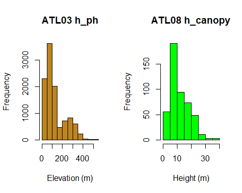
  <p class="caption">
  Histograms for ATL03 elevation and ATL08 h_canopy
</p>
  
  </div>
  
  </div>
  
  ## Export to vector
  
  The function `to_vect()` will return a `terra::vect` object.

``` r
library(terra)

blueYellowRed <- function(n) grDevices::hcl.colors(n, "RdYlBu")

set.seed(123)
mask <- base::sample(seq_len(nrow(atl03_seg_dt)), 50)
atl03_seg_vect <- to_vect(atl03_seg_dt)

# Plot with mapview
mapview::mapview(
  atl03_seg_vect[mask],
  zcol = "h_ph",
  layer.name = "h_ph",
  breaks = 3,
  col.regions = blueYellowRed,
  map.types = c("Esri.WorldImagery")
)
```

<div align="center">
  
  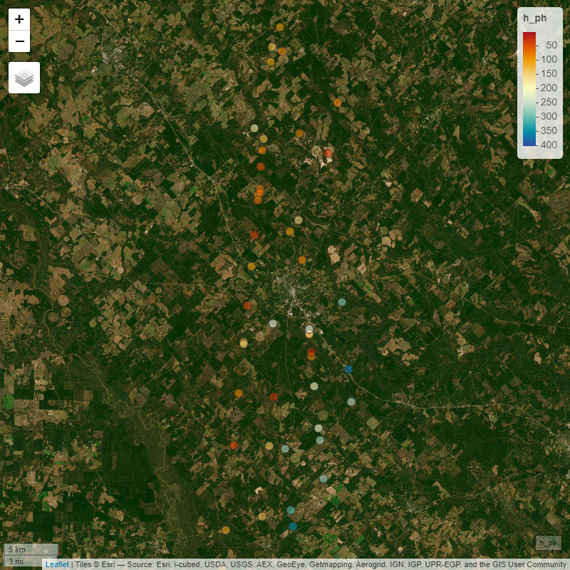
  
  </div>
  
  ``` r
# Extract vector from atl08_seg_dt
class(atl08_seg_dt)
atl08_seg_vect <- to_vect(atl08_seg_dt)

# Palette function
greenYellowRed <- function(n) {
  grDevices::hcl.colors(n, "RdYlGn")
}


# Plot with mapview
leaflet_available <- require("leaflet")
if (!leaflet_available) stop("leaflet not found!")

map_vect <- mapview::mapView(
  atl08_seg_vect,
  layer.name = "h_canopy",
  zcol = "h_canopy",
  col.regions = greenYellowRed,
  map.types = c("Esri.WorldImagery")
)

map_vect
```

<div align="center">
  
  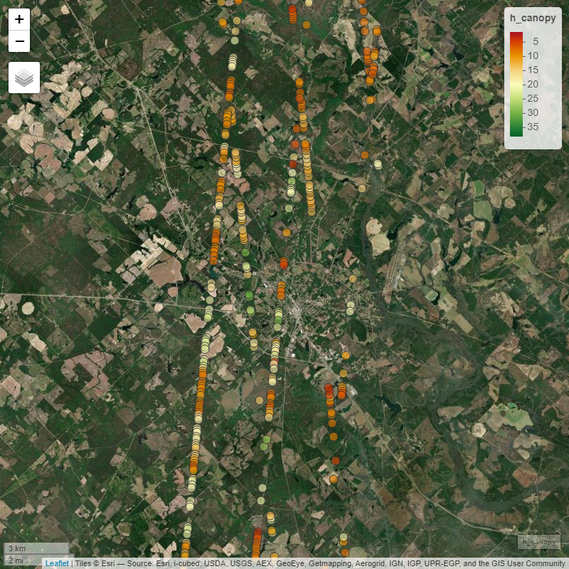
  
  </div>
  
  Save vector as geopackage file. The formats supported are as from GDAL
terra package.

``` r
terra::writeVector(atl03_seg_vect, file.path(outdir, "atl03_seg.gpkg"))
terra::writeVector(atl08_seg_vect, file.path(outdir, "atl08_seg.gpkg"))
```

## View ATL08 segments as raster

Single max_h_canopy:
  
  ``` r
redYellowGreen <- function(n) grDevices::hcl.colors(n, "RdYlGn")
max_h_canopy <- ATL08_seg_attributes_dt_gridStat(atl08_seg_dt, func = max(h_canopy), res = 0.02)

mapview::mapView(
  max_h_canopy,
  map = map_vect,
  col.regions = redYellowGreen
)
```

<div align="center">
  
  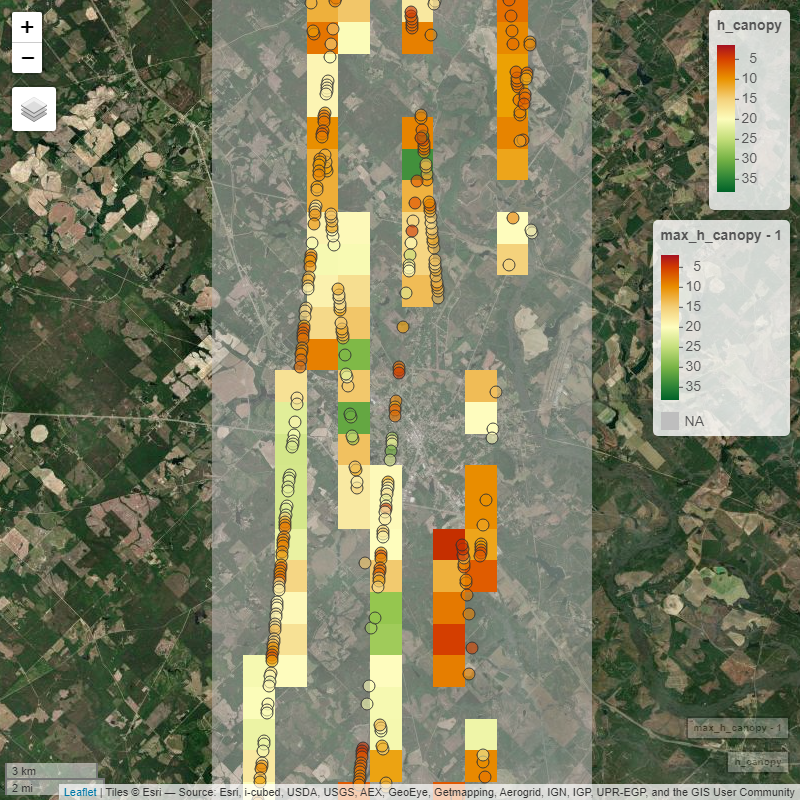
  
  </div>
  
  
  Multiple attributes:
  
  ``` r
multiple_attributes <- ATL08_seg_attributes_dt_gridStat(atl08_seg_dt, func = list(
  max_h_canopy = max(h_canopy),
  min_h_canopy = min(h_canopy),
  mean_canopy_openness = mean(canopy_openness),
  mean_h_te_mean = mean(h_te_mean)
), res = 0.01)

map_vect_openness <- mapview::mapView(
  atl08_seg_vect,
  zcol = "canopy_openness",
  layer.name = "canopy_openness",
  col.regions = redYellowGreen,
  map.types = c("Esri.WorldImagery")
)

blueYellowRed <- function(n) grDevices::hcl.colors(n, "RdYlBu", rev = TRUE)

map_vect_terrain <- mapview::mapView(
  atl08_seg_vect,
  zcol = "h_te_mean",
  layer.name = "h_te_mean",
  col.regions = blueYellowRed,
  map.types = c("Esri.WorldImagery")
)


m1 <- mapview::mapView(multiple_attributes[[1]], layer.name = "Max h_canopy", map = map_vect, col.regions = redYellowGreen)
m2 <- mapview::mapView(multiple_attributes[[2]], layer.name = "Min h_canopy", map = map_vect, col.regions = redYellowGreen)
m3 <- mapview::mapView(multiple_attributes[[3]], layer.name = "Mean canopy openness", map = map_vect_openness, col.regions = redYellowGreen)
m4 <- mapview::mapView(multiple_attributes[[4]], layer.name = "Mean h_te_mean", col.regions = blueYellowRed, map = map_vect_terrain)

leafsync::sync(m1, m2, m3, m4)
```

<div align="center" style="width:100%;">
  
  <figure>
  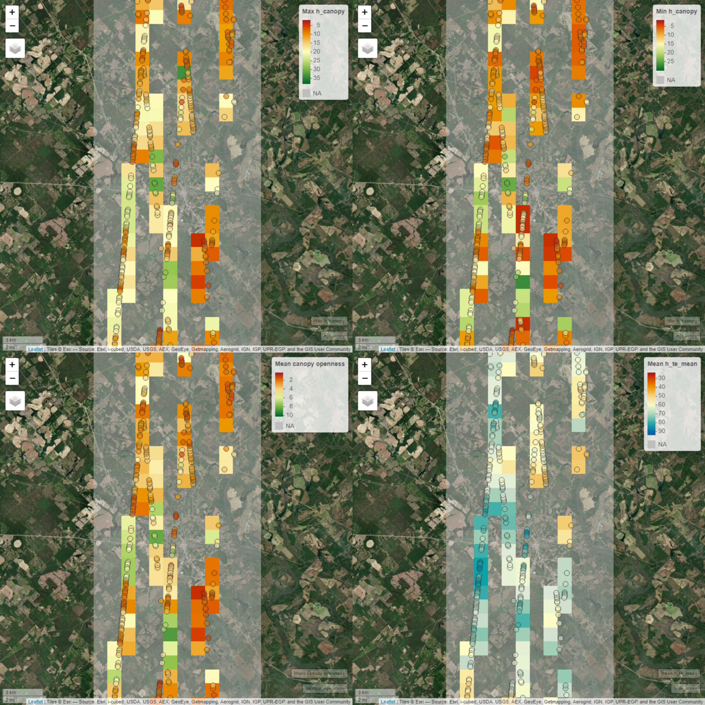
  <figcaption aria-hidden="true">multi</figcaption>
  </figure>
  
  </div>
  
  # Clipping ATL03 and ATL08 data
  
  Now we will use the clipping functions. There are two ways of clipping data in ICESat2VegR:
  
  1.Clipping raw HDF5 data from ATL03 and ATL08 files
2.Clipping extracted attributes produced by the extraction functions, such as:
  
  `ATL03_seg_metadata_dt`
`ATL03_photon_attributes_dt`
`ATL08_seg_attributes_dt`
`ATL03_ATL08_photons_attributes_dt_join`

The second method is preferred because it is faster and more efficient. It does not require re-reading the HDF5 file and clips only the extracted attributes, whereas the raw HDF5 structure contains many additional variables that may not be needed.
There are multiple clipping variants that operate either on a bounding box or a geometry, using the suffixes _clipBox or _clipGeometry:
  
  1.`ATL03_h5_clipBox`
2.`ATL03_h5_clipGeometry`
3.`ATL03_seg_metadata_dt`
4.`ATL03_photons_attributes_dt_clipBox` 
5.`ATL03_photons_attributes_dt_clipGeometry` 
6.`ATL08_h5_clipBox` 
7.`ATL08_h5_clipGeometry` 
8.`ATL08_seg_attributes_dt_clipBox` 
9.`ATL08_seg_attributes_dt_clipGeometry` 
10.`ATL03_ATL08_photons_attributes_dt_clipBox`
11.`ATL03_ATL08_photons_attributes_dt_clipGeometry`

In the following two sections there are two small examples on how to
clip the raw HDF5 and the extracted attributes.

## Clipping raw hdf5 data from ATL08

``` r
# Define bbox
clip_region <- terra::ext(-83.2, -83.14, 32.12, 32.18)
aoi <- file.path(outdir, "example_aoi.gpkg")
aoi_vect <- terra::vect(aoi)

# Define hdf5 output file
output <- tempfile(pattern = "alt08_h5_clip_", fileext = ".h5")

# Clip the data for only the first ATL08 file
atl08_clipped <- ATL08_h5_clipBox(atl08_h5[[1]], output, clip_obj = clip_region)

##atl08_clippeds <- ATL08_h5_clipGeometry(atl08_h5[[2]], output, clip_obj = aoi_vect, split_by="id")

atl08_seg_dt <- ATL08_seg_attributes_dt(atl08_h5[[1]], attributes = c("h_canopy"))
atl08_seg_dt_clip <- ATL08_seg_attributes_dt(atl08_clipped, attributes = c("h_canopy"))

# Display location of clipped data
atl08_seg_vect <- to_vect(atl08_seg_dt)
atl08_seg_clip_vect <- to_vect(atl08_seg_dt_clip)

bbox <- terra::vect(terra::ext(atl08_seg_clip_vect), crs = "epsg:4326")
centroid <- terra::geom(terra::centroids(bbox))

map1 <- mapview::mapview(
  atl08_seg_clip_vect,
  col.regions = "yellow",
  alpha.regions = 1,
  lwd = 5,
  map.types = c("Esri.WorldImagery"),
  alpha = 0,
  cex = 2,
  legend = FALSE
)

map1

dplyr_available <- require("dplyr")
if (!dplyr_available) stop("dplyr not found!")

# Final map
final_map <- map1@map %>%
  leaflet::addCircleMarkers(data = atl08_seg_vect, radius = 2) %>%
  leaflet::addPolygons(
    data = bbox, fillOpacity = 0, weight = 3, color = "white",
    opacity = 1, dashArray = "5, 1, 0"
  ) %>%
  leaflet::addLegend(
    position = "topright",
    colors = c("blue", "yellow", "white"),
    labels = c("atl08_segment", "atl08_segment_clipped", "bbox"),
    opacity = 1
  ) %>%
  leaflet::setView(centroid[, "x"][[1]], centroid[, "y"][[1]], zoom = 13)

final_map
```

<div align="center">
  
  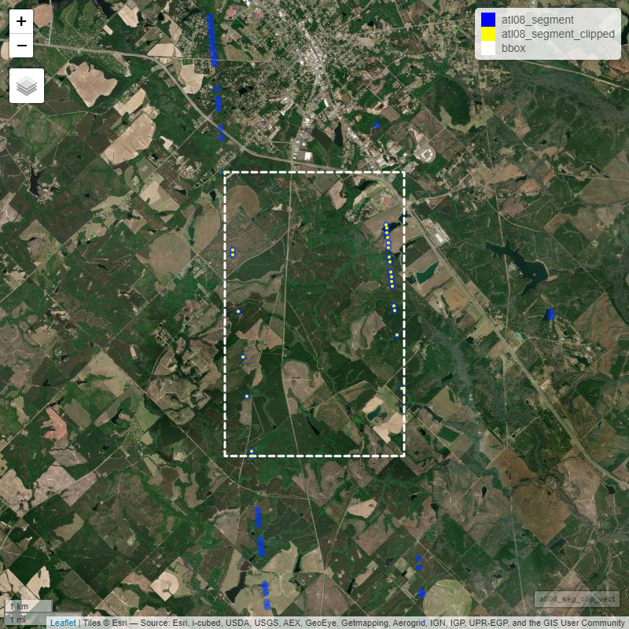
  
  </div>
  
  ## Clipping extracted attributes from ATL08 segments data
  
  ``` r
aoi <- file.path(outdir, "example_aoi.gpkg")
aoi_vect <- terra::vect(aoi)

centroid <- terra::geom(terra::centroids(aoi_vect))

# Extract the h_canopy attribute from the first ATL08 file
atl08_seg_dt <- lapply(atl08_h5, ATL08_seg_attributes_dt, attributes = c("h_canopy"))
atl08_seg_dt <- rbindlist2(atl08_seg_dt)
atl08_seg_vect <- to_vect(atl08_seg_dt)

# Clip using geometry
atl08_seg_dt_clip <- ATL08_seg_attributes_dt_clipGeometry(
  atl08_seg_dt, aoi_vect, split_by = "id"
)

atl08_seg_clip_vect <- to_vect(atl08_seg_dt_clip)

colors <- c("#00FF00", "#FF00FF")

map1 <- mapview::mapview(
  atl08_seg_clip_vect,
  alpha = 0,
  col.regions = colors,
  alpha.regions = 1,
  zcol = "poly_id",
  lwd = 5,
  map.types = c("Esri.WorldImagery"),
  cex = 2,
  legend = FALSE
)

# Final map
final_map <- map1@map %>%
  leaflet::addCircleMarkers(data = atl08_seg_vect, color = "blue", radius = 2) %>%
  leaflet::addPolygons(
    data = aoi_vect, fillOpacity = 0, weight = 3, color = colors,
    opacity = 1, dashArray = "5, 1, 0"
  ) %>%
  leaflet::addLegend(
    position = "topright",
    colors = c("blue", "yellow", colors),
    labels = c("atl08_segment", "atl08_segment_clipped", "aoi_1", "aoi_2"),
    opacity = 1
  ) %>%
  leaflet::setView(centroid[, "x"][[1]], centroid[, "y"][[1]], zoom = 13)

final_map
```

Using the Generic clip() Function

Instead of manually choosing from the many _clipBox or _clipGeometry functions, ICESat2VegR provides a unified clipping interface using the generic clip() function. The generic automatically:
  detects the class of the input object (x),
determines whether the clipping object is a bounding box or a geometry,
dispatches to the appropriate helper function internally.

This allows simpler and cleaner code:
  
  ```r
clipped <- clip(data_object, clip_obj = aoi)
```
which internally routes the request to the correct clipping function — for example, ATL08_seg_attributes_dt_clipGeometry() or ATL03_h5_clipBox(), depending on the objects supplied.


The clip() function automatically:
  
  detects the class of the ICESat-2 object (x),
determines whether the clipping object is a bounding box or a geometry,
and dispatches to the appropriate specialized clipping helper.

This makes your workflow much simpler and more consistent, especially when switching between ATL03/ATL08 HDF5 objects and extracted attribute tables.

Example 1: Using clip() on Extracted ATL08 Segment Attributes
```r
# Extract ATL08 segment attributes
atl08_seg <- ATL08_seg_attributes_dt(atl08_h5[[1]], attributes = "h_canopy")

# Define area of interest
aoi <- file.path(outdir, "example_aoi.gpkg")
aoi_vect <- terra::vect(aoi)

# Clip using the generic function
atl08_seg_clip <- clip(atl08_seg, clip_obj = aoi_vect)

# Convert to vector for visualization
atl08_seg_clip_vect <- to_vect(atl08_seg_clip)
```


Example 2: Using clip() on Raw ATL03 HDF5 Data
```r
# ATL03 HDF5 object
atl03 <- ATL03_read(atl03_files[[1]])

# Define output path
output <- tempfile(pattern = "atl03_clip_", fileext = ".h5")

# Define bounding box with YOUR coordinates
bbox <- terra::ext(c(-84.71409, -84.6435, 30.12047, 30.17786))

# Clip using generic clip()
atl03_clipped <- clip(atl03, output, clip_obj = bbox)
```

Comparison: Generic `clip()` vs. Direct Helper Functions

| Task                                      | Generic `clip()`              | Specific Helper Function                                                   |
  |-------------------------------------------|-------------------------------|-----------------------------------------------------------------------------|
  | Clip ATL03 HDF5 by bounding box           | `clip(atl03, bbox)`          | `ATL03_h5_clipBox(atl03, bbox)`                                            |
  | Clip ATL03 HDF5 by geometry               | `clip(atl03, geom)`          | `ATL03_h5_clipGeometry(atl03, geom)`                                       |
  | Clip ATL03 extracted attributes           | `clip(atl03_dt, geom)`       | `ATL03_photon_attributes_dt_clipGeometry(atl03_dt, geom)`                  |
  | Clip ATL08 extracted attributes           | `clip(atl08_dt, geom)`       | `ATL08_seg_attributes_dt_clipGeometry(atl08_dt, geom)`                     |
  | Clip ATL03–ATL08 joined attributes        | `clip(join_obj, geom)`       | `ATL03_ATL08_photons_attributes_dt_join_clipGeometry(join_obj, geom)`      |
  
  ---
  
  Why Use `clip()`?
  
  - Avoids memorizing many different clipping helper function names  
- Ensures consistent behavior across ATL03, ATL08, and joined datasets  
- Reduces code duplication and improves maintainability  
- Automatically selects the correct clipping method based on inputs  
- Produces cleaner and more readable workflows  


<div align="center">
  
  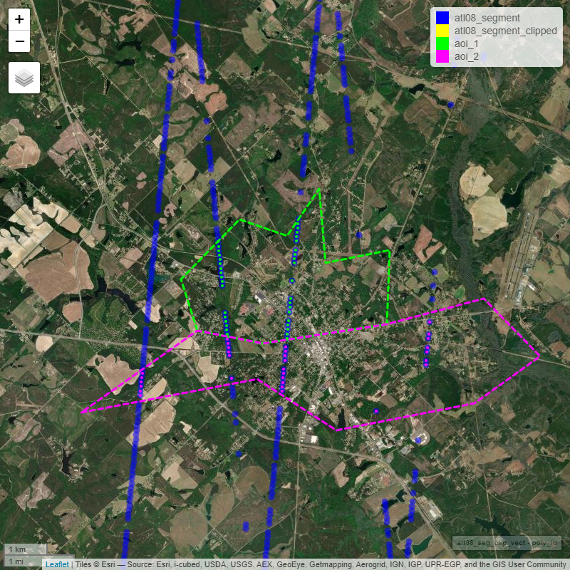
  
  </div>
  
  # Joining ATL03 and ATL08 data
  
  ## Extract attributes
  
  ``` r
# import the ATL03 h5 files
atl03_files <- list.files(outdir, "ATL03.*h5", full.names = TRUE)
atl03_h5 <- lapply(atl03_files, ATL03_read)

# Herein as we are working with list of h5 files we will need
# to loop over each file and extract the attributes and then
# concatenate them with rbindlist2
atl03_atl08_dts <- lapply(
  seq_along(atl03_h5),
  function(ii) {
    ATL03_ATL08_photons_attributes_dt_join(
      atl03_h5[[ii]],
      atl08_h5[[ii]]
    )
  }
)

atl03_atl08_dt <- rbindlist2(atl03_atl08_dts)

head(atl03_atl08_dt)
```

<div align="center" style="overflow-x: scroll;">
  
  | ph_segment_id |    lon_ph |   lat_ph |     h_ph | quality_ph | solar_elevation | dist_ph_along | dist_ph_across | night_flag | classed_pc_indx | classed_pc_flag |       ph_h | d_flag | delta_time | orbit_number | beam | strong_beam |
  |--------------:|----------:|---------:|---------:|-----------:|----------------:|--------------:|---------------:|-----------:|----------------:|----------------:|-----------:|-------:|-----------:|-------------:|:-----|:------------|
  |        177488 | -83.17570 | 31.99959 | 44.61499 |          0 |        15.39738 |      3762.072 |       3169.208 |          0 |              44 |               2 |  4.3425255 |      1 |   40393396 |         3208 | gt1r | TRUE        |
  |        177488 | -83.17570 | 31.99959 | 48.81370 |          0 |        15.39738 |      3762.074 |       3169.180 |          0 |              45 |               3 |  8.6167412 |      1 |   40393396 |         3208 | gt1r | TRUE        |
  |        177488 | -83.17571 | 31.99962 | 43.38353 |          0 |        15.39738 |      3765.626 |       3169.205 |          0 |              49 |               2 |  3.2494583 |      1 |   40393396 |         3208 | gt1r | TRUE        |
  |        177488 | -83.17571 | 31.99964 | 48.24021 |          0 |        15.39738 |      3767.768 |       3169.175 |          0 |              56 |               3 |  8.1592712 |      1 |   40393396 |         3208 | gt1r | TRUE        |
  |        177488 | -83.17571 | 31.99964 | 56.24585 |          0 |        15.39738 |      3767.773 |       3169.122 |          0 |              57 |               3 | 16.2089348 |      1 |   40393396 |         3208 | gt1r | TRUE        |
  |        177488 | -83.17571 | 31.99965 | 40.30040 |          0 |        15.39738 |      3769.191 |       3169.229 |          0 |              62 |               1 |  0.2985229 |      1 |   40393396 |         3208 | gt1r | TRUE        |
  
  </div>
  
  ## Plotting the result:
  
  ``` r
oldpar <- par(no.readonly = TRUE)
par(oma = c(0, 0, 0, 0))
par(mar = c(2, 3, 1, 1))
layout(matrix(c(1, 2), ncol = 1))
plot(
  atl03_atl08_dt[orbit_number == 3208],
  y = "h_ph",
  colors = c("gray", "#bd8421", "forestgreen", "green"),
  xlim = c(25500, 28500),
  beam = "gt2r",
  cex = 0.5,
  pch = 16
)

par(mar = c(3, 3, 1, 1))

plot(
  atl03_atl08_dt[orbit_number == 3208],
  y = "ph_h",
  colors = c("gray", "#bd8421", "forestgreen", "green"),
  xlim = c(25500, 28500),
  beam = "gt2r",
  cex = 0.5,
  pch = 16,
  legend = FALSE
)

par(
  oldpar
)
```

<div align="center">
  
  <div class="figure" style="text-align: center">
  
  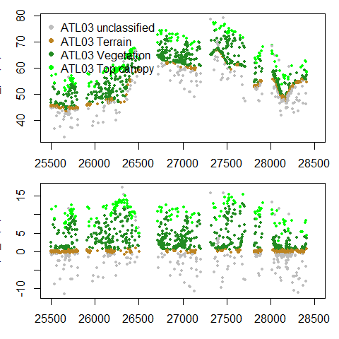
  <p class="caption">
  Classified ATL03 photons using ATL08 labels
</p>
  
  </div>
  
  </div>
  
  ## Calculating raster statistics
  
  ``` r
h_canopy <- ATL03_ATL08_photons_attributes_dt_gridStat(
  atl03_atl08_dt[ph_h < 50 & ph_h > 0],
  func = list(
    h_canopy = quantile(ph_h, 0.98),
    count = .N
  ),
  res = 0.01
)

plot(h_canopy,
     col = viridis::inferno(100),
     xlab = "Langitude (degree)",
     ylab = "Latitude (degree)",
     ylim = c(32.1, 32.4)
)
```

<div align="center">
  
  <div class="figure" style="text-align: center">
  
  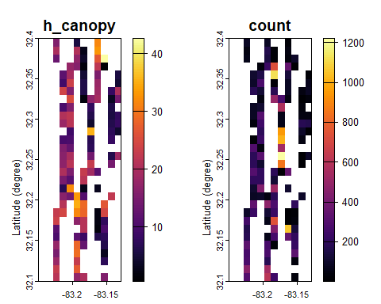
  <p class="caption">
  Rasterized ATL03_ATL08 data for canopy height (h_canopy) and number of
photons (n)
</p>
  
  </div>
  
  </div>
  
  # Calculating ATL08 metrics for different size segments other than 100m and 20m
  
  ## Introduction
  
  In this section, we will demonstrate how to use the
`ATL03_ATL08_segment_create` function from the `ICESat2VegR` package.
This function is used to compute segment IDs for ICESat-2 `ATL03` and
`ATL08` data and create segments based on a specified segment length.

``` r
# Herein as we are working with list of h5 files we will need
# to loop over each file and extract the attributes and then
# concatenate them with rbindlist2

stopifnot(length(atl03_h5) == length(atl08_h5))

atl03_atl08_dts <- lapply(
  seq_along(atl03_h5),
  function(ii) {
    ATL03_ATL08_photons_attributes_dt_join(
      atl03_h5[[ii]],
      atl08_h5[[ii]]
    )
  }
)

atl03_atl08_dt <- rbindlist2(atl03_atl08_dts)
head(atl03_atl08_dt)

```

## Create Segments IDs

Now, we use the `ATL03_ATL08_segment_create` function to create segments
with a specified segment length.

``` r
atl03_atl08_photons_grouped_dt <- ATL03_ATL08_segment_create(atl03_atl08_dt,
                                                             segment_length = 30,
                                                             centroid = "mean",
                                                             output = NA,
                                                             overwrite = FALSE
)
```

## Compute Segment Statistics

``` r
atl03_atl08_seg_dt <- ATL03_ATL08_compute_seg_attributes_dt_segStat(
  atl03_atl08_photons_grouped_dt,
  list(
    h_canopy_ge0 = quantile(ph_h, 0.98),
    h_canopy_gt0 = quantile(ph_h[ph_h > 0], 0.98),
    n_ground = sum(classed_pc_flag == 1),
    n_mid_canopy = sum(classed_pc_flag == 2),
    n_top_canopy = sum(classed_pc_flag == 3),
    n_canopy_total = sum(classed_pc_flag >= 2)
  ),
  ph_class = c(1, 2, 3)
)

head(atl03_atl08_seg_dt)
```

<div align="center" style="overflow-x: scroll;">
  
  | segment_id | beam | longitude | latitude | h_canopy_ge0 | h_canopy_gt0 | n_ground | n_mid_canopy | n_top_canopy | n_canopy_total |
  |-----------:|:-----|----------:|---------:|-------------:|-------------:|---------:|-------------:|-------------:|---------------:|
  |        352 | gt1r | -54.37593 | 42.80719 |    10.752865 |    13.017654 |       32 |            6 |            1 |              7 |
  |        353 | gt1r | -61.84944 | 40.06217 |    11.603264 |    13.582950 |       31 |            5 |            1 |              6 |
  |        354 | gt1r | -60.80575 | 40.45152 |    12.474311 |    14.081770 |       49 |            7 |            1 |              8 |
  |        355 | gt1r | -74.82788 | 35.28340 |    14.985960 |    15.917793 |       38 |           17 |            2 |             19 |
  |        356 | gt1r | -66.45581 | 38.37186 |     1.457885 |     1.672792 |       31 |           16 |            0 |             16 |
  |        357 | gt1r | -63.74473 | 39.37878 |    14.188966 |    14.395315 |       30 |           10 |            1 |             11 |  
  
  </div>
  
  ## Convert to SpatVector
  
  Now, we convert the data.table to a SpatVector object.

``` r
atl03_atl08_vect <- to_vect(atl03_atl08_seg_dt[h_canopy_gt0 <= 31])
```

## Visualize the segments

Finally, we visualize the SpatVector interactively using mapview.

``` r
# Get coordinates of segment 1358
seg_1358 <- atl03_atl08_seg_dt[segment_id == 1358]
seg_1358$longitude
seg_1358$latitude

# Use those coordinates as centroid
map_output <- mapview::mapview(
  atl03_atl08_vect,
  zcol        = "h_canopy_gt0",
  col.regions = grDevices::hcl.colors(9, "RdYlGn"),
  alpha       = 0,
  layer.name  = "h_canopy",
  map.types   = c("Esri.WorldImagery"),
  cex         = 4
)@map %>%
  leaflet::setView(
    lng  = seg_1358$longitude, 
    lat  = seg_1358$latitude, 
    zoom = 10
  )

map_output
```

<div align="center">
  
  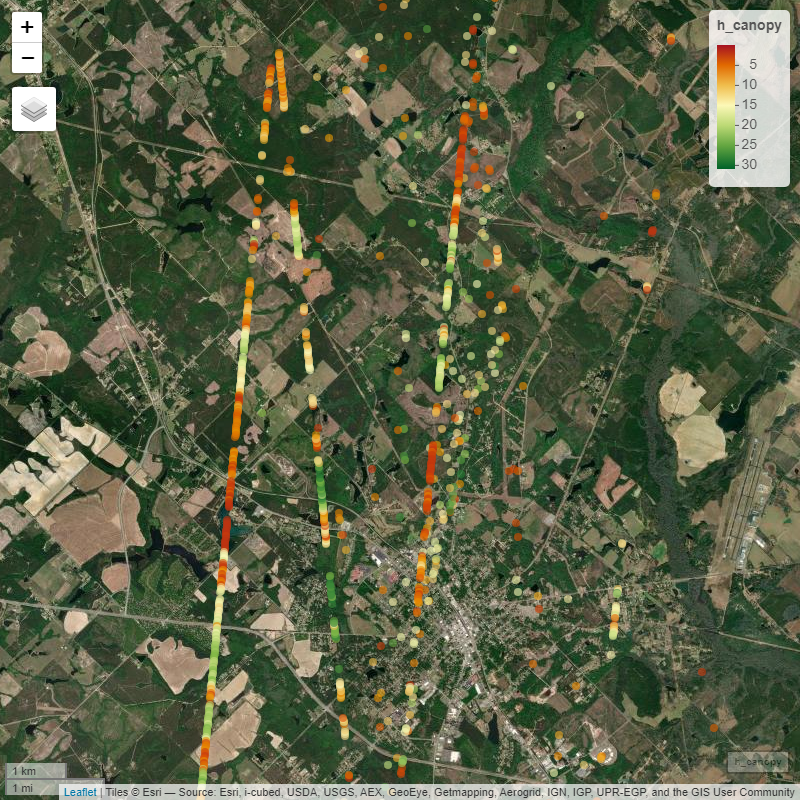
  
  </div>
  
  # Predicting and rasterizing ATL08 h_canopy data using machine learning models
  
  ## Creating a simple model for ATL08 data
  
  Here, we will create a simple model to predict the AGBD of ATL08 data
based on the height of the canopy. We will use the `randomForest`
package to create the model.

Let’s assume we have the following tabular data from ATL08 and field
data.

``` r
# For the sake of the example, we will train and test the model with the same data
library(randomForest)

h_canopy <- c(
  13.9, 3.1, 2.2, 4.6, 21.6,
  7.2, 5, 7.7, 0.8, 9.7,
  11, 11.3, 15.5, 5.1, 10.4,
  0.6, 14.6, 13.3, 9.8, 14.7
)

agbd <- c(
  144.8, 27.5, 51.6, 60.5, 232.3,
  102.8, 33.1, 91.3, 23, 120.1,
  125.7, 127.2, 147.4, 48.8, 103.3,
  55.9, 181.8, 139.9, 120.1, 162.8
)

set.seed(172783946)
model <- randomForest::randomForest(data.frame(h_canopy = h_canopy), agbd)
```

## Predicting ATL08 data

Now we will predict the data for the entire ATL08 dataset, this can be
as large as you want. This will create or append the predicted values to
an H5 file.

``` r
out_h5 <- tempfile(fileext = ".h5")

for (atl08_h5_item in atl08_h5) {
  atl08_seg_dt <- ATL08_seg_attributes_dt(atl08_h5_item, attributes = c("h_canopy"))
  atl08_seg_dt[h_canopy > 100, h_canopy := NA_real_]
  atl08_seg_dt <- na.omit(atl08_seg_dt)
  predicted_h5 <- predict_h5(model, atl08_seg_dt, out_h5)
}
```

## Rasterizing the predicted data

``` r

# Fix PROJ path
Sys.setenv(PROJ_DATA = system.file("proj", package = "ICESat2VegR"))
Sys.setenv(PROJ_LIB  = system.file("proj", package = "ICESat2VegR"))

# Verify
system.file("proj", package = "ICESat2VegR")  # should return a path
# Use only your AOI coordinates
x_clip <- x[x >= -84.72 & x <= -84.64]
y_clip <- y[y >= 30.12  & y <= 30.18]

bbox <- terra::ext(
  min(x_clip), max(x_clip),
  min(y_clip), max(y_clip)
)
bbox

# Rasterize
output_raster <- tempfile(fileext = ".tif")
rasterize_h5(predicted_h5, output_raster, bbox = bbox, res = 0.005)

output_raster <- tempfile(fileext = ".tif")
x <- predicted_h5[["longitude"]][]
y <- predicted_h5[["latitude"]][]
bbox <- terra::ext(min(x), max(x), min(y), max(y))

# Creates the raster with statistics
res <- 0.02
rasterize_h5(predicted_h5, output_raster, bbox = bbox, res = res)

# Open the raster by file path
forest_height_palette <- c("#ffffff", "#4d994d", "#004d00")

# Open band 2 only (mean AGBD)
library(leaflet)

stars_rast <- stars::read_stars(output_raster, RasterIO = list(bands = 2))
res_map <- mapview::mapview(
  stars_rast,
  layer.name = "AGBD mean",
  col.regions = forest_height_palette,
  na.alpha = 0.1,
  map = leaflet::leaflet() %>% leaflet::addProviderTiles("Esri.WorldImagery")
)
res_map
```

<div align="center">
  
  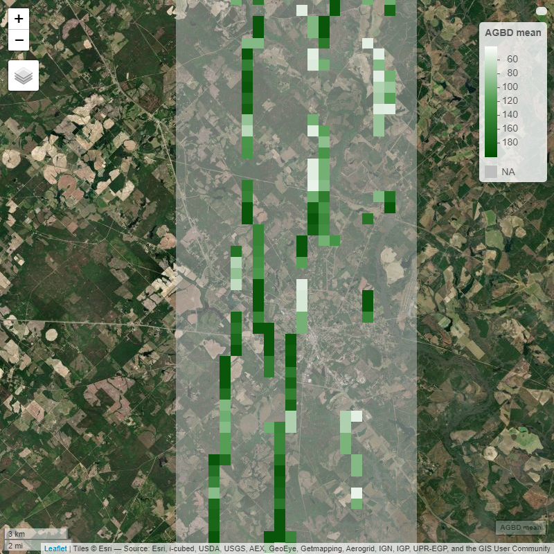
  
  </div>
  
#
# Upscaling ICESat-2 canopy height using AlphaEarth Embeddings and ancillary datasets 
#

## Introduction
  
In this workflow we model the `rh98` canopy height metric from ICESat-2 ATL03/ATL08 using
**AlphaEarth embeddings** (64 bands: A00–A63) combined with terrain predictors
(elevation, slope, aspect, lon, lat) retrieved through Google Earth Engine.
A Random Forest model is trained on sampled segments and applied wall-to-wall across the AOI.

## Code availability

A complete end-to-end workflow demonstrating the use of ICESat2VegR for canopy height modeling is available as a standalone R script:


📢 **Click here to access and download the example workflow script [](inst/scripts/upscaling_alphaearth_workflow.R).**

Users can download, copy, and run this script to test the full workflow, including:

- ICESat-2 data discovery, download, and processing
- Segment-level canopy height metric extraction
- AlphaEarth embedding generation
- Ancillary terrain predictor extraction
- Predictor selection and model development
- Wall-to-wall canopy height prediction
- GeoTIFF export and visualization

This script serves as a practical example of how to integrate ICESat2VegR functions into a complete forest structure mapping workflow.
## Install and load required packages

``` r
# The r-universe version (recommended for the latest version)
install.packages("ICESat2VegR", , repos = c("https://caiohamamura.r-universe.dev", "https://cloud.r-project.org"))
#install.packages('ICESat2VegR', repos = c('https://carlos-alberto-silva.r-universe.dev', 'https://cloud.r-project.org'))

# The CRAN version
#install.packages("ICESat2VegR")

# Required additional libraries
need_pkgs <- c(
  "reticulate",   # Python <-> R interface
  "leaflet",      # interactive maps
  "sf",           # spatial vectors
  "terra",        # rasters & vectors
  "data.table",   # fast tables
  "dplyr",        # tidy helpers
  "mapview",      # interactive map viewer
  "caret"         # modeling / ML
)
missing <- need_pkgs[!need_pkgs %in% rownames(installed.packages())]
if (length(missing)) {
  message("Installing missing R packages: ", paste(missing, collapse = ", "))
  install.packages(missing, repos = repos, dependencies = TRUE)
}
```

## Load the package

``` r
suppressPackageStartupMessages({
  library(ICESat2VegR)
  library(reticulate)
  library(leaflet)
  library(sf)
  library(terra)
  library(data.table)
  library(dplyr)
  library(mapview)
  library(caret)
})
cat("Loading libraries... done.\n")                                                    # Confirm loading

```

## Read AOI and define date range

``` r
aoi_path <- system.file("extdata", "aoi_4326.geojson", package = "ICESat2VegR")
boundary <- sf::st_read(aoi_path, quiet = TRUE)
box      <- sf::st_bbox(boundary)

lower_left_lon  <- box["xmin"];  lower_left_lat  <- box["ymin"]
upper_right_lon <- box["xmax"];  upper_right_lat <- box["ymax"]

daterange <- c("2025-08-01", "2025-08-31")
```

## Discover ATL03 and ATL08 granules

``` r
atl03_granules_cloud <- ICESat2VegR::ATLAS_dataFinder(
  short_name = "ATL03",
  lower_left_lon, lower_left_lat, upper_right_lon, upper_right_lat,
  version = "007", daterange = daterange, persist = TRUE, cloud_computing = FALSE
)

atl08_granules_cloud <- ICESat2VegR::ATLAS_dataFinder(
  short_name = "ATL08",
  lower_left_lon, lower_left_lat, upper_right_lon, upper_right_lat,
  version = "007", daterange = daterange, persist = TRUE, cloud_computing = FALSE
)
```

## Download granules locally

``` r
outdir <- tempdir()
ATLAS_dataDownload(atl03_granules_cloud, outdir)
ATLAS_dataDownload(atl08_granules_cloud, outdir)
```

## Pair ATL03 and ATL08 files by shared timestamp

``` r
atl03_files <- list.files(outdir, pattern = "ATL03.*h5", full.names = TRUE)
atl08_files <- list.files(outdir, pattern = "ATL08.*h5", full.names = TRUE)
get_timestamp <- function(f) sub(".*_(\\d{14})_.*", "\\1", basename(f))
timestamps_comuni <- intersect(sapply(atl08_files, get_timestamp),
                               sapply(atl03_files, get_timestamp))
```

## Read one ATL03/ATL08 pair and join photon attributes

``` r
ts    <- timestamps_comuni[1]
atl03 <- ICESat2VegR::ATL03_read(atl03_files[grepl(ts, atl03_files)])
atl08 <- ICESat2VegR::ATL08_read(atl08_files[grepl(ts, atl08_files)])

dt <- ICESat2VegR::ATL03_ATL08_photons_attributes_dt_join(atl03, atl08)
head(dt)
```

## Create 20 m segments and compute canopy metrics

``` r
seg20 <- ATL03_ATL08_segment_create(dt, 20, centroid = "mean", output = NA, overwrite = FALSE)

stats20 <- ATL03_ATL08_compute_seg_attributes_dt_segStat(
  seg20,
  list(
    rh98           = quantile(ph_h[ph_h > 0 & classed_pc_flag %in% c(2,3)], 0.98),
    n_ground       = sum(classed_pc_flag == 1),
    n_top_canopy   = sum(classed_pc_flag == 3),
    n_canopy_total = sum(classed_pc_flag >= 2),
    mean_solar     = mean(solar_elevation),
    night_flag2    = as.integer(mean(night_flag) > 0.5)
  ),
  ph_class = c(2, 3)
)
# Convert to SpatVector first
stats20_vect <- to_vect(stats20)

centroid <- stats20[, .(x = mean(longitude), y = mean(latitude))]

map_output <- mapview::mapview(
  stats20_vect,
  zcol        = "rh98",
  col.regions = grDevices::hcl.colors(9, "RdYlGn"),
  alpha       = 0,
  layer.name  = "rh98 (m)",
  map.types   = c("Esri.WorldImagery"),
  cex         = 4
)@map %>%
  leaflet::setView(lng = centroid$x, lat = centroid$y, zoom = 10)

map_output
```
<div align="center">
  
  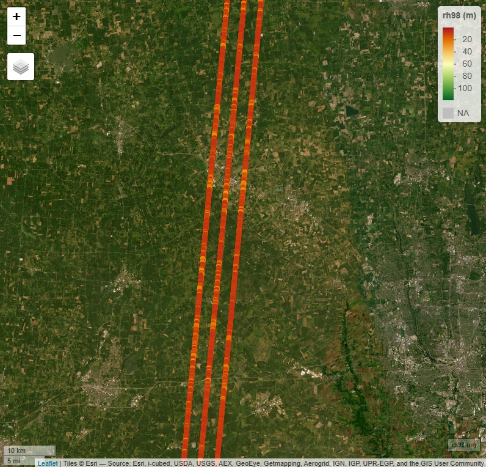
  
  </div>
  
  ## Clip segments to AOI and export GeoJSON
  
  ``` r
stats20_clip <- ATL03_ATL08_seg_attributes_dt_clipGeometry(stats20, boundary)
stats20_clip$year <- as.integer(substr(ts, 1, 4))
stats20_clip <- stats20_clip[stats20_clip$rh98 <= 50]

stats20_clip_sf <- st_as_sf(
  as.data.frame(stats20_clip),
  coords = c("longitude", "latitude"), crs = 4326, remove = FALSE
)
st_write(stats20_clip_sf,
         file.path(outdir, paste0("ATL03_ATL08_", ts, "_20.geojson")),
         delete_dsn = TRUE, quiet = TRUE)
```

## Package configuration
This package uses three Python packages through reticulate:
  
  earthaccess: allows reading directly from the cloud
h5py: for reading HDF5 content from the cloud
earthengine-api: integration with Google Earth Engine for sampling, extracting raster data, and upscaling models

For full configuration and initialization steps, please read the Package Configuration README.

``` r
Sys.setenv(EE_PROJECT = "your-ee-project")
ICESat2VegR::ee_initialize()

boundary_simple <- sf::st_simplify(
  sf::st_union(sf::st_make_valid(boundary)),
  dTolerance = 0.001
)
region <- .as_ee_geom(boundary_simple)
```

## Build AlphaEarth predictor stack and extract values at segment locations

``` r
seg_path <- system.file("extdata", "ATL03_ATL08_example_segments.geojson", package = "ICESat2VegR")
data_raw <- sf::read_sf(seg_path)
df_dt    <- data.table::as.data.table(sf::st_drop_geometry(data_raw))
class(df_dt) <- c("icesat2.atl03_atl08_seg_dt", "data.table", "data.frame")

set.seed(1)
df_sampled <- ICESat2VegR::sample(df_dt, method = randomSampling(500))

df_vect <- terra::vect(
  as.data.frame(df_sampled), geom = c("longitude", "latitude"), crs = "EPSG:4326"
)

yr          <- 2025
predictors2 <- ee_build_AlphaEarth_embedding_terrain_stack(region, yr, yr)
sampling_df <- ICESat2VegR::seg_ancillary_extract(predictors2, df_vect, 20)
head(sampling_df[, 1:12])
```
| **idx** | **rh98** | **beam** | **n_canopy_total** | **year** | **n_ground** | **n_top_canopy** | **n_mid_canopy** | **night_flag2** | **A43** | **A00** | **A01** |
  |---|---|---|---|---|---|---|---|---|---|---|---|
  | 1 | 14.7536 | gt1l | 11 | 2025 | 0 |  1 | 10 | 1 | -0.0888 |  0.0797 | -0.1191 |
  | 2 | 34.2744 | gt1r | 21 | 2025 | 0 |  7 | 14 | 1 | -0.0022 |  0.1417 | -0.1034 |
  | 3 | 21.3566 | gt1r | 27 | 2025 | 0 |  6 | 21 | 1 | -0.0354 |  0.0936 | -0.0630 |
  | 4 | 14.3197 | gt1l |  3 | 2025 | 0 |  0 |  3 | 1 |  0.0754 |  0.1085 | -0.1538 |
  | 5 |  0.5030 | gt1l |  1 | 2025 | 0 |  0 |  1 | 1 | -0.0062 |  0.1359 | -0.0178 |
  | 6 | 16.9825 | gt1l |  3 | 2025 | 0 |  1 |  2 | 1 | -0.0325 |  0.0936 | -0.0842 |
  
  ### Visualize the predictor stack as false-color RGB
  
  ``` r
predictors2_rgb <- predictors2$select(c("A00", "A20", "A40"))
#
centroid_lon <- mean(terra::ext(terra::vect(boundary))[c(1,2)])
centroid_lat <- mean(terra::ext(terra::vect(boundary))[c(3,4)])
#
leaflet::leaflet() |>
  addEEImage(
    predictors2_rgb,
    bands = c("A00", "A20", "A40"),
    group = "RGB Embedding",
    min = c(-0.06),
    max = c( 0.12)
  ) |>
  leaflet::addControl(
    html     = "<b>RGB Embedding</b><br>Bands: A00 / A20 / A40",
    position = "bottomleft"
  ) |>
  leaflet::setView(lng = centroid_lon, lat = centroid_lat, zoom = 16) |>
  leaflet::addLayersControl(
    overlayGroups = "RGB Embedding",
    options = leaflet::layersControlOptions(collapsed = FALSE)
  )
```

<div align="center">
  
  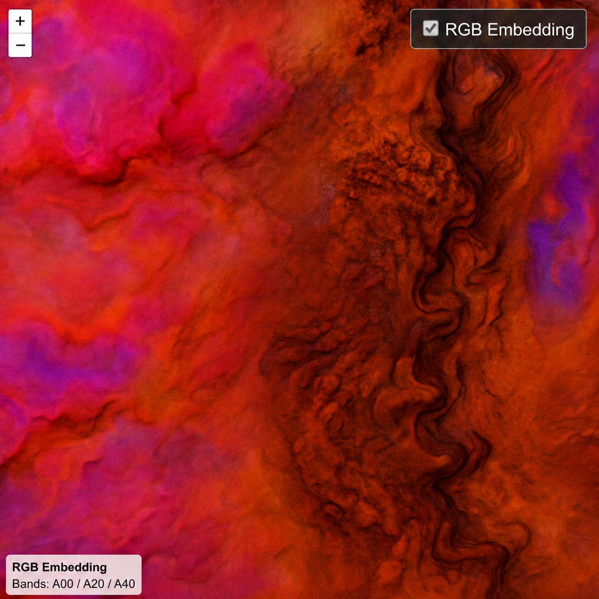
  
  </div>
  
  ## Variable selection with RFE
  
  Select the most informative bands for `rh98` prediction (importance ≥ 0.2).

``` r
x <- sampling_df %>%
  dplyr::select(starts_with("A"), "slope", "aspect", "elevation") %>%
  data.frame()
y <- sampling_df %>% dplyr::select("rh98") %>% data.frame()

sel_rf_rfe   <- varSel(x, y$rh98)
best_metrics <- sel_rf_rfe$selvars
print(best_metrics)

# Build importance tables from sel_rf_rfe
imp_desc <- sel_rf_rfe$importance %>%
  dplyr::mutate(selected = parameter %in% sel_rf_rfe$selvars) %>%
  dplyr::arrange(importance)

best_imp_rfe <- imp_desc %>%
  dplyr::filter(selected == TRUE) %>%
  dplyr::arrange(importance)

par(mfrow = c(1, 2), mar = c(4, 6, 2, 1))

# Left — all RFE evaluated, colored by selection
barplot(
  rev(imp_desc$importance),
  names.arg = rev(as.character(imp_desc$parameter)),
  horiz     = TRUE,
  las       = 1,
  main      = "RFE importance\n(green = selected)",
  xlab      = "Importance",
  col       = ifelse(rev(imp_desc$selected), "#1B7837", "grey70"),
  cex.names = 0.7
)
abline(v = 0.2, lty = 2, col = "red")

# Right — selected only
barplot(
  best_imp_rfe$importance,
  names.arg = as.character(best_imp_rfe$parameter),
  horiz     = TRUE,
  las       = 1,
  main      = "Selected predictors",
  xlab      = "Importance",
  col       = "#1B7837",
  cex.names = 0.8
)
abline(v = 0.2, lty = 2, col = "red")

par(mfrow = c(1, 1), mar = c(5, 4, 4, 2))

```

    ##  [1] "A07"  "A22"  "A24"  "A40"  "A56"  "A62"  "A36"  "A34"  "A38"
    ## [10] "elevation" "A23" "A20"  "A18"  "A02"  "A57"  "A13"  "A21"  "A30"


<div align="center">
  
  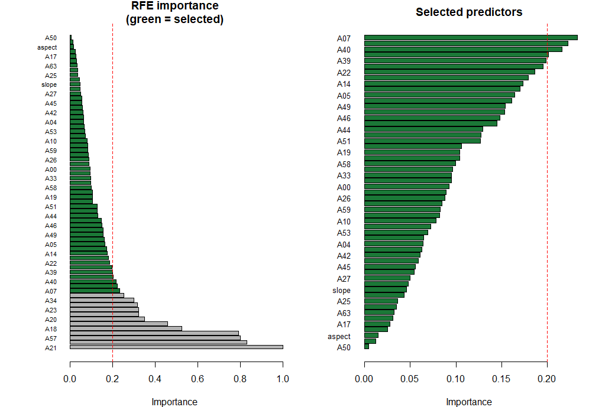
  
  </div>
  
  
  ## Train/test split and fit Random Forest model
  
  70 % training / 30 % test holdout split.

``` r
x      <- dplyr::select(sampling_df, dplyr::any_of(best_metrics))
y      <- sampling_df$rh98
data_i <- data.frame(y, x, check.names = FALSE)

idx_train <- caret::createDataPartition(y = data_i$y, p = 0.70, list = FALSE)
trainData <- data_i[ idx_train, ]
testData  <- data_i[-idx_train, ]

fit_rf   <- fit_model(x = dplyr::select(trainData, dplyr::any_of(best_metrics)),
                      y = trainData$y,
                      rf_args = list(ntree = 100))
rf_model <- fit_rf$model

pred_train <- predict(rf_model, newdata = dplyr::select(trainData, dplyr::any_of(best_metrics)))
pred_test  <- predict(rf_model, newdata = dplyr::select(testData,  dplyr::any_of(best_metrics)))

results_train <- fit_metrics(trainData$y, as.numeric(pred_train))
results_test  <- fit_metrics(testData$y,  as.numeric(pred_test))

head(results_train)
head(results_test)
```

| | **Train** | | | **Test** | |
  |---|---|---|---|---|---|
  | **stat** | **value** | **unit** | **stat** | **value** | **unit** |
  | rmse  |  2.30718520 |   | rmse  |  4.8401941 |   |
  | rmseR | 11.16195315 | % | rmseR | 23.5437462 | % |
  | mae   |  1.45726795 |   | mae   |  3.0926085 |   |
  | maeR  |  7.05013041 | % | maeR  | 15.0431139 | % |
  | bias  | -0.03851741 |   | bias  |  0.1111090 |   |
  | biasR | -0.18634375 | % | biasR |  0.5404579 | % |
  
  ## Wall-to-wall canopy height map in GEE
  
  ``` r
mosaic <- ee_build_AlphaEarth_embedding_terrain_stack(region, yr, yr)

ch_map <- map_create(
  model    = fit_rf$model,
  stack    = mosaic,
  aoi      = region,
  reducer  = "mosaic",
  mode     = "auto",
  to_float = TRUE
)
```

### Visualize the canopy height map

``` r
min_hcanopy <- 0
max_hcanopy <- 40

forest_palette <- colorRampPalette(
  c("#fcd88f", "#00441B", "#1B7837", "#A6DBA0", "#E7E1EF", "#762A83")
)(128)

pal_fun <- leaflet::colorNumeric(forest_palette, domain = c(min_hcanopy, max_hcanopy))

leaflet::leaflet() |>
  addEEImage(
    ch_map,
    bands   = "prediction_layer",
    group   = "Canopy Height",
    min     = min_hcanopy,
    max     = max_hcanopy,
    palette = forest_palette
  ) |>
  leaflet::addLegend(
    pal      = pal_fun,
    values   = c(min_hcanopy, max_hcanopy),
    opacity  = 1,
    title    = "Canopy Height (m)",
    position = "bottomleft"
  ) |>
  leaflet::setView(lng = centroid_lon, lat = centroid_lat, zoom = 15) |>
  leaflet::addLayersControl(
    overlayGroups = "Canopy Height",
    options = leaflet::layersControlOptions(collapsed = FALSE)
  )
```

<div align="center">
  
  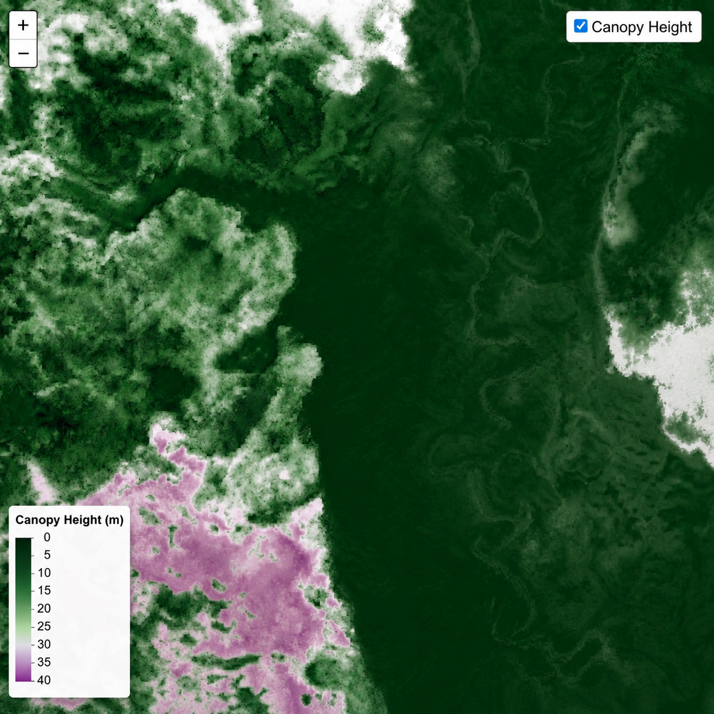
  
  </div>
  
  ## Export map to GeoTIFF via Google Drive
  
  ``` r
googledrive::drive_auth(cache = FALSE)

out <- map_download(
  ee_image         = ch_map,
  method           = "drive",
  region           = region,
  scale            = 10,
  file_name_prefix = "prediction_2025",
  dsn              = file.path(outdir, "prediction_2025.tif"),
  drive_folder     = "EE_Exports",
  monitor          = TRUE
)
terra::plot(out)
```

## Close the files

Do not forget to close the files to properly release them.

``` r
lapply(atl03_h5, close)
lapply(atl08_h5, close)
```

# Acknowledgements

We gratefully acknowledge funding from NASA’s ICESat-2 (ICESat-2, grant
                                                        22-ICESat2_22-0006), Carbon Monitoring System (CMS, grant 22-CMS22-0015)
and Commercial Smallsat Data Scientific Analysis(CSDSA, grant
                                                 22-CSDSA22_2-0080).

# Reporting Issues

Please report any issue regarding the ICESat2VegR package to Dr. Silva
(<c.silva@ufl.edu>) or Caio Hamamura (<hamamura.caio@ifsp.edu>).

# Citing ICESat2VegR

Silva,C.A; Hamamura,C. ICESat2VegR: An R Package for NASA’s Ice, Cloud,
and Elevation Satellite (ICESat-2) Data Processing and Visualization for
Terrestrial Applications.version 0.0.1, accessed on Jun. 13 2024,
available at: <https://CRAN.R-project.org/package=ICESat2VegR>
  
  # Disclaimer
  
  **ICESat2VegR package comes with no guarantee, expressed or implied, and
the authors hold no responsibility for its use or reliability of its
outputs.**
  
  
  
  
