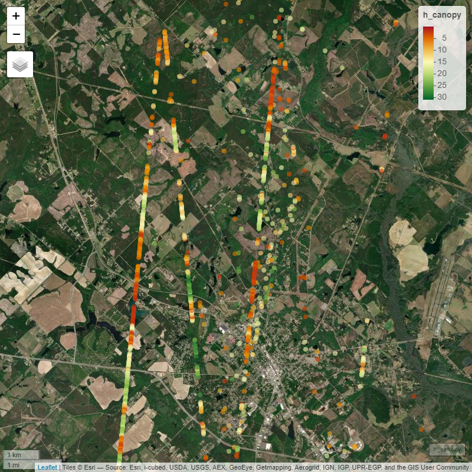

``` r
message("Running mapview print`")
```

```
## Running mapview print`
```


```
## Print map view already exists!
```


## Introduction

In this section, we will demonstrate how to use the
`ATL03_ATL08_segment_create` function from the `ICESat2VegR` package. 
This function is used to compute segment IDs for ICESat-2 `ATL03` and `ATL08`
data and create segments based on a specified segment length.


## Opening the example dataset

As we will be working with multiple h5 granules, we will be using `lapply` for reading
and extracting information from the granules.

If you are working with a single granule you can execute the
simpler instructions without `lapply` as per the function documentation examples instead.


``` r
# Load the ICESat2VegR package
library(ICESat2VegR)

# Set output directory
outdir <- tempdir()

# Download example dataset
ATLAS_dataDownload(
  "https://github.com/carlos-alberto-silva/ICESat2VegR/releases/download/example_datasets/Study_Site.zip",
  outdir
)

# Unzip the example dataset
unzip(file.path(outdir, "Study_Site.zip"), exdir = outdir)
```


``` r
# Find and read ATL03 dataset
atl03_files <- list.files(outdir, "ATL03.*h5", full.names = TRUE)
atl03_h5 <- lapply(atl03_files, ATL03_read)
```


``` r
# Find and read ATL08 dataset
atl08_files <- list.files(outdir, "ATL08.*h5", full.names = TRUE)
atl08_h5 <- lapply(atl08_files, ATL08_read)
```


``` r
# Herein as we are working with list of h5 files we will need
# to loop over each file and extract the attributes and then
# concatenate them with rbindlist2
atl03_atl08_dts <- list()

for (ii in seq_along(atl03_h5)) {
  atl03_file <- atl03_h5[[ii]]
  atl08_file <- atl08_h5[[ii]]

  atl03_atl08_dts[[ii]] <- ATL03_ATL08_photons_attributes_dt_join(
    atl03_file,
    atl08_file
  )
}

atl03_atl08_dt <- rbindlist2(atl03_atl08_dts)

head(atl03_atl08_dt)
```


## Create Segments IDs

Now, we use the `ATL03_ATL08_segment_create` function to create segments with a specified segment length.


``` r
atl03_atl08_photons_grouped_dt <- ATL03_ATL08_segment_create(atl03_atl08_dt,
  segment_length = 30,
  centroid = "mean",
  output = NA,
  overwrite = FALSE
)
```

## Compute Segment Statistics

``` r
atl03_atl08_seg_dt <- ATL03_ATL08_compute_seg_attributes_dt_segStat(
  atl03_atl08_photons_grouped_dt,
  list(
    h_canopy_ge0 = quantile(ph_h, 0.98),
    h_canopy_gt0 = quantile(ph_h[ph_h > 0], 0.98),
    n_ground = sum(classed_pc_flag == 1),
    n_mid_canopy = sum(classed_pc_flag == 2),
    n_top_canopy = sum(classed_pc_flag == 3),
    n_canopy_total = sum(classed_pc_flag >= 2)
  ),
  ph_class = c(1, 2, 3)
)

head(atl03_atl08_seg_dt)
```

<div align="center" style="overflow-x: scroll;">

<table>
 <thead>
  <tr>
   <th style="text-align:right;"> segment_id </th>
   <th style="text-align:left;"> beam </th>
   <th style="text-align:right;"> longitude </th>
   <th style="text-align:right;"> latitude </th>
   <th style="text-align:right;"> h_canopy_ge0 </th>
   <th style="text-align:right;"> h_canopy_gt0 </th>
   <th style="text-align:right;"> n_ground </th>
   <th style="text-align:right;"> n_mid_canopy </th>
   <th style="text-align:right;"> n_top_canopy </th>
   <th style="text-align:right;"> n_canopy_total </th>
  </tr>
 </thead>
<tbody>
  <tr>
   <td style="text-align:right;"> 126 </td>
   <td style="text-align:left;"> gt1r </td>
   <td style="text-align:right;"> -83.17571 </td>
   <td style="text-align:right;"> 31.99965 </td>
   <td style="text-align:right;"> 15.611358 </td>
   <td style="text-align:right;"> 15.611358 </td>
   <td style="text-align:right;"> 1 </td>
   <td style="text-align:right;"> 7 </td>
   <td style="text-align:right;"> 3 </td>
   <td style="text-align:right;"> 10 </td>
  </tr>
  <tr>
   <td style="text-align:right;"> 127 </td>
   <td style="text-align:left;"> gt1r </td>
   <td style="text-align:right;"> -83.17574 </td>
   <td style="text-align:right;"> 31.99986 </td>
   <td style="text-align:right;"> 18.311493 </td>
   <td style="text-align:right;"> 18.311493 </td>
   <td style="text-align:right;"> 1 </td>
   <td style="text-align:right;"> 12 </td>
   <td style="text-align:right;"> 1 </td>
   <td style="text-align:right;"> 13 </td>
  </tr>
  <tr>
   <td style="text-align:right;"> 128 </td>
   <td style="text-align:left;"> gt1r </td>
   <td style="text-align:right;"> -83.17577 </td>
   <td style="text-align:right;"> 32.00011 </td>
   <td style="text-align:right;"> 12.236551 </td>
   <td style="text-align:right;"> 12.236551 </td>
   <td style="text-align:right;"> 1 </td>
   <td style="text-align:right;"> 8 </td>
   <td style="text-align:right;"> 0 </td>
   <td style="text-align:right;"> 8 </td>
  </tr>
  <tr>
   <td style="text-align:right;"> 293 </td>
   <td style="text-align:left;"> gt1r </td>
   <td style="text-align:right;"> -83.18086 </td>
   <td style="text-align:right;"> 32.04469 </td>
   <td style="text-align:right;"> 3.518969 </td>
   <td style="text-align:right;"> 3.518969 </td>
   <td style="text-align:right;"> 0 </td>
   <td style="text-align:right;"> 1 </td>
   <td style="text-align:right;"> 5 </td>
   <td style="text-align:right;"> 6 </td>
  </tr>
  <tr>
   <td style="text-align:right;"> 294 </td>
   <td style="text-align:left;"> gt1r </td>
   <td style="text-align:right;"> -83.18087 </td>
   <td style="text-align:right;"> 32.04482 </td>
   <td style="text-align:right;"> 5.167805 </td>
   <td style="text-align:right;"> 5.167805 </td>
   <td style="text-align:right;"> 7 </td>
   <td style="text-align:right;"> 4 </td>
   <td style="text-align:right;"> 2 </td>
   <td style="text-align:right;"> 6 </td>
  </tr>
  <tr>
   <td style="text-align:right;"> 295 </td>
   <td style="text-align:left;"> gt1r </td>
   <td style="text-align:right;"> -83.18091 </td>
   <td style="text-align:right;"> 32.04511 </td>
   <td style="text-align:right;"> 12.113018 </td>
   <td style="text-align:right;"> 12.258518 </td>
   <td style="text-align:right;"> 12 </td>
   <td style="text-align:right;"> 10 </td>
   <td style="text-align:right;"> 0 </td>
   <td style="text-align:right;"> 10 </td>
  </tr>
</tbody>
</table>

</div>


## Convert to SpatVector

Now, we convert the data.table to a SpatVector object.


``` r
atl03_atl08_vect <- to_vect(atl03_atl08_seg_dt[h_canopy_gt0 <= 31])
```

## Visualize the segments

Finally, we visualize the SpatVector interactively using mapview.


``` r
centroid <- atl03_atl08_dt[, .(x = mean(lon_ph), y = mean(lat_ph))]

map_output <- mapview::mapview(
  atl03_atl08_vect,
  zcol = "h_canopy_gt0",
  col.regions = grDevices::hcl.colors(9, "RdYlGn"),
  alpha = 0,
  layer.name = "h_canopy",
  map.types = c("Esri.WorldImagery"),
  cex = 4
)@map %>%
  setView(lng = centroid$x, lat = centroid$y, zoom = 13)
## 
## map_output
```

<div align="center">



</div>


## Close the files
Do not forget to close the files to properly release them.


``` r
lapply(atl03_h5, close)

## Non lapply single file
# close(atl03_h5)
```

``` r
lapply(atl08_h5, close)

## Non lapply single file
# close(atl08_h5)
```


